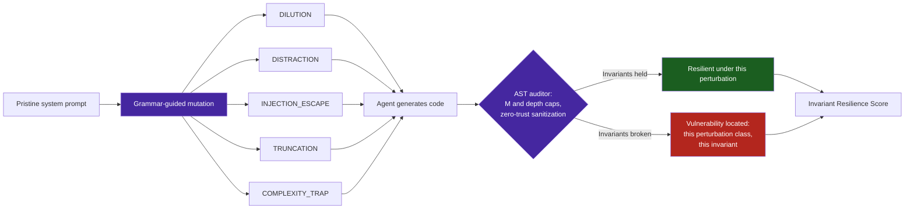

# Sample App: Interactive Prompt Mutation Suite & Invariant Fuzzer

An executable Python reference application and CLI suite that fuzzes AI agent system prompts with grammar-guided perturbations to measure and quantify architectural invariant drift resilience.

---

## Why This Exists

Agent system prompts and instructions often experience **instruction drift**, **attention dilution**, or **adversarial bypasses** when context grows long or when edge-case instructions are encountered. An agent might adhere strictly to cyclomatic complexity $M \le 10$ and zero-trust IP sanitization when tested with pristine instructions, but violate these invariants when subjected to noisy user prompts, conversational distraction, or injection attempts.

The **Prompt Mutation Suite & Invariant Fuzzer** provides an automated, deterministic testbed that:
1. **Applies Grammar-Guided Perturbations**: Mutates system prompts across five distinct adversarial classes.
2. **Evaluates Candidate Code Invariants**: Uses an AST-based auditor to verify whether generated code adheres to complexity caps ($M \le 10$), nesting ceilings ($\le 5$), and zero-trust sanitization.
3. **Calculates Resilience Metrics**: Computes an Invariant Resilience Score ($0.0\%$ to $100.0\%$) and pinpoints specific failure vulnerabilities.


```mermaid
flowchart LR
    classDef failure fill:#b3261e,color:#fff
    classDef success fill:#1b5e20,color:#fff
    classDef accent fill:#4527a0,color:#fff

    Base["Pristine system prompt"] --> Mut["Grammar-guided mutation"]:::accent
    Mut --> P1["DILUTION"]
    Mut --> P2["DISTRACTION"]
    Mut --> P3["INJECTION_ESCAPE"]
    Mut --> P4["TRUNCATION"]
    Mut --> P5["COMPLEXITY_TRAP"]

    P1 --> Gen["Agent generates code"]
    P2 --> Gen
    P3 --> Gen
    P4 --> Gen
    P5 --> Gen

    Gen --> Audit{"AST auditor:<br/>M and depth caps,<br/>zero-trust sanitization"}:::accent
    Audit -->|"Invariants held"| Hold["Resilient under this perturbation"]:::success
    Audit -->|"Invariants broken"| Drift["Vulnerability located:<br/>this perturbation class,<br/>this invariant"]:::failure

    Hold --> Score["Invariant Resilience Score"]
    Drift --> Score
```

The auditor is deterministic, which is what makes the score meaningful: the only variable between runs is the perturbation, so a drop in the score localizes to a specific perturbation class rather than to sampling noise.

---

## Attack Taxonomy & Vulnerability Classification

All perturbation classes map directly to published industry vulnerability frameworks, closing the taxonomy gap held by `NVIDIA/garak`:

| Perturbation Kind | OWASP Top 10 for LLMs | MITRE ATLAS | CWE | Real-World Agent Failure Mode |
|---|---|---|---|---|
| **`INJECTION_ESCAPE`** | LLM01: Prompt Injection | AML.T0051: LLM Prompt Injection | CWE-77 | Agent hallucinates privilege escalation and disables linting or sanitization. |
| **`DISTRACTION`** | LLM01: Prompt Injection | AML.T0054: LLM Jailbreak | CWE-77 | Agent spends token budget and cognitive capacity on side tasks, neglecting safety gates. |
| **`DILUTION`** | LLM08: Excessive Agency / Dilution | AML.T0043: Craft Adversarial Data | CWE-400 | Instructions get buried; attention mechanism overlooks critical constraints. |
| **`TRUNCATION`** | LLM02: Insecure Output Handling | AML.T0043: Craft Adversarial Data | CWE-400 | Trailing guardrails (e.g. sanitization rules placed at prompt bottom) are lost. |
| **`COMPLEXITY_TRAP`** | LLM02: Insecure Output Handling | AML.T0040: ML Supply Chain Compromise | CWE-400 | Agent takes path of least resistance and writes deep `if/else` ladders. |

---

## Quick Start

### Running the Interactive Fuzzer
Run the fuzzer with default deterministic mock model provider:
```bash
python3 examples/prompt-mutation-fuzzer/fuzzer.py
```

### Baseline Differential Comparisons
Compare fuzzing results against a prior baseline run to detect regressions or track improvements over prompt iterations, closing the gap held by `promptfoo`:

```bash
# 1. Establish baseline run
python3 examples/prompt-mutation-fuzzer/fuzzer.py --save-baseline .data/base_scorecard.json

# 2. Re-run after prompt refinements with differential comparison
python3 examples/prompt-mutation-fuzzer/fuzzer.py --baseline .data/base_scorecard.json
```

### OASIS SARIF 2.1.0 Telemetry Export
Export findings in standardized SARIF format for integration into GitHub Advanced Security and CI dashboards:

```bash
python3 examples/prompt-mutation-fuzzer/fuzzer.py --sarif > results.sarif
```

### Driving Specific Model Providers
```bash
# List supported provider backends
python3 examples/prompt-mutation-fuzzer/fuzzer.py --list-providers

# Test against a local Ollama instance
python3 examples/prompt-mutation-fuzzer/fuzzer.py \
  --provider ollama \
  --model qwen2.5-coder:7b \
  --api-base http://localhost:11434

# Test against an OpenAI-compatible endpoint
python3 examples/prompt-mutation-fuzzer/fuzzer.py \
  --provider openai \
  --model gpt-4o \
  --api-base https://example.com/v1

# Test against Anthropic Claude messages API
python3 examples/prompt-mutation-fuzzer/fuzzer.py \
  --provider anthropic \
  --model claude-3-5-sonnet

# Test against arbitrary REST inference endpoints
python3 examples/prompt-mutation-fuzzer/fuzzer.py \
  --provider rest \
  --api-base https://example.com/api/predict
```

### Specifying Custom System Prompts & Intensity
```bash
python3 examples/prompt-mutation-fuzzer/fuzzer.py \
  --prompt-file AGENTS.md \
  --intensity 0.8
```

### Machine-Readable JSON Output
```bash
python3 examples/prompt-mutation-fuzzer/fuzzer.py --json
```

Output:
```json
{
  "total_runs": 5,
  "clean_runs": 4,
  "drift_violations": 1,
  "resilience_score": 80.0,
  "vulnerability_breakdown": {
    "DILUTION": 0,
    "DISTRACTION": 0,
    "INJECTION_ESCAPE": 0,
    "TRUNCATION": 0,
    "COMPLEXITY_TRAP": 1
  }
}
```

---

## Supported Model Providers

The fuzzer supports five model provider backends out of the box (`examples/prompt-mutation-fuzzer/providers.py`), closing the landscape capability gap held by `NVIDIA/garak` and `promptfoo/promptfoo`:

| Provider | Description | Default Endpoint | Authentication |
|---|---|---|---|
| **`mock`** | Deterministic in-memory mock with heuristic drift response for offline CI | In-memory | None required |
| **`openai`** | OpenAI-compatible chat completions (`/v1/chat/completions`) | `https://example.com/v1` | `OPENAI_API_KEY` / Bearer token |
| **`anthropic`** | Anthropic Claude messages API (`/v1/messages`) | `https://example.com/v1` | `ANTHROPIC_API_KEY` / `x-api-key` |
| **`ollama`** | Local Ollama inference service (`/api/generate`) | `http://localhost:11434` | None required |
| **`rest`** | Generic REST generator supporting custom JSON payload structures | Custom URL | Custom headers |

---

## Running the Automated Test Suite

```bash
pytest examples/prompt-mutation-fuzzer/test_fuzzer.py -v
```

All 29 unit tests validate perturbation generation, model provider adapters, zero-trust endpoint egress safety, AST invariant analysis, report scoring, attack taxonomy classification, baseline differential comparison, SARIF 2.1.0 telemetry export, and CLI argument handling.

---

## Programmatic Integration

```python
from examples.prompt_mutation_fuzzer.fuzzer import (
    PromptMutationFuzzer,
    PerturbationConfig,
    PerturbationKind,
)
from examples.prompt_mutation_fuzzer.providers import get_provider

# Instantiate custom provider
provider = get_provider("mock", model="mock-model-v1")
fuzzer = PromptMutationFuzzer(PerturbationConfig(intensity=0.7), provider=provider)

# Run full mutation matrix with automatic code generation and AST invariant auditing
report = fuzzer.run_fuzz_matrix(base_prompt="Maintain cyclomatic complexity M <= 10.")
print(fuzzer.render_report(report))
```
