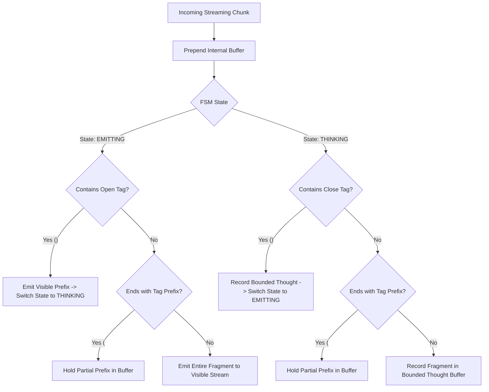

# Streaming Reasoning Token Parser & Bounded Stream Sanitizer

Reference implementation of a streaming finite state machine (FSM) that intercepts, isolates, and sanitizes internal reasoning blocks (`<think>...</think>`, `[reasoning]...[/reasoning]`) emitted by frontier reasoning models.

---

## 🏛️ Why This Matters in Production

Frontier reasoning models interleave or prefix responses with chain-of-thought tokens. In autonomous agent architectures, unmanaged reasoning tokens cause critical system failures:
1. **Tool Argument Poisoning**: Leaked thought tokens get serialized into bash scripts, SQL queries, or JSON payloads, triggering execution syntax errors.
2. **Terminal Stream Pollution**: Unfiltered `<think>` traces flood developer consoles, breaking interactive TUI layouts and obfuscating operational outputs.
3. **Memory Exhaustion (CWE-400)**: Unbounded models can loop inside thinking blocks, consuming tens of thousands of tokens and exhausting client buffer memory.
4. **Tag Splitting Across Stream Chunks**: Network chunking frequently cuts tags across packet boundaries (`<th` in chunk $N$, `ink>` in chunk $N+1$).

---

## 🧭 Architecture



---

## 🚀 Usage

### Streaming Processing

```python
from sanitizer import StreamingReasoningSanitizer

sanitizer = StreamingReasoningSanitizer(max_thought_chars=32768)

for chunk in llm_stream:
    result = sanitizer.feed(chunk)
    if result.visible_chunk:
        sys.stdout.write(result.visible_chunk)
        sys.stdout.flush()

# Finalize stream at EOF
final_chunk = sanitizer.flush()
if final_chunk.visible_chunk:
    sys.stdout.write(final_chunk.visible_chunk)

# Inspect isolated thinking trace and telemetry
thoughts = sanitizer.get_accumulated_thoughts()
metrics = sanitizer.metrics
print(f"Sanitized {metrics.visible_chars} visible chars, isolated {metrics.thought_chars} thought chars.")
```

### One-Shot Batch Sanitization

```python
from sanitizer import sanitize_reasoning_stream

chunks = ["Task starting. ", "<think>Analyzing graph...</think>", "Completed."]
visible, thoughts, metrics = sanitize_reasoning_stream(chunks)
assert visible == "Task starting. Completed."
assert thoughts == "Analyzing graph..."
```

---

## 🧪 Testing

Run the isolated test suite:
```bash
pytest examples/streaming-reasoning-sanitizer/test_sanitizer.py
```
