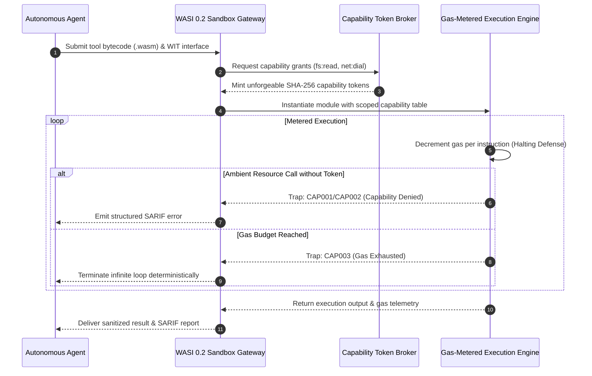

# WebAssembly Component Model & Capability-Based Sandbox Gateway (WASI 0.2)

> **Exemplar Status**: Living Artifact & Executable Reference Implementation  
> **Classification**: Capability Isolation, Wasm Component Model, WASI 0.2, Gas Metering  
> **Related**: [Observation 36](../../observations/systems/36-wasi-component-models-and-capability-based-tool-sandboxing.md), [Pattern: Capability-Based Wasm Sandboxing](../../patterns/capability-based-wasm-sandboxing.md)

---

## 1. Executive Overview

In autonomous agent workflows, subagents frequently generate and execute ephemeral helper utilities, format converters, and data scrapers. Executing untrusted agent-generated code inside traditional host processes (`python -c` or `bash`) grants **ambient UNIX authority** (CWE-250), exposing local credentials, filesystems, and network sockets to unverified tools.

Containerized sandboxes (`docker run`, cgroups v2) mitigate ambient authority but impose severe startup overhead (100ms–500ms, 50MB+ RAM), making high-frequency tool loops prohibitively slow and expensive.

The **WASI 0.2 Component Model & Capability-Based Sandbox Gateway** eliminates ambient authority using **unforgeable object-capability tokens**, sub-millisecond instantiation ($< 500\mu\text{s}$), deterministic instruction gas metering, and linear memory containment.

---

## 2. Architectural Sequence



---

## 3. WIT Interface Contract

Declarative WebAssembly Interface Type (`wit`) contract governing the agent tool execution boundary:

```wit
package example:tool-runner;

interface runner {
    import wasi:filesystem/preopens@0.2.0;
    import wasi:clocks/monotonic-clock@0.2.0;

    export run: func(payload: string) -> string;
}
```

---

## 4. Diagnostic Rules & Containment Invariants

| Rule ID | Invariant Category | Severity | Description |
|---|---|---|---|
| `CAP001` | Filesystem Isolation | `error` | Ambient filesystem access denied (outside preopened capability scope). |
| `CAP002` | Network Isolation | `error` | Ambient network egress denied (unauthorized destination host/port). |
| `CAP003` | Instruction Budget | `error` | Execution halted due to deterministic gas budget exhaustion (runaway loop defense). |
| `CAP004` | Memory Containment | `error` | Execution halted due to linear memory ceiling breach (page allocation cap). |
| `CAP005` | Interface Contract | `error` | Missing capability grant for declared WIT component import. |

---

## 5. CLI Usage & Verification

```bash
# Validate Wasm binary header magic and section table
python3 examples/wasm-capability-sandbox/wasm_sandbox.py validate module.wasm

# Audit requested path against capability permissions
python3 examples/wasm-capability-sandbox/wasm_sandbox.py audit \
    --grant-fs /workspace/sandbox \
    --check-path /workspace/sandbox/in.json

# Run unit and integration tests
uv run pytest -q examples/wasm-capability-sandbox/test_wasm_sandbox.py
```

---

## 6. Zero-Dependency Statement

This reference implementation strictly leverages the **Python standard library** (`argparse`, `dataclasses`, `enum`, `hashlib`, `json`, `pathlib`, `struct`, `sys`, `time`), requiring zero external packages or native C runtime extensions.
