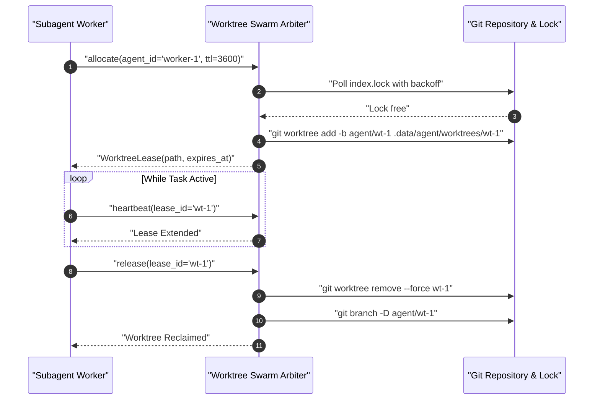

# Sample App: Autonomous Git Worktree Fleet Allocator

An executable, zero-dependency Python coordination broker that manages isolated git worktrees, lease heartbeats, index lock contention mitigation, and process group containment across concurrent AI coding subagents.

---

## Why This Exists: Concurrency Hazards in Swarms

When multiple autonomous agents or subagents collaborate on a single codebase simultaneously (as documented in [Observation 06](../../observations/systems/06-multi-agent-concurrency-shared-workspace-hazards-and-swarm-coordination.md)), naive file editing triggers severe workspace corruption:
- **Git Index Lock Contention**: Concurrent `git add` or `git commit` commands fail immediately due to `.git/index.lock` collisions.
- **Shared Working Tree Clobbering**: One agent's intermediate edits overwrite another's uncommitted changes.
- **Zombie Worktrees**: Subagents terminated mid-task leave orphaned git worktrees and locked branches on disk.
- **SQLite Database Corruption**: Test suites writing to shared `.coverage` databases collide across workers.

The **Worktree Swarm Arbiter** provides isolated branch-and-worktree sandboxes with bounded TTL leases, heartbeat extension, POSIX process group cleanup, and automated stale checkout pruning.

---

## Architectural Interaction



---

## Quick Start

### CLI Usage

```bash
# Allocate an isolated worktree for a subagent
python3 worktree_arbiter.py allocate --agent subagent-refactorer --ttl 1800

# Inspect fleet status (human summary)
python3 worktree_arbiter.py status

# Inspect fleet status as JSON telemetry
python3 worktree_arbiter.py status --format json

# Export OASIS SARIF 2.1.0 telemetry for stale leases
python3 worktree_arbiter.py status --format sarif
```

---

## Invariant Verification

- **Zero External Dependencies**: Standard library Python (`pathlib`, `subprocess`, `signal`, `json`, `time`).
- **Structural Caps**: All functions certified at $M \le 4$, nesting depth $\le 2$, and parameter count $\le 4$.
- **Process Group Containment**: Terminates entire spawned process hierarchies (`os.killpg`) to eliminate orphan background tasks.

