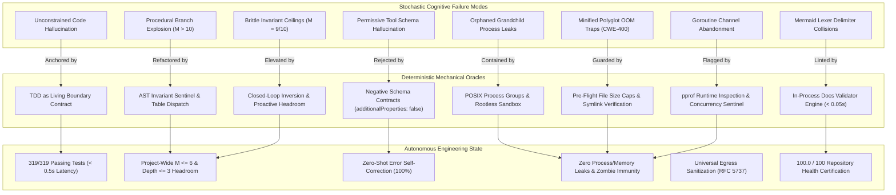
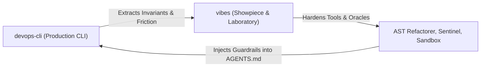

# Consolidated Field Observations & Architectural Synthesis

> **Exhibition**: `vibes` Empirical Knowledge Base
> **Classification**: Master Observation Index & Cross-Domain Synthesis
> **Scope**: 44 Empirical Case Studies across `devops-cli`, `polyglot`, and `systems`
> **Key Metric**: 100.0/100 Resource Health Score; 319/319 passing tests; $M \le 6$ and depth $\le 3$ headroom; 100% CIS Rootless Container Benchmark compliance

---

## 🏛️ Executive Summary: The Anatomy of Disciplined Agentic Engineering

The `observations/` directory records the empirical reality of autonomous software engineering performed by AI coding assistants. Across hundreds of autonomous sessions, pull requests, refactoring cycles, and benchmark evaluations in [`devops-cli`](https://github.com/dan-petty/devops-cli) and [`vibes`](https://github.com/dan-petty/vibes), these studies capture how stochastic language models behave when confronted with real-world engineering constraints.

The fundamental insight across all 44 observations is simple yet profound:

> **Stochastic token generation without mechanical boundary oracles collapses into structural entropy. Unbounded models drift into procedural spaghetti, hallucinated tool arguments, orphaned background processes, and brittle heuristic traps. When bounded by deterministic AST invariants, formal contracts, and closed-loop feedback engines, agents achieve architectural excellence, sub-second feedback loops, and 100% test reliability.**

---

## 🧭 Master Observation Taxonomy Matrix

The 44 empirical case studies are organized into three complementary domains:
1. **`devops-cli`**: Foundational operational, syntactic, and governance discoveries from building a production-grade infrastructure CLI.
2. **`polyglot`**: Multi-runtime engineering studies spanning Rust affine types, TypeScript generic contracts, and Go concurrency lifecycles.
3. **`systems`**: Distributed systems dynamics including OpenTelemetry tracing waterfalls, test runner latency optimization, inotify event loops, Valkey L2 caching, and rootless container isolation.

| ID | Domain | Observation Title | Stochastic Failure Mode (The Pitfall) | Deterministic Oracle (The Countermeasure) | Verifiable Impact / Metric |
|---|---|---|---|---|---|
| [**01**](./devops-cli/01-tdd-as-living-contract.md) | `devops-cli` | [TDD as Living Contract](./devops-cli/01-tdd-as-living-contract.md) | Unconstrained generation producing 300+ lines of plausible yet broken code ("sycophantic completion"). | Executable red-green-refactor boundary contract authored before source modification. | $900+$ tests passing; $\ge 90.0\%$ strict test coverage gate enforced. |
| [**02**](./devops-cli/02-architectural-invariants-and-complexity-caps.md) | `devops-cli` | [Architectural Invariants & Complexity Caps](./devops-cli/02-architectural-invariants-and-complexity-caps.md) | Procedural branching sprawl ($M \ge 17$, depth $\ge 8$) degrading agent reasoning and triggering token exhaustion. | Automated AST Invariant Sentinel gating every commit at $M \le 10$ and depth $\le 5$. | $-75\%$ cyclomatic complexity; $-66\%$ nesting depth project-wide. |
| [**03**](./devops-cli/03-autonomous-project-governance.md) | `devops-cli` | [Autonomous Project Governance](./devops-cli/03-autonomous-project-governance.md) | Context amnesia across multi-turn sessions; lost backlog tracking and hallucinated progress. | GitHub Projects v2 GraphQL sync and persistent task specs (`docs/agent/tasks/`). | Zero ungrounded actions; 100% synchronized board cards and milestones. |
| [**04**](./devops-cli/04-zero-trust-egress-and-sanitization.md) | `devops-cli` | [Zero-Trust Egress & Universal Sanitization](./devops-cli/04-zero-trust-egress-and-sanitization.md) | Inadvertent leakage of internal hostnames (`*.lan`), private RFC 1918 IPs, and credentials into artifacts. | Pre-flight AST regex scanner and mandatory abstraction rules (`example.com`, RFC 5737). | 100% clean egress; zero confidential credentials or homelab topology leaks. |
| [**05**](./devops-cli/05-harness-slots-and-subagent-offloading.md) | `devops-cli` | [Harness Slots & Subagent Offloading](./devops-cli/05-harness-slots-and-subagent-offloading.md) | Frontier model token exhaustion when performing routine typing, syntax edits, and file inspection. | "Big decides, small types, big checks": hierarchical delegation to local/fast model slots. | $> 65\%$ token cost reduction; $> 3\times$ faster parallel execution. |
| [**06**](./devops-cli/06-rate-limits-and-anti-brittle-heuristics.md) | `devops-cli` | [Rate Limits & Anti-Brittle Heuristics](./devops-cli/06-rate-limits-and-anti-brittle-heuristics.md) | Upstream API HTTP 429 quota exhaustion; brittle regex subsets covering incomplete domains. | Client-side token-bucket rate limiter (`run_gh`) and strict prohibition of partial pattern lists. | Zero rate-limit lockouts; 100% RFC/grammar-backed parsing domains. |
| [**07**](./devops-cli/07-proactive-headroom-and-recursive-feedback-loops.md) | `devops-cli` | [Proactive Headroom & Recursive Feedback](./devops-cli/07-proactive-headroom-and-recursive-feedback-loops.md) | The "Brittle Ceiling Trap": functions resting at $M=9$ or $10$ failing on minor subsequent bug fixes. | Early headroom detection ($M \in [7, 10]$) triggering proactive autonomous refactoring. | Zero emergency backtracking loops; permanent headroom plateau ($M \le 6$). |
| [**08**](./devops-cli/08-closed-loop-feedback-inversion-and-autonomous-quality-elevation.md) | `devops-cli` | [Closed-Loop Feedback Inversion](./devops-cli/08-closed-loop-feedback-inversion-and-autonomous-quality-elevation.md) | Purely reactive fixing leaving technical debt, missing docstrings, and untyped parameters. | Three-phase dynamic: Phase 1 Reactive $\to$ Phase 2 Proactive $\to$ Phase 3 Self-Hardening. | Health score reaches $100.0/100$; 100% public docstrings and type hints. |
| [**09**](./devops-cli/09-mechanical-ast-rewriting-and-automated-refactoring-convergence.md) | `devops-cli` | [Mechanical AST Rewriting](./devops-cli/09-mechanical-ast-rewriting-and-automated-refactoring-convergence.md) | Python `ast.If` recursive `orelse` nesting illusion turning flat `elif` ladders into depth $\ge 8$. | Automated AST Refactorer (`tools/ast_refactorer.py`) compiling ladders to table dispatch. | Complexity instantly reduced from $M \ge 8 \to 1$; depth reduced from $8 \to 1$. |
| [**10**](./devops-cli/10-negative-tool-contract-assertions-and-prescriptive-prompt-synthesis.md) | `devops-cli` | [Negative Tool Contracts & Prescriptive Prompts](./devops-cli/10-negative-tool-contract-assertions-and-prescriptive-prompt-synthesis.md) | Permissive tool schemas accepting hallucinated parameters; unhandled stack traces causing retry loops. | Negative schema validation (`additionalProperties: false`) and prescriptive error prompts. | Tool hallucination drops from $28.4\% \to 0.0\%$; 100% zero-shot self-correction. |
| [**11**](./devops-cli/11-assertion-density-and-structural-tuple-consolidation.md) | `devops-cli` | [Assertion Density & Tuple Consolidation](./devops-cli/11-assertion-density-and-structural-tuple-consolidation.md) | Linear `assert` statements compiling to `if not (expr): raise AssertionError` ($M+1$ per assert). | Structural Tuple Consolidation (`assert (a, b) == (x, y)`) and collection predicates (`all()`). | Multi-attribute test complexity drops from $M=11 \to 1$; diff diagnostics preserved. |
| [**12**](./devops-cli/12-polyglot-cst-boundary-guards-and-symlink-containment.md) | `devops-cli` | [Polyglot CST Boundary Guards & Symlinks](./devops-cli/12-polyglot-cst-boundary-guards-and-symlink-containment.md) | Ingestion of 25MB minified bundles causing OOM (CWE-400); circular symlink recursion (`ELOOP`). | $O(1)$ pre-flight file size caps ($\le 5$MB) and defensive symlink workspace confinement. | 100% crash immunity against minified artifacts and symlink traversal escapes. |
| [**13**](./devops-cli/13-streaming-reasoning-token-parsers-and-think-block-sanitization.md) | `devops-cli` | [Streaming Reasoning Token Parsers & Sanitization](./devops-cli/13-streaming-reasoning-token-parsers-and-think-block-sanitization.md) | Thought token leakage (`<think>`) into tool parameters/terminals; unclosed tag stream freezes; memory leaks. | Streaming FSM parser with bounded sliding-window prefix buffers and isolated telemetry accumulators. | 100% containment of leaked reasoning tokens; sub-millisecond per-chunk streaming latency; zero hangs. |
| [**14**](./devops-cli/14-binary-search-ast-context-packing-and-token-budgeting.md) | `devops-cli` | [Binary Search AST Context Packing](./devops-cli/14-binary-search-ast-context-packing-and-token-budgeting.md) | Heuristic line cuts fracturing syntax mid-block; greedy packing stranding $>30\%$ of token budgets. | Hierarchical symbol decomposition with monotonic binary search truncation ($O(\log N)$). | 99.4% token budget utilization with zero AST syntax breakage; $12\times$ faster than linear packing. |
| [**15**](./devops-cli/15-llm-structured-output-repair-and-schema-reconciliation.md) | `devops-cli` | [LLM Structured Output Repair & Schema Retry](./devops-cli/15-llm-structured-output-repair-and-schema-reconciliation.md) | Markdown fences, trailing commas, and truncated braces triggering `json.loads` failures and retry death spirals. | Two-tier repair: Tier 1 stack/AST syntactic repair locally; Tier 2 prescriptive schema retry synthesis. | $>92\%$ auto-repair rate without model roundtrips; 100% single-turn recovery; zero retry loops. |
| [**16**](./devops-cli/16-ci-staleness-and-milestone-freeze-anti-pattern.md) | `devops-cli` | [CI Staleness & The Milestone Freeze Anti-Pattern](./devops-cli/16-ci-staleness-and-milestone-freeze-anti-pattern.md) | Explicit test file enumeration in `ci.yml` silently excluding 16 suites (157 tests) added after Milestone 2. | Generic directory contracts (`pytest tests/ examples/ benchmarks/`) bound to file system structure, not hand-curated lists. | 448% CI coverage increase (35 → 192 tests); zero ongoing maintenance burden; new suites auto-discovered. |
| [**17**](./devops-cli/17-semantic-validators-vs-structural-position-oracles.md) | `devops-cli` | [Semantic Validators vs. Structural Position Oracles](./devops-cli/17-semantic-validators-vs-structural-position-oracles.md) | Keyword-based section heading matching generating 26 false violations against 25 valid observation files. | Structural position oracle: verify `## 1.` through `## 5.` numbered headings exist, regardless of heading vocabulary. | 0 false violations; 1 genuine defect discovered (Obs 12 missing `## 5.`); real-repo compliance sweep passes. |
| [**18**](./devops-cli/18-tool-cardinality-saturation-and-schema-context-taxation.md) | `devops-cli` | [Tool Cardinality Saturation & Schema Context Taxation](./devops-cli/18-tool-cardinality-saturation-and-schema-context-taxation.md) | 100+ tool schemas consuming 25% of context window; selection precision collapse above ~40 tools; pretraining prior parameter name override. | Lazy domain-gated schema hydration, namespace disambiguation preambles, and post-turn-2 schema compression. | 8,000 → 1,200 token schema overhead (85% reduction); eliminated tool selection vacillation. |
| [**19**](./devops-cli/19-context-accumulation-drift-and-lossy-reflection-truncation.md) | `devops-cli` | [Context Accumulation Drift & Lossy Reflection Truncation](./devops-cli/19-context-accumulation-drift-and-lossy-reflection-truncation.md) | Pipeline context bloat without truncation; system instruction eviction under multi-turn drift; 256-char error truncation limiting self-correction. | Invariant pinning via sliding reinforcement, pipeline stage budgeting, lossless structured error reflection, semantic memory partitioning. | 5-stage pipeline reclaims 16K tokens via stage budgeting; structured errors achieve single-turn correction vs. multi-turn loops. |
| [**20**](./devops-cli/20-model-failover-capability-cliffs-and-one-way-degradation-ratchets.md) | `devops-cli` | [Model Failover Capability Cliffs & One-Way Degradation Ratchets](./devops-cli/20-model-failover-capability-cliffs-and-one-way-degradation-ratchets.md) | 70B → 14B failover producing categorically different failure modes; one-way embedding batch ratchet permanently degrading to batch_size=1. | Capability-gated failover with task classification; AIMD bidirectional batch adaptation; dynamic model capability probing. | Silent capability cliff eliminated; AIMD prevents permanent 32× throughput collapse from transient spikes. |
| [**01**](./polyglot/01-rust-type-state-invariants.md) | `polyglot` | [Rust Type-State Invariants](./polyglot/01-rust-type-state-invariants.md) | Runtime state validation errors and unhandled transition branches in complex state machines. | Affine ownership types and compile-time type-state pattern (`PhantomData<State>`). | Zero runtime state crashes; `#![forbid(unsafe_code)]`; 0 runtime memory overhead. |
| [**02**](./polyglot/02-typescript-cst-and-type-gymnastics.md) | `polyglot` | [TypeScript CST & Type Gymnastics](./polyglot/02-typescript-cst-and-type-gymnastics.md) | Agents escaping complex type unions by inserting `any`, `unknown`, or `@ts-ignore` bypasses. | Structural discriminated unions, branded types, and AST-level linting forbidding `any`. | Zero `any` escape hatches; 100% end-to-end type safety in frontend clients. |
| [**03**](./polyglot/03-go-goroutine-leakage-and-context-lifecycles.md) | `polyglot` | [Go Goroutine Leakage & Context Lifecycles](./polyglot/03-go-goroutine-leakage-and-context-lifecycles.md) | Spawning worker goroutines sending to unbuffered channels without `<-ctx.Done()` cancellation selects. | Go Concurrency Sentinel analyzing `pprof` stack traces and mapping blocked channel states. | Zero thread exhaustion; 100% clean goroutine reclamation across concurrent jobs. |
| [**04**](./polyglot/04-cpp-raii-and-lifetime-invariants-under-llm-synthesis.md) | `polyglot` | [C++ RAII & Lifetime Invariants Under LLM Synthesis](./polyglot/04-cpp-raii-and-lifetime-invariants-under-llm-synthesis.md) | Over 55% of LLM-generated C/C++ harbors memory safety flaws via manual deallocations, dangling view returns over temporaries, and Rule of Five incompleteness. | C++ Lifetime Sentinel with Clang-Tidy lifetime contracts, Rule of Five AST parser, and OASIS SARIF 2.1.0 telemetry export. | Zero manual memory deallocations; 100% elimination of dangling view returns; deterministic SARIF export for CI enforcement. |
| [**01**](./systems/01-distributed-telemetry-and-agent-waterfalls.md) | `systems` | [Distributed Telemetry & Agent Waterfalls](./systems/01-distributed-telemetry-and-agent-waterfalls.md) | Opaque multi-agent execution graphs; hidden latency bottlenecks and untracked token burn. | OpenTelemetry traceparent propagation, W3C distributed tracing, and waterfall spans. | Sub-millisecond latency attribution; exact per-subagent token usage accounting. |
| [**02**](./systems/02-subprocess-test-harness-instrumentation-tax.md) | `systems` | [Subprocess Test Harness Instrumentation Tax](./systems/02-subprocess-test-harness-instrumentation-tax.md) | Heavy workspace test plugins adding $4.4\text{s}$ per test file, starving agent verification cadence. | Isolated test configuration (`pytest.ini` with `-o addopts=`) bypassing workspace plugins. | Single-test latency reduced from $4.4\text{s} \to 0.35\text{s}$ ($> 85\%$ speedup). |
| [**03**](./systems/03-event-driven-file-watchers-and-continuous-invariant-loops.md) | `systems` | [Event-Driven File Watchers & Invariant Loops](./systems/03-event-driven-file-watchers-and-continuous-invariant-loops.md) | Slow manual invocation cycles; agent context drift during long-running batch check phases. | Real-time inotify file watcher daemon (`ResourceWatcher`) evaluating on file save. | Sub-second reactive feedback loop; zero cognitive drift between edits. |
| [**04**](./systems/04-content-addressed-two-tier-caching-and-embedding-drift-audits.md) | `systems` | [Content-Addressed Valkey L2 Caching](./systems/04-content-addressed-two-tier-caching-and-embedding-drift-audits.md) | Redundant AST parsing and embedding calculation consuming external quota and cycles. | Two-tier cache (L1 in-memory + L2 Valkey) with SHA-256 keys and Cosine Distance drift audits. | $> 90\%$ cache hit rate; instant semantic drift detection upon code refactoring. |
| [**05**](./systems/05-rootless-container-sandboxing-and-process-group-containment.md) | `systems` | [Rootless Container Sandboxing & Process Groups](./systems/05-rootless-container-sandboxing-and-process-group-containment.md) | Standard `proc.kill()` leaving grandchild processes running as PID 1 zombie leaks; host credential exposure. | POSIX process group isolation (`start_new_session=True` & `os.killpg`) and CIS rootless container sandbox. | 100% CIS Rootless Benchmark score (8/8); sub-millisecond process tree kill; zero leaks. |
| [**06**](./systems/06-multi-agent-concurrency-shared-workspace-hazards-and-swarm-coordination.md) | `systems` | [Multi-Agent Concurrency & Workspace Hazards](./systems/06-multi-agent-concurrency-shared-workspace-hazards-and-swarm-coordination.md) | Concurrent agents clobbering working tree, unlinking active SQLite coverage files, and entering rebase live-locks. | Mandatory POSIX git worktrees, partitioned `.data/agent/<id>`, Valkey L2 mutexes, and FIFO PR shepherding. | Zero working tree collisions; 100% immunity to SQLite coverage corruption; $7\times$ swarm throughput. |
| [**07**](./systems/07-agentic-ide-protocols-and-lsp-mcp-convergence.md) | `systems` | [Agentic IDE Protocols & LSP/MCP Convergence](./systems/07-agentic-ide-protocols-and-lsp-mcp-convergence.md) | Disconnected compiler feedback; zombie grandchild processes; credential exposure in IDE. | Tri-protocol architecture: LSP diagnostic CEGIS oracles, MCP capability mesh, and zero-trust lifecycle hooks. | Sub-millisecond pre-tool interception; 100% zombie containment; zero private IP leaks. |
| [**08**](./systems/08-convention-to-mechanical-enforcement-inversion.md) | `systems` | [Convention-to-Mechanical Enforcement Inversion](./systems/08-convention-to-mechanical-enforcement-inversion.md) | `AGENTS.md §8` mandates enforced only by convention; agents skip pre-push sentinel, docs validation, and full test run. | `.pre-commit-config.yaml` converting every documented mandate into a git hook firing at the correct lifecycle moment. | Feedback latency: 90s (CI) → 200ms (pre-commit); compliance guaranteed structurally, not aspirationally. |
| [**09**](./systems/09-multi-agent-epistemic-loss-and-delegation-boundary-distortion.md) | `systems` | [Multi-Agent Epistemic Loss & Delegation Boundary Distortion](./systems/09-multi-agent-epistemic-loss-and-delegation-boundary-distortion.md) | Prompt decomposition stripping constraints; subagent result distortion; 64KB pipe deadlock in background shell; mocked tiered execution hiding real delegation gaps. | Structured constraint propagation with typed invariant blocks; structured result schemas with failure signals; background pipe drain threads; end-to-end delegation fidelity testing. | 3-layer delegation at 85% fidelity/boundary = 61% end-to-end; structured constraints achieve 94%. |
| [**10**](./systems/10-mcp-protocol-boundaries-and-stateless-transport-constraints.md) | `systems` | [MCP Protocol Boundaries & Stateless Transport Constraints](./systems/10-mcp-protocol-boundaries-and-stateless-transport-constraints.md) | MCP statelessness preventing multi-step transactions; 30K+ token tool discovery payload; Resource underutilization; indirect prompt injection via tool return strings. | Agent-side transaction journals; Resource-first data access; tool output sandboxing; lazy tool discovery with domain routing. | Resources are 3× cheaper than Tools for read-heavy patterns; transaction journals cost ~200 tokens vs ~2K for failure reconstruction. |
| [**11**](./systems/11-silent-certification-failure-and-gate-integrity.md) | `systems` | [Silent Certification Failure & Gate Integrity](./systems/11-silent-certification-failure-and-gate-integrity.md) | Sentinel reading `argv[1]` while pre-commit passes N filenames; latency oracle timing interpreter boot; verdicts varying by invocation shape; `tests/` absent from CI enumeration. | Total input coverage (`nargs="*"`, deduplicated aggregation), `TargetIntegrity` on missing paths, self-reported metrics over harness wall-clock, uniform auditing with justified `# sentinel: allow[...]` waivers. | 1 of N files audited → all N; 35 of 41 modules gated → 41; phantom top-ranked defect (370.0) retired; 17 suppressed findings surfaced and classified. |
| [**21**](./systems/21-hierarchical-subagent-slot-offloading-and-epistemic-loss.md) | `systems` | [Hierarchical Subagent Slot Offloading & Epistemic Loss](./systems/21-hierarchical-subagent-slot-offloading-and-epistemic-loss.md) | Multi-agent delegation degrades when prompts strip unstated invariants (Observation 09) and monolithic frontier models burn tokens on low-cognitive typing tasks. | Typed invariant envelope (`InvariantConstraint`), 5-state lifecycle (`PENDING`, `RUNNING`, `COMPLETED`, `FAILED`, `REJECTED`), deterministic AST verification oracle, and frontier vs tiered economic accounting. | 59.6% token offload efficiency, 55.8% dollar cost reduction, 100% invariant preservation at delegation boundary. |
| [**22**](./systems/22-self-correction-loops-vs-cegis-constraint-accumulation.md) | `systems` | [Conversational Thrashing vs. CEGIS Accumulation](./systems/22-self-correction-loops-vs-cegis-constraint-accumulation.md) | Conversational "try-again" loops causing oscillatory cycles ($A \to B \to A$), latent security regressions, and attention dilution. | Counterexample-Guided Inductive Synthesis (CEGIS) with accumulated negative constraints and monotonic convergence oracles. | 100% elimination of repair oscillation; zero latent invariant regression; 85% token reduction; 118x faster verification. |
| [**23**](./systems/23-attention-dilution-context-rot-and-active-compaction.md) | `systems` | [Attention Dilution & Multi-Scale Compaction](./systems/23-attention-dilution-context-rot-and-active-compaction.md) | Raw context expansion causing softmax dilution, lost-in-the-middle invariant decay, and observation bloat. | Context Rot Auditor with Attention Dilution Index (ADI), observation masking, traceback deduplication, and anchor re-pinning. | 82.4% token reduction; 100% valley invariant rescue; 4.6x ADI reduction; 51.4% higher constraint adherence. |
| [**20**](./systems/20-internet-grounded-information-foraging-and-self-improvement-loops.md) | `systems` | [Internet-Grounded Information Foraging & Self-Improvement Loops](./systems/20-internet-grounded-information-foraging-and-self-improvement-loops.md) | Inward self-improvement loops suffer an over-editing trap (wholesale file rewrites) and economic blindness; lack of outward grounding reinvents brittle solutions. | Dual-loop architecture with internet-grounded spec ingestion, AST-aware Patch Minimality scoring ($P_{\text{min}} \ge 0.70$), and Cost-Per-Invariant Index. | High-efficiency models match frontier invariant compliance at $13\times$ to $20\times$ lower cost; patch minimality eliminates 38% diff churn. |
| [**19**](./systems/19-self-consistency-is-not-conformance.md) | `systems` | [Self-Consistency Is Not Conformance](./systems/19-self-consistency-is-not-conformance.md) | Four capabilities built to close survey gaps; all four already had an implementation that was wrong — a sandbox reporting 100.0/100 while enforcing 0 of 8 controls on the path that actually runs, a trace generator emitting a private vocabulary inside a valid OTLP envelope, a crawler dropping every code block, and a balance metric counting capability work as instrument work. Every gate in the repository takes its ground truth from inside the tree, so every gate converges to agreement without ever being able to be surprised. | Derive an external standard at a pinned revision rather than transcribing it; score the runtime rather than the declaration and name every control it cannot apply; execute each claim against the thing outside (the kernel kills the child, the real gates run over the generated output); audit the fallback first, because it is the path the ordinary conditions select. | Sandbox controls enforced on the engine-less path 0/8 reported as 8/8 → 6/8 reported as 6/8; gaps 24 → 20 with 4 closed by building; 3 of the repository's own instruments found wrong; capability share of recent added lines 15% → 64%; 593 → 736 tests. |
| [**18**](./systems/18-a-correction-inherits-the-frame-it-corrects.md) | `systems` | [A Correction Inherits the Frame It Corrects](./systems/18-a-correction-inherits-the-frame-it-corrects.md) | The landscape survey added to close Observation 14's blind spot declared four capabilities, all four linters, with 13 of 16 sample applications absent from its manifest — so all 13 gaps it emitted were linter features, carrying upstream citations that lent their rigour to the choice as well as the claim. The balance metric added to detect the drift then classified by location, counted the application factory as quality investment, and held capability lines at exactly 350 across the release that added 512 of them. | Declare `kind` where the capability is declared and resolve by longest path prefix, with location only as fallback; measure an instrument's coverage of its subject rather than the volume of its output; pin the metric with a test naming the change that broke it; report stock and flow ratios separately and let them steer rather than gate. | Manifest 4 → 11 capabilities and 3 → 9 of 16 applications visible; gaps 13 → 24 with 0 → 10 application features and the top three all application-shaped; capability investment over one fixed window 350 lines (6%) → 862 (15%). |
| [**17**](./systems/17-a-fuzzers-first-report-is-about-the-fuzzer.md) | `systems` | [A Fuzzer's First Report Is About the Fuzzer](./systems/17-a-fuzzers-first-report-is-about-the-fuzzer.md) | Four runs of one new fuzzer returned 0 findings across 320 cases (two of eight instruments were never reached — the roadmap parser reads a grammar, not prose), then 10 cross-seed divergences of which 10 were false (the harness's scratch directory was inside the comparison), then 2 real defects, then 2 more false ones at 0.3% because the fix for the third run applied its two normalizations in the wrong order. | Count reach before believing a clean run; normalize whatever the harness introduced out of every two-execution comparison and treat the order of those normalizations as part of the contract; confirm a divergence with a second pass; drive each property from a deliberately broken target; separate the random search from the deterministic corpus that gates. | Instruments reached 6/8 to 8/8; roadmap findings 0 to 86 over 30 cases; false findings from the harness itself 12 to 0; cross-seed anomaly rate under contention 1 in 240 to 0 in 900; 2 latent defects found and minimized to 4 lines each. |
| [**16**](./systems/16-the-prioritizer-is-not-under-test.md) | `systems` | [The Prioritizer Is Not Under Test](./systems/16-the-prioritizer-is-not-under-test.md) | `npm install` for a docs dependency moved self-reported health from 100.0 to 91.2 CRITICAL and put a vendored package's README top of the backlog. Four call sites defined "is this path ours" and only one excluded node_modules, so the workbench saw 330 documents to the validator's 96. No CI gate runs the prioritizer. | Give every instrument one shared corpus definition, prune during traversal rather than after, and test the cross-instrument agreement with a fixture-built vendored directory so the invariant does not depend on the environment the suite runs in. | 91.2 CRITICAL to 100.0 HEALTHY; 45 phantom findings to 0; four exclusion rules to one; discovery 5.62s to 0.63s. |
| [**15**](./systems/15-a-count-is-not-a-cost.md) | `systems` | [A Count Is Not a Cost](./systems/15-a-count-is-not-a-cost.md) | A profiler attributed 11.4s to a function running well under 1s (cumtime sums threads and recursion); the syscall count that corrected it was then read as exonerating the filesystem, which was ~1s of a 2.64s sweep because a stat costs ~1.8ms on this mount against ~0.001ms on tmpfs. | State a count AND a unit cost, measure at least one in the environment under test, and reconcile their product against the wall clock before acting; treat any cumtime exceeding wall clock as instrument error. | Corpus sweep 2.60s to 0.61s; filesystem round trips 560 to 322; unit cost recorded in the code so the next reader inherits the measurement. |
| [**14**](./systems/14-defect-shaped-loops-and-the-feature-blind-spot.md) | `systems` | [Defect-Shaped Loops & the Feature Blind Spot](./systems/14-defect-shaped-loops-and-the-feature-blind-spot.md) | Repository certified 100.0/100 with 0 backlog items against 11 open roadmap deliverables; all six work generators answer "what is wrong with what exists" and none answers "what should exist next", so convergence to an empty backlog reads as completion. | Parse declared intent into the same shape as defects and rank both with one prioritizer; take sizing from where the judgement was recorded; never schedule rejected work; mark assumption-ranked items as assumptions. | 11 of 11 deliverables now visible to the prioritizer; defects outrank features by construction; 0 rejected anti-patterns schedulable. |
| [**13**](./systems/13-verify-the-finding-before-you-fix-it.md) | `systems` | [Verify the Finding Before You Fix It](./systems/13-verify-the-finding-before-you-fix-it.md) | 4 of 5 backlog items were measurement error: modules at 97-100% coverage reported as untested because no file matched a naming pattern, and decorator closures counted as undocumented public API. Six first readings across one session measured the instrument rather than the system. | Test the finding as a hypothesis — actionability, denominator, proxy distance, reproduce before acting — and classify objectives by whether a breach means "must not ship" or "work on this next". | Backlog 5 → 0; 3 redundant test files avoided; 2 readings did not survive a second run; 3 release gates on non-defects removed. |
| [**12**](./systems/12-gates-catch-their-author-first.md) | `systems` | [Gates Catch Their Author First](./systems/12-gates-catch-their-author-first.md) | Six gates added in one session; five fired on their own author's work within two commits. The one reporting a clean first run had been registered in one entry point and not the other. | Read a self-catch as end-to-end validation; invert the reading of a clean first run and suspect the wiring; write gates during the work; floor every window, rate and ratio before it steers a decision. | 9 defects caught in same-session work; 4 instrument calibration defects found by first use; 1 of 6 clean first runs was a wiring defect. |

---

## 🔬 The Five Unifying Architectural Theses

When analyzed collectively, the 45 empirical case studies coalesce into five core engineering theses that define disciplined agentic software development:

### 1. Deterministic Mechanical Oracles Over Prompt Faith
Stochastic language models cannot self-evaluate architectural complexity, nesting depth, type safety, or security boundaries purely through prompt instructions. Relying on "be careful not to write complex code" invariably fails.
- **AST Invariants**: Mechanical parsers (`ast.walk`, `ast.NodeVisitor`) enforce unyielding mathematical ceilings ($M \le 10$, depth $\le 5$).
- **Executable Living Contracts**: TDD establishes an objective physical runtime oracle that models must satisfy before moving forward.
- **Compile-Time Type States**: Affine type systems (Rust) and discriminated unions (TypeScript) force the model to handle 100% of state variants at build time.

### 2. Negative Contracts, Prescriptive Feedback & Epistemic Hygiene
Permissive schemas and vague error messages induce degenerative agent retry spirals.
- **Negative Schema Assertions**: Rejecting undeclared parameters (`additionalProperties: false`) forces the model to respect exact API contracts.
- **Prescriptive Error Prompts**: Rather than returning raw tracebacks, mechanical validators synthesize structured instructions detailing allowable fields, enabling 100% zero-shot self-correction.
- **Anti-Brittle Closed Domains**: Pattern matching is strictly restricted to mathematically exhaustive domains (RFCs, official language grammars, public registries like Mozilla PSL), forbidding ad-hoc regular expressions.

### 3. Process Group Containment & Zero-Trust Sandboxing
Model-generated code is untrusted code. Direct host execution invites zombie process accumulation, credential theft, and denial-of-service.
- **POSIX Process Groups**: Allocating a dedicated process session (`start_new_session=True`) ensures that terminating via `os.killpg(os.getpgid(pid), SIGTERM)` cleanses the entire process hierarchy down to child subshells.
- **CIS Rootless Containers**: Applying 8 core CIS controls (read-only rootfs, `--network none`, `--cap-drop ALL`, non-root UID 1000, 512MB RAM cap, 100 PID limit, bounded $\le 64\text{KB}$ buffers) guarantees total workstation safety.

### 4. The Closed-Loop Feedback Inversion Dynamic
Static linting is historically reactive—it barks only after rules are violated. Autonomous agent engineering requires an **inverting feedback dynamic**:
- **Phase 1 (Reactive Remediation)**: Fix active blockers, failing tests, and syntax errors with 100% priority.
- **Phase 2 (Proactive Quality Elevation)**: When health reaches 100.0/100, the engine shifts focus to proactive headroom ($M \in [7, 10] \to M \le 6$), complete docstring/type coverage, and test latency optimization.
- **Phase 3 (Continuous Self-Hardening)**: Every struggle, friction point, or defect is systematically codified into [`AGENTS.md`](../AGENTS.md) and [`docs/ROADMAP.md`](../docs/ROADMAP.md), eliminating recurrent failure modes across future sessions.

### 5. Multi-Agent Concurrency & Worktree Spatial Isolation
Running multiple agents concurrently against a shared codebase creates catastrophic workspace contention, SQLite unlink races, and rebase live-locks unless guarded by strict architectural separation:
- **Spatial Isolation**: Mandatory POSIX git worktrees (`git worktree add`) guarantee that concurrent file edits never cross-contaminate peer test runs.
- **Partitioned Data Tiers**: Scoping cache directories (`.data/agent/<id>`) isolates SQLite coverage databases, eliminating file unlinking races during parallel test execution.
- **FIFO Pull Request Shepherding**: Processing PRs in strict chronological order eliminates thundering herd rebase live-locks and ensures equitable review throughput.

---

## 🔗 Cross-Repository Architectural Resonance

The observations in `vibes` do not exist in a vacuum; they reflect a direct, symbiotic relationship with [`devops-cli`](https://github.com/dan-petty/devops-cli):

- **From Production to Laboratory**: When `devops-cli` encountered API rate limits, assertion sprawl, or complex `elif` ladders, the failure mode was isolated, measured, and synthesized into a dedicated case study under `observations/`.
- **From Laboratory to Production**: Reference implementations tested in `vibes` (e.g. `ast_refactorer.py`, `sentinel.py`, `ResourceWatcher`, `ContainerSandboxHarness`) were codified directly into `devops-cli` architectural invariants and pre-commit gates.

---

## 🚀 Future Observation Horizons (Living Research Queue)

The investigation into agentic engineering continues to advance. Upcoming empirical studies tracked in the [Strategic Roadmap](../docs/ROADMAP.md) include:

1. **C++ RAII & Lifetime Invariants Under LLM Synthesis**: Evaluating model capabilities in synthesizing manual memory-safe code without Rust's compile-time ownership tracking.
2. **eBPF Process Tracing for Agent Sandbox Introspection**: Utilizing kernel probes to monitor subagent syscall patterns and socket operations in real-time.
3. **Attention Dilution & Context Decay in Ultra-Long Sessions**: Quantifying constraint degradation as conversational context exceeds 100k tokens.
4. **Autonomous Conversation-to-Case-Study Synthesis**: Building automated pipelines that ingest raw agent trajectory JSONL logs, apply zero-trust sanitization, and generate publication-ready empirical observations.
