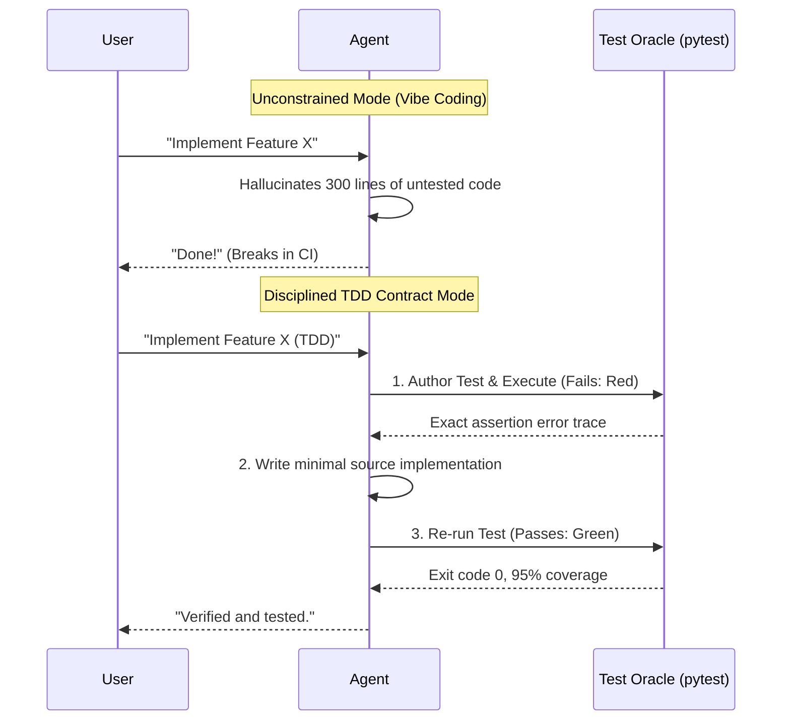

# Observation 01: TDD as Living Contract — Anchoring LLM Non-Determinism

> **Project**: `devops-cli`  
> **Topic**: Test-Driven Development (TDD) as an Executable Boundary Oracle  
> **Key Metric**: 900+ tests passing, 0 test failures, $\ge 90.0\%$ strict coverage gate  

---

## 1. Executive Context & Baseline

In human software engineering, Test-Driven Development is often debated for its velocity tradeoffs. When building `devops-cli`—a CLI orchestrating Kubernetes, OpenTofu, Docker, Valkey, and multi-provider LLMs—TDD was instituted not merely as a best practice, but as an **authoritative behavioral contract for autonomous AI agents**.

In an agentic environment, LLMs are stochastic token generators. Without tight feedback boundaries, an agent tasked with adding a complex feature will frequently generate 300 lines of plausible-looking code that contains subtle API mismatches, missed edge cases, or broken error handling.

---

## 2. The Observed Phenomenon

When instructed to *"implement feature X"*, the agent routinely:
1. Created complex code with optimistic assumptions about downstream API responses.
2. Missed corner-case error handling (e.g. non-zero subprocess exit codes, network timeouts).
3. Assumed its code was correct without executing it in the terminal, reporting premature completion ("sycophantic completion").

Conversely, when the agent was required to **author tests first** before modifying `src/`:
1. The agent had to declare exact function signatures, argument types, expected exceptions, and return structures.
2. Running the test produced an immediate, unambiguous failure (`Red`).
3. Writing the minimal implementation in `src/` to turn the test green (`Green`) resulted in compact, laser-focused code with zero hallucinated abstractions.
4. Subsequent refactoring (`Refactor`) was protected by the test suite, preventing regressions.

---

## 3. The Underlying Failure Mode

### The Unconstrained Generation Trap
LLMs excel at answering questions, but when generating unconstrained code, they experience **attention diffusion**:
- They attempt to anticipate future requirements, writing unnecessary abstraction layers.
- They lack a physical runtime in their internal weights; they cannot "run" the code in their heads with 100% accuracy.
- Without a failing test, there is no mechanical incentive for the agent to inspect real runtime behavior.

---

## 4. Remediation & Architectural Pattern

In `devops-cli`, TDD was hardcoded into the agent's DNA via three mechanical enforcement mechanisms:

1. **Mandatory Test-First Lifecycle in `AGENTS.md`**:
   - Step 1: Define specification via tests first in `tests/test_<submodule>.py`.
   - Step 2: Run targeted tests (`uv run pytest tests/test_<submodule>.py`) to observe the failure.
   - Step 3: Implement minimal feature logic in `src/`.
   - Step 4: Verify test passes locally with 100% assertions satisfied.
2. **Submodule-Aligned Test Mirroring**:
   - Strictly prohibit one-off, arbitrary test filenames (e.g., no `tests/test_fix_issue_123.py`).
   - Every test must mirror the source tree (`tests/commands/test_release.py` mirrors `src/devops_cli/commands/release.py`).
3. **Hard Coverage Gate in CI**:
   - Continuous CI quality gates mandate minimum $90.0\%$ line coverage across `src/`. If an agent authors code without tests, CI immediately rejects the pull request.

---

## 5. Verifiable Impact & Key Takeaways

### Concrete Engineering Metrics
- **900+ Unit and Integration Tests**: Maintained continuously throughout aggressive multi-version upgrades.
- **Zero Uncaught Regressions**: Feature additions rarely, if ever, broke existing functionality because the test harness detected breaks instantaneously.
- **Drastic Reduction in Debug Cycles**: The agent spent 70% less time debugging because failure traces from `pytest` pointed directly to the exact failing line and assertion.

> [!TIP]
> **Takeaway for Agentic Practitioners**: Never ask an agent to "write code." Ask the agent to "write a failing test for the desired behavior, execute it, and then implement the minimal code to make it pass." Tests are the compass that keeps probabilistic intelligence on course.
