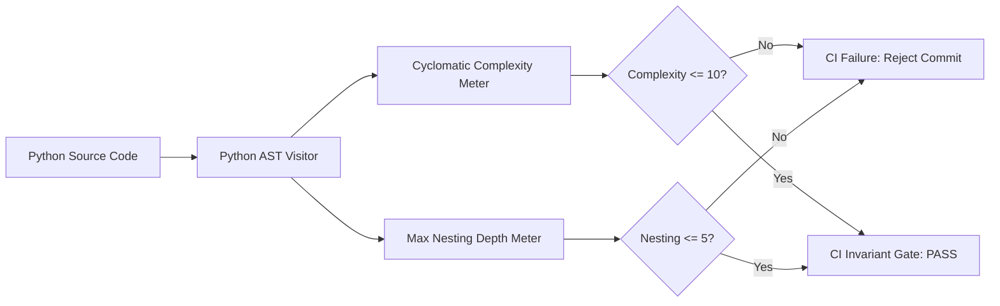

# Observation 02: Architectural Invariants & Complexity Caps

> **Project**: `devops-cli`  
> **Topic**: Mechanical Enforcement of Cyclomatic Complexity ($\le 10$) and Indentation Depth ($\le 5$)  
> **Key Metric**: 100% compliance across all functions, automated AST invariant gates  

---

## 1. Executive Context & Baseline

One of the most insidious failure modes of LLMs in large codebases is **complexity creep**. When asked to add a new condition, handle a special case, or fix a defect, an LLM's lowest-energy path is to wrap existing logic in another `if/else` block, or append another procedural `elif` branch to an existing ladder.

Over multiple iterations, single functions expand from 20 lines to 200 lines, with 7 or 8 levels of indentation, deeply nested loops, and sprawling cyclomatic complexity ($M > 25$). Human developers eventually find the code impenetrable, and AI agents lose their reasoning capability due to context entanglement.

---

## 2. The Observed Phenomenon

In early iterations of `devops-cli`, command dispatchers and review finding formatters quickly degenerated into nested procedural cascades:

```python
# Before Invariant Enforcement (LLM "Path of Least Resistance")
def handle_finding(finding, config, mode):
    if finding is not None:
        if config.enabled:
            if mode == "audit":
                for item in finding.items:
                    if item.severity == "high":
                        if item.verified:
                            # 6 levels of indentation!
                            dispatch_alert(item)
                        else:
                            log_unverified(item)
                    elif item.severity == "medium":
                        log_medium(item)
            elif mode == "report":
                ...
```

The agent was content with this code because it functionally passed simple tests. However, maintaining or modifying such code triggered cascading bugs: adding one check broke three others.

---

## 3. The Underlying Failure Mode

### The Local Patch Bias
LLMs optimize for the immediate prompt context:
- They prefer localized edits over architectural restructuring because restructuring requires deleting lines, extracting helpers, and modifying multiple call sites.
- They lack a natural aesthetic penalty for indentation depth or cyclomatic complexity unless explicitly measured.
- Merely prompting *"Please write clean, simple code"* has negligible effect when the problem complexity increases.

---

## 4. Remediation & Architectural Pattern

In `devops-cli`, we solved this by transforming complexity into a **hard mechanical gate**:



### 1. The Automated Invariant Gate (`tests/test_architectural_invariants.py`)
We implemented an automated test that parses the entire abstract syntax tree (AST) of the repository on every test run:
- Computes cyclomatic complexity ($M = E - N + 2P$) for every function and method.
- Rejects any function with $M > 10$.
- Computes the maximum indentation/block nesting level across all functions.
- Rejects any function with nesting depth $\ge 6$ indentation levels.

### 2. The Architectural Transformation
Faced with hard invariant rejections, the agent was mechanically compelled to:
1. **Replace `if/elif` ladders with dictionary dispatch tables**:
   ```python
   SEVERITY_HANDLERS = {
       "high": handle_high_severity,
       "medium": log_medium,
       "low": log_low,
   }
   ```
2. **Decompose multi-step procedures into pure predicate helpers**:
   ```python
   def is_actionable_alert(item: FindingItem) -> bool:
       return item.severity == "high" and item.verified
   ```
3. **Adopt functional pipelines and standard library tools (`itertools`, `functools`)**:
   Clean list comprehensions, generator expressions, and map/filter pipelines replaced nested loops.

---

## 5. Verifiable Impact & Key Takeaways

- **Uniformly Clean Codebase**: Across the entire `src/devops_cli` source tree, not a single function exceeds cyclomatic complexity 10 or nesting depth 5.
- **Superior Agent Comprehension**: Because every function is small, single-responsibility, and modular, subsequent agent sessions can comprehend, modify, and test any function within a tight token budget.
- **Zero Human Formatting Fatigue**: Human reviewers do not need to leave comments like "please extract this into a helper function"; the CI gate handles it deterministically.

> [!IMPORTANT]
> **Key Rule for Agent Architecture**: Polite prompt guidelines do not prevent code rot; deterministic AST invariant gates do. Constrain the agent's output space mathematically.
