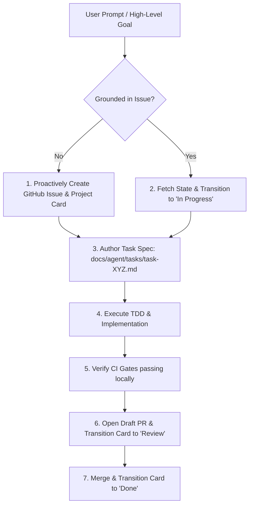

# Observation 03: Autonomous Project Governance & Grounded Lifecycle

> **Project**: `devops-cli`  
> **Topic**: Grounding Agent Sessions into GitHub Projects v2 and Structured Task Files  
> **Key Metric**: Zero ungrounded tasks, 100% issue-to-commit traceability  

---

## 1. Executive Context & Baseline

A major hurdle in long-horizon autonomous software engineering is **agent amnesia and drift**. In complex projects spanning dozens of pull requests, multiple contributors, and deep technical debt, an ungrounded AI agent will frequently:
- Jump between unrelated tasks without finishing the first.
- Duplicate previously completed work because it didn't know an issue was already solved.
- Modify files outside the scope of the immediate user prompt.
- Lose track of acceptance criteria mid-session.

To achieve enterprise-grade reliability in `devops-cli`, we introduced **Autonomous Project Governance**: anchoring every agent action into a stateful, external project board.

---

## 2. The Observed Phenomenon

When agents were required to bootstrap and manage their own GitHub Project cards:
1. **Self-Focus**: The agent had to articulate acceptance criteria and define what "Done" looked like before writing any code.
2. **Context Persistence**: The task file (`docs/agent/tasks/task-<issue>-<slug>.md`) survived session restarts, allowing subsequent agents to resume work seamlessly.
3. **Observability for Humans**: The human engineering lead could glance at the GitHub Projects v2 board at any moment and see exactly which issues were in progress, blocked, or in review.

---

## 3. The Underlying Failure Mode

### The Ephemeral Scratchpad Trap
Without an external ground truth:
- The agent's working memory exists only inside the LLM context window.
- When the context window fills and triggers summarization or a new session is started, context is lost.
- The agent reverts to a blank state and may misinterpret previous partial edits as bugs, rewriting working code.

---

## 4. Remediation & Architectural Pattern

In `devops-cli`, this is codified in `AGENTS.md` through the **Proactive GitHub Project Tracking & Workflow Grounding Mandate**:

### 1. Mandatory Session Bootstrap
At the beginning of every session or upon receiving any user prompt:
- The agent queries active issues and project cards (`devops gh project-status` or FastMCP `gh_project_status`).
- If no issue exists for the requested task, the agent immediately authors a structured issue and places it on the project board.
- The card is transitioned from `Todo` -> `In Progress`.

### 2. Structured Task Artifacts (`docs/agent/tasks/task-XYZ.md`)
Every non-trivial deliverable receives a dedicated markdown file containing:
- Issue title, number, target milestone, and status.
- Key technical challenges and architectural decisions.
- Step-by-step implementation checklist.
- Verification log recording exact command outputs, test run counts, and coverage figures.

### 3. State Transitions & Lifecycle Synchronization
- When opening a pull request: Transition card to `In Review`.
- When CI checks pass and PR is merged: Transition card to `Done`, close the issue, and link the commit SHA.

---

## 5. Verifiable Impact & Key Takeaways

- **Over 200 Traceable Issues**: Every single deliverable in `devops-cli` is linked to an atomic issue, task spec, and PR.
- **Zero Orphaned Code**: No code was committed without a clear rationale and parent issue.
- **Flawless Multi-Agent Handoffs**: When one agent reached token limits or timed out, the next agent resumed by simply reading the task spec and checking the project card.

> [!TIP]
> **Takeaway for Agentic Practitioners**: Treat the project board not as a human management dashboard, but as an external memory bank for your AI agents.
