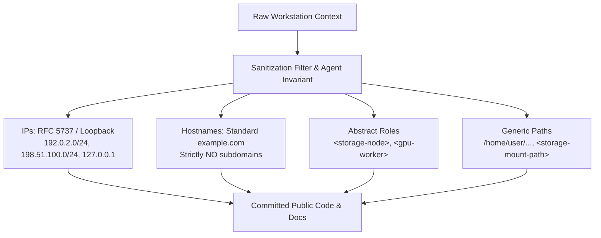

# Observation 04: Zero-Trust Egress & Environment Sanitization

> **Project**: `devops-cli`  
> **Topic**: Eliminating Homelab Leaks, Private IP Disclosure, and Standardizing Mock Data  
> **Key Metric**: Zero leaked secrets/IPs across 200+ issues and public repositories  

---

## 1. Executive Context & Baseline

When autonomous agents are granted terminal access to local workstations, dev containers, and private cloud clusters, they inevitably encounter sensitive runtime context:
- Private IP addresses (`192.168.1.x`, `10.0.x.x`).
- Internal network DNS names (`*.lan`, `*.local`, physical machine hostnames).
- Real infrastructure mount points (`/mnt/nvme0n1/`, `/dev/sdX`).
- Local user account paths and shell environment variables.

If left unchecked, agents will casually copy-paste real environment details into public documentation, pull request descriptions, task tracking files, and mock unit tests.

---

## 2. The Observed Phenomenon

During initial experiments with autonomous documentation generation and test creation, the agent naturally used whatever strings it saw in the active environment:
- Unit tests hardcoded URLs like `http://192.168.1.150:11434` or `http://vault.internal.lan`.
- Markdown tasks recorded actual workstation hostnames and file system paths.
- Dummy test endpoints used arbitrary random domains (e.g., `http://mytestapp.com`, `http://fake-vault.io`), which risked collision with real external domains or leaking intent.

In an open-source project, this is a severe security and operational hazard (CWE-200 / CWE-209).

---

## 3. The Underlying Failure Mode

### The Context Mimicry Trap
LLMs are contextual mimicry engines:
- They prioritize immediate token context over abstract security boundaries.
- If a terminal output contains `node1.homelab.lan:30500`, the LLM considers that string high-relevance and recycles it when writing examples or mock fixtures.
- The LLM does not distinguish between ephemeral workstation reality and committed public repository artifacts unless strictly commanded by an immutable rule.

---

## 4. Remediation & Architectural Pattern

In `devops-cli`, we codified the **Zero Information Leakage & Comprehensive Environment Sanitization Mandate**:

### 1. Mandatory Documentation Placeholders & Standards
- **IP Addresses**: Strictly restricted to RFC 5737 blocks (`192.0.2.0/24`, `198.51.100.0/24`, `203.0.113.0/24`) or loopback (`127.0.0.1` / `localhost`). Private RFC 1918 IPs (`10/8`, `172.16/12`, `192.168/16`) are strictly prohibited in committed code.
- **Mock Domain Standardization**: Standardize all mock and dummy URLs to `example.com` with **no subdomains** (e.g. `http://example.com/api`, never `api.example.com` or `test.example.com`). This completely eliminates DNS leakage and inconsistent test fixtures.
- **Abstract Role Notation**: Concrete servers are always referred to by role abstractions: `<gpu-node>`, `<storage-node>`, `<ingress-host>`.

### 2. Committed vs. Runtime Config Segregation
- `config.example.yaml`: Committed repository template containing only generic or `localhost` endpoints.
- `config.yaml`: Uncommitted, `.gitignored` local runtime file that remains the exclusive property of the developer's workstation. Agents are forbidden from overwriting or resetting user runtime configurations.

### 3. Automated Pre-Push Secret & Sanitization Scans
- CI runs `devops scan gitleaks` and custom regex sanitization checks prior to allowing any push.

---

## 5. Verifiable Impact & Key Takeaways

- **Zero Information Leakage**: Complete sanitization across all public repositories, PRs, and release notes.
- **High Portability**: Test fixtures running against `http://example.com` execute reliably in any CI environment without network dependency or DNS resolution failures.
- **Mental Clarity**: Eliminates ambiguity over whether an endpoint in documentation is real or illustrative.

> [!IMPORTANT]
> **Key Rule for Agentic Infrastructure**: Never allow agents to invent random mock domains or recycle local IP addresses. Enforce RFC 5737 and standard `example.com` across all tests and documentation.
