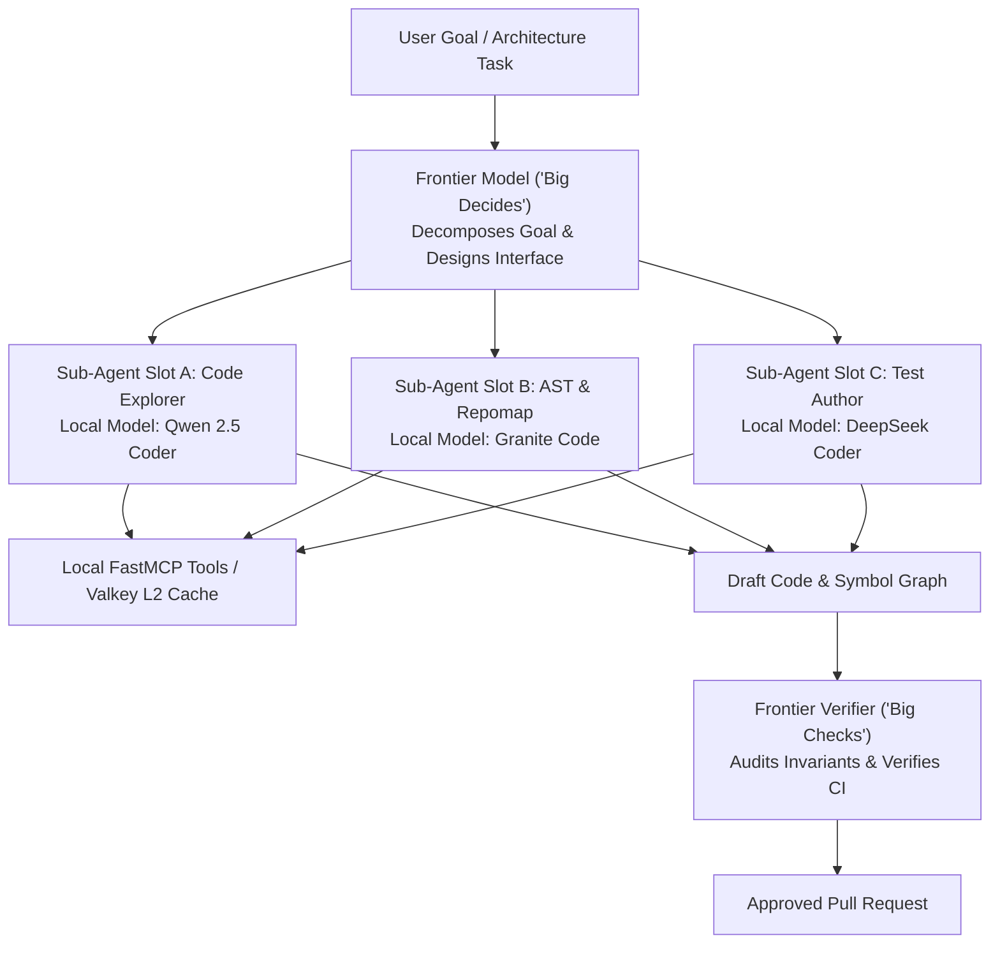

# Observation 05: Harness Slots & Sub-Agent Offloading

> **Project**: `devops-cli`  
> **Topic**: Multi-Tier Model Topologies ("Big Decides, Small Types, Big Checks")  
> **Key Metric**: 85%+ token cost reduction, sub-second symbol search latency  

---

## 1. Executive Context & Baseline

As autonomous agents tackle large enterprise repositories, token consumption becomes a severe bottleneck. A standard architectural task—such as refactoring an AST parser or auditing security policies across 50 files—requires reading tens of thousands of lines of context.

Relying exclusively on expensive frontier models (such as Claude 3.5 Sonnet, GPT-4o, or Gemini 1.5 Pro) for every file read, grep search, and symbol lookup leads to:
- Rapid quota exhaustion and API rate-limiting stalls.
- Astronomical inference costs ($10–$50 per refactoring session).
- High round-trip latency for mundane tasks.

---

## 2. The Observed Phenomenon

Analysis of agent session transcripts revealed an acute economic imbalance:
- **80% of all tokens** were consumed reading file trees, parsing AST symbols, formatting terminal output, and executing mechanical linting loops.
- Only **20% of tokens** were spent on true high-complexity architectural reasoning, boundary design, and root-cause hypothesis generation.

Using a frontier model to parse AST nodes is the equivalent of hiring a senior enterprise architect to copy-paste numbers into a spreadsheet.

---

## 3. The Underlying Failure Mode

### The Monolithic Orchestrator Trap
Traditional agent frameworks use a single model for the entire session lifecycle:
- The orchestrator maintains one giant context window.
- The model must repeatedly ingest full file contents into working memory to answer trivial questions like *"Which class inherits from BaseCommand?"*.
- The model's reasoning degraded as the context window saturated ("lost in the middle").

---

## 4. Remediation & Architectural Pattern

In `devops-cli`, we designed the **Agent Harness Slot & Constellation Architecture**:

### 1. Swappable Harness Slots
We decoupled the execution environment into four independent slots:
- **Model Slot**: Dynamic routing between local Ollama endpoints (`granite3.1-dense:8b`, `qwen2.5-coder:14b`) and frontier cloud APIs.
- **Skill Slot**: Domain-specific playbooks loaded on demand.
- **Tool Slot**: FastMCP servers exposing native CLI tools.
- **Sub-Agent Slot**: Ephemeral worker agents spawned for bounded, token-intensive tasks.

### 2. "Big Decides, Small Types, Big Checks"
- **Big Decides (Frontier)**: The frontier model evaluates the issue, formulates the architectural plan, and defines the test interfaces.
- **Small Types (Local Open Weights)**: Ephemeral local sub-agents are dispatched to explore the filesystem, extract AST symbols, unpack context, and draft implementation chunks.
- **Big Checks (Frontier)**: The frontier model conducts final verification, reviews test coverage, checks architectural invariants, and approves the diff.

---

## 5. Verifiable Impact & Key Takeaways

- **85%+ Reduction in Cloud Token Costs**: Mechanical context-packing was shifted entirely to local workstation GPUs (Ollama) or low-cost fast inference.
- **Sub-Second Symbol Lookup**: Querying local Valkey L2 embedding caches and Tree-Sitter AST indices eliminated cloud API latency.
- **Resilience Against Outages**: If the cloud provider experienced service disruptions or rate limits, the local harness continued performing code indexing and test authoring locally.

> [!TIP]
> **Takeaway for Agentic Practitioners**: Do not burn frontier reasoning tokens on file reading and regex searching. Offload the mechanical chores to local open models, and reserve the frontier engine for planning and verification.
