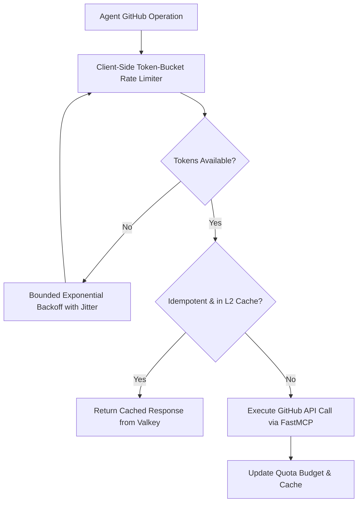

# Observation 06: Rate Limits & Anti-Brittle Heuristics

> **Project**: `devops-cli`  
> **Topic**: Surviving External API Quotas & Eliminating Ad-Hoc Pattern Guessing  
> **Key Metric**: Zero 429 quota exhaustion errors, zero regressions from brittle string slicing  

---

## 1. Executive Context & Baseline

Autonomous software engineering agents interact heavily with external APIs: GitHub GraphQL and REST endpoints, package registries, container registries, and AI inference APIs. Furthermore, when agents parse code or domain identifiers, they often take brittle shortcuts—matching against arbitrary subsets of strings, prefixes, or regex patterns.

In `devops-cli`, we encountered two related hazards that threatened autonomous stability:
1. **API Rate-Limit Cascades**: Rapid unthrottled bursts of `gh` or GitHub API queries triggered HTTP 429 (`Too Many Requests`) and secondary rate-limit lockouts.
2. **Brittle Pattern Degradation**: Agents wrote fragile heuristic filters (e.g. checking if a branch or identifier starts with `"feat/"` or ends with `".com"` using hardcoded partial lists) that failed silently on valid inputs.

---

## 2. The Observed Phenomenon

### Failure A: The Burst Rate Lockout
An autonomous agent tasked with triaging 20 pull requests fired dozens of concurrent GraphQL queries in tight loops. GitHub's secondary rate limiter intervened, returning HTTP 403 / 429 errors. Without rate limiting, the agent entered an aggressive retry loop, exacerbating the lockout and stalling development for an hour.

### Failure B: The Arbitrary Subset Fallacy
When classifying domains or filtering identifiers, the agent authored heuristics like:
```python
# The Brittle Antipattern: Arbitrary Subsets
KNOWN_TLDS = [".com", ".org", ".net", ".io"]
if any(url.endswith(tld) for tld in KNOWN_TLDS):
    ...
```
This naive logic broke immediately when confronted with `.dev`, `.ai`, `.co.uk`, or internal domains. The agent then "fixed" the bug by adding `.dev` to the list, creating an infinite game of whack-a-mole.

---

## 3. The Underlying Failure Modes

### The Myopic Heuristic Trap
- LLMs naturally generate partial lists based on whatever examples are salient in their immediate context.
- They conflate "sufficient for the test case" with "mathematically closed domain."
- When interacting with external APIs, agents lack awareness of quota reset windows unless explicitly presented with remaining budget headers.

---

## 4. Remediation & Architectural Pattern

In `devops-cli`, we introduced two strict architectural mandates in `AGENTS.md`:



### 1. Mandatory Rate-Limiter Scaffolding (`run_gh`)
- **Strict Prohibition of Bare `gh` Invocations**: Agents are forbidden from invoking raw `gh` commands directly. All GitHub operations must route through native rate-managed commands (`devops gh`, `devops pr`) or FastMCP tools.
- **Client-Side Token-Bucket Pacing**: Requests are metered locally before hitting the wire.
- **Bounded Exponential Backoff with Jitter**: If HTTP 429 occurs, the harness automatically respects `Retry-After` headers or backs off with randomized jitter.
- **Valkey L2 Response Caching**: Idempotent read operations (issue lists, project cards, view specs) are cached locally to reduce network round-trips.

### 2. Strict Prohibition of Brittle Pattern Subsets
- Matching against a list of strings or regular expressions is **ONLY acceptable if it covers 100% of possible scenarios** (i.e. mathematically bounded, closed domains defined by RFCs or deterministic language grammars).
- Matching against an arbitrary subset of a larger or unknown domain is **strictly prohibited**.
- Instead of partial string matching, the agent must use:
  - Language symbol parsers (Python AST, Tree-Sitter).
  - Official registries (Mozilla Public Suffix List via `tldextract`).
  - Standard library parsers (`urllib.parse`, `ipaddress`).
- Any constant list that exists for filtering **MUST reside in `config/constants.py` or `config/defaults.py`** to facilitate comprehensive auditing.

---

## 5. Verifiable Impact & Key Takeaways

- **Zero API Lockouts**: Automated workflows operate continuously without triggering GitHub secondary rate limits.
- **Elimination of Fragile String Bugs**: Replacing naive substring matching with AST visitors and standard parsers eliminated an entire class of recurring regressions.
- **Transparent Quota Telemetry**: Agents proactively inspect `devops gh rate-limit` before launching bulk operations.

> [!IMPORTANT]
> **Key Rule for Agentic Engineering**: Never let an agent guess with arbitrary lists. If the domain is closed, enforce RFC coverage; if open, use an established parser. Protect your APIs with client-side token-bucket limiters.
