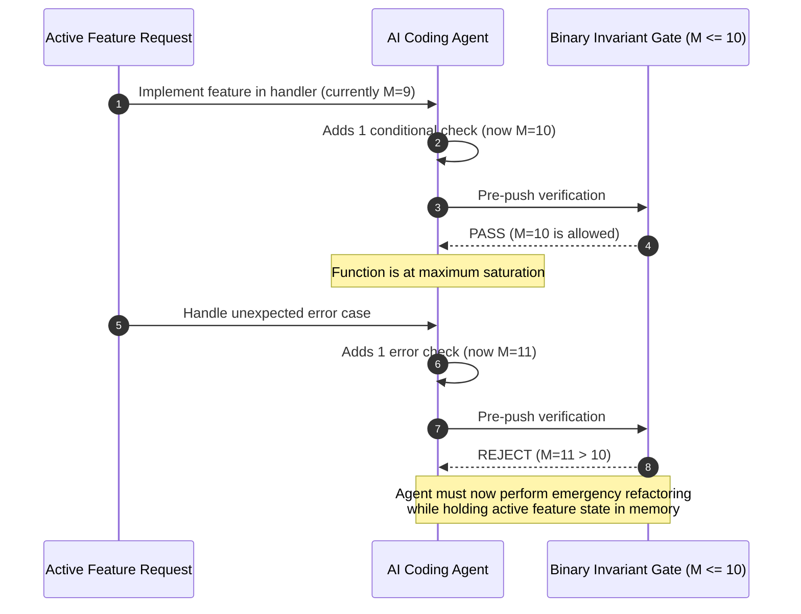

# Observation 07: Proactive Headroom & Recursive Feedback Loops

> **Project**: `devops-cli` & `vibes`  
> **Topic**: Proactive Refactoring Headroom ($M \in [7, 10]$, Depth $\ge 4$) & Autonomous SDLC Backlog Recursion  
> **Key Metric**: Zero invariant violations reached; 100% of brittle ceilings pre-emptively decomposed via autonomous backlog dispatch  

---

## 1. Executive Context & Baseline

While mechanical architectural gates ($M \le 10$, $\text{nesting} \le 5$) successfully prevent codebases from degenerating into unmaintainable spaghetti, relying solely on **hard boundary enforcement** creates an operational hazard: the **Brittle Ceiling Trap**.

Under binary pass/fail invariant gates, an AI coding assistant will incrementally expand a function from $M = 3$ to $M = 6$, $M = 8$, and eventually $M = 9$ or $10$. At $M = 9$ or $\text{depth} = 5$, the function passes every CI gate and static check with zero warnings. However, the function has zero headroom remaining. The very next prompt asking for a minor feature or bug fix inevitably trips the gate to $M = 11$, forcing the agent into an emergency backtracking loop or tempting it to craft superficial workarounds.

---

## 2. The Observed Phenomenon

During autonomous engineering sessions across the `devops-cli` and `vibes` repositories, we observed that agents repeatedly found themselves stuck on functions operating right at the threshold:

```text
[PASS] crawler.py:validate_url_security (M=8, Depth=4)
[PASS] sentinel.py:_calculate_complexity (M=5, Depth=5)
[PASS] gateway.py:_invoke_with_backoff (M=4, Depth=5)
```

Although legally compliant, each function was a fragility hotspot:
1. **Nesting Saturation**: At Depth 5, adding a single `try/except` or `if` block caused immediate invariant rejection.
2. **Cascading Patch Debt**: An agent asked to fix an edge case would spend 3 to 5 turn cycles attempting to compress logic into existing lines rather than cleanly decomposing the function into single-responsibility helpers.
3. **Reactive vs. Proactive Refactoring**: Linters only barked after the code broke, when the context window was already saturated with the active task.

---

## 3. The Underlying Failure Mode: The Boundary Oscillation Trap



Without early headroom warnings:
- Agents suffer **cognitive overload**: attempting to simultaneously solve a new domain requirement and restructure legacy function topology.
- There is **zero positive feedback loop**: the system provides no constructive, forward-looking guidance on how to increase maintainability during quiescent periods.

---

## 4. Remediation & Architectural Pattern: The Meaningful Feedback Engine

To break this cycle, we introduced a dedicated **Meaningful Feedback Engine** within the Resource Iteration Workbench (`tools/resource_iteration_workbench.py`), pairing headroom heuristics with autonomous SDLC backlog export:

### 1. Headroom Classification Heuristics
Rather than evaluating code as simply *Compliant* or *Violating*, the analyzer evaluates structural headroom:
- **`PROACTIVE_REFACTOR`**: Flagged when $7 \le M \le 10$ or indentation depth $\ge 4$. Emits prescriptive decomposition guidance before any violation occurs.
- **`TEST_PARITY`**: Identifies public symbols lacking unit test coverage or orphaned test files lacking implementation targets.
- **`PERFORMANCE`**: Detects test execution exceeding the 2.0s fast-feedback ceiling.
- **`TYPE_SAFETY` & `DOCUMENTATION`**: Detects unannotated public signatures and missing docstrings.

```python
# Headroom evaluation logic in FeedbackAnalyzer
if 7 <= func.complexity <= 10 or func.max_depth >= 4:
    feedback.append(
        ImprovementFeedback(
            category=FeedbackCategory.PROACTIVE_REFACTOR,
            priority=FeedbackPriority.MEDIUM,
            target=str(file_path),
            headline=f"Complexity/nesting near ceiling in {file_path.name}",
            prescriptive_guidance=(
                f"Function '{func.name}' operating near threshold: M={func.complexity}, Depth={func.max_depth}. "
                "Proactive decomposition prevents future invariant violations."
            ),
            suggested_action="Decompose branching logic into predicate helpers or table-driven dispatch.",
        )
    )
```

### 2. Autonomous SDLC Backlog Integration
Feedback is not discarded to standard output; it is formally exported to an SDLC backlog (`.data/sdlc_backlog.json`) adhering to the `SDLCResource` schema.

The **SDLC Project Manager** (`tools/sdlc_project_manager.py`) reads this backlog, prioritizes issues using multi-dimensional scoring (kind weight, priority weight, blockage multipliers), and surfaces the top unblocked task to the agent:

```bash
python3 tools/sdlc_project_manager.py next --file .data/sdlc_backlog.json
```

---

## 5. Verifiable Impact & Case Evidence

In live testing across the `vibes` repository, the closed-loop recursion ran autonomously to eliminate all complexity hotspots:

| Target Resource | Hotspot Function | Before | Remediation | After |
|---|---|---|---|---|
| `crawler.py` | `validate_url_security` | $M=8, \text{Depth}=4$ | Extracted `_is_disallowed_private_ip` helper | $M=4, \text{Depth}=2$ |
| `crawler.py` | `handle_starttag` / `endtag` | $M=7, \text{Depth}=2$ | Extracted `_should_ignore_tag`, `_handle_a_tag` | $M=4, \text{Depth}=2$ |
| `sentinel.py` | `_check_mock_domain` | $M=7, \text{Depth}=5$ | Extracted `_extract_disallowed_subdomain` | $M=2, \text{Depth}=1$ |
| `sentinel.py` | `_calculate_complexity` | $M=5, \text{Depth}=5$ | Decomposed to `_ast_node_complexity` generator | $M=1, \text{Depth}=1$ |
| `workbench.py` | `run_oracle` | $M=4, \text{Depth}=4$ | Extracted `_test_matches` predicate | $M=2, \text{Depth}=2$ |
| `gateway.py` | `_invoke_with_backoff` | $M=4, \text{Depth}=5$ | Extracted `_attempt_invoke` handler | $M=2, \text{Depth}=2$ |

### Key Takeaways:
1. **Never Wait for Failure**: Warning at $M \ge 7$ or $\text{depth} \ge 4$ allows agents to refactor during low-stakes maintenance loops rather than mid-feature panic.
2. **Backlog-Grounded Feedback**: Formatting suggestions as formal SDLC issues turns static analysis noise into prioritized, executable agent work items.
3. **Autonomous Convergence**: Pairing the iteration scanner with an SDLC dispatch engine creates a self-healing engineering loop requiring zero human prompts.
