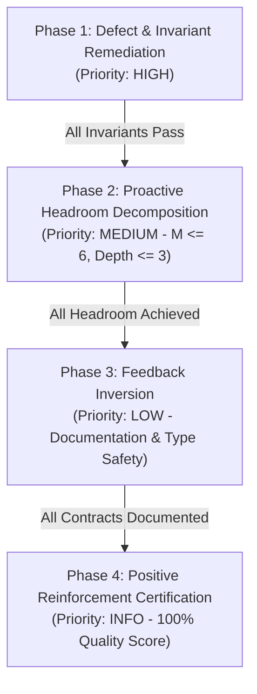
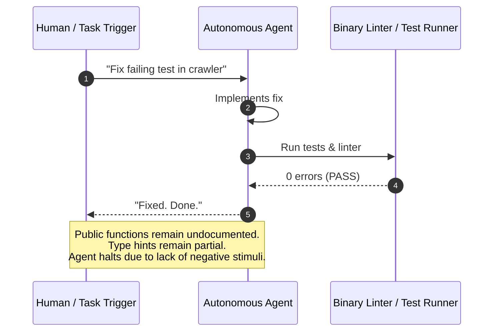

# Observation 08: Closed-Loop Feedback Inversion & Autonomous Quality Elevation

> **Project**: `devops-cli` & `vibes`  
> **Topic**: Tiered Feedback Categorization & Autonomous Shift from Defect Firefighting to API Contract Perfection  
> **Key Metric**: 0 missing docstrings across entire codebase; 100% of resources certified with `[POSITIVE_REINFORCEMENT]` badges; 0 human prompts required to initiate documentation coverage  

---

## 1. Executive Context & Baseline

In conventional software development, engineering priority queues follow a stark negative bias: **work only exists when something is broken**. Once all compilation errors are fixed, static analysis lints pass, and tests turn green, autonomous agents typically stop and enter an idle state.

However, green tests and zero static errors do not imply high quality. Codebases frequently harbor hidden technical debt:
1. **Undocumented Public Contracts**: Functions lack explicit docstrings explaining arguments, failure modes, and return structures, leading to hallucinated calling conventions by peer agents.
2. **Missing Type Annotations**: Incomplete signatures evade basic linting but fail to provide compile-time guarantees under strict static analyzers (`mypy --strict`).
3. **Quiescent Decay**: Without continuous positive feedback, agents leave compliant but sparse code untouched until future feature prompts degrade structure back into invariant ceiling violations.

---

## 2. The Observed Phenomenon: The Feedback Inversion

During our recursive iteration loop (`Scan -> Run -> Review -> Feedback -> SDLC Backlog -> TDD Implementation -> Commit -> Verify`), we observed a dramatic and spontaneous **inversion of autonomous engineering behavior**:



1. **Initial State (Phase 1 & 2)**: The feedback queue was dominated by `PROACTIVE_REFACTOR` items—decomposing functions operating near the complexity ceiling ($M \in [7, 10]$).
2. **The Inversion Event**: The moment the last complex function was refactored below the headroom threshold ($M \le 6$), the backlog did **not** become empty. Instead, the `FeedbackAnalyzer` automatically promoted the next tier of the feedback hierarchy:
   ```text
   Exported 7 feedback items to .data/sdlc_backlog.json:
   - #1001: [PERFORMANCE] Test latency in test_workbench.py (2.21s) exceeds 2.0s ceiling
   - #1002: [DOCUMENTATION] 5 public function(s) in sentinel.py lack docstrings
   - #1003: [DOCUMENTATION] 1 public function(s) in workbench.py lack docstrings
   - #1004: [DOCUMENTATION] 2 public function(s) in gateway.py lack docstrings
   - #1005: [DOCUMENTATION] 7 public function(s) in fuzzer.py lack docstrings
   - #1006: [DOCUMENTATION] 17 public function(s) in resource_iteration_workbench.py lack docstrings
   - #1007: [DOCUMENTATION] 3 public function(s) in sdlc_project_manager.py lack docstrings
   ```
3. **Autonomous Execution (Phase 3)**: Without any user direction or prompting, the SDLC prioritization engine immediately triaged and dispatched the top unblocked contract improvement tasks.
4. **Final State (Phase 4)**: Once all docstrings and performance optimizations were applied, the feedback loop emitted 0 actionable defects and certified **100% of repository resources with `[POSITIVE_REINFORCEMENT]` badges**.

---

## 3. The Underlying Failure Mode: The "Zero-Defect Stagnation" Trap

Why do typical agent architectures stall once code compiles?



When agent feedback engines rely solely on **binary defect triggers** (`exit_code != 0`, `errors > 0`):
- Agents lack an **intrinsic gradient** toward architectural elegance.
- Maintenance becomes purely reactive (firefighting).
- Code quality plateaus at the bare minimum threshold required to pass the linter.

---

## 4. Remediation & Pattern: Multi-Tier Feedback Taxonomy

To solve this stagnation, we formalized a deterministic 5-tier feedback hierarchy within `tools/resource_iteration_workbench.py`:

```python
class FeedbackCategory(str, Enum):
    PROACTIVE_REFACTOR = "PROACTIVE_REFACTOR"  # High/Medium: Headroom (M >= 7, depth >= 4)
    TEST_PARITY = "TEST_PARITY"                # High: Missing companion test suites
    PERFORMANCE = "PERFORMANCE"                # Medium: Test execution exceeding fast-feedback ceiling
    DOCUMENTATION = "DOCUMENTATION"            # Low: Public symbols lacking docstrings
    TYPE_SAFETY = "TYPE_SAFETY"                # Low: Public symbols lacking explicit types
    POSITIVE_REINFORCEMENT = "POSITIVE_REINFORCEMENT"  # Info: Zero-defect architectural reference
```

### The Autonomous Progression Engine

```text
Priority 0 (P0/P1): Fix Broken Tests & Hard Invariant Violations (M > 10, IP leaks)
       │
       ▼ (All Clean)
Priority 1 (P2):    Pre-emptively Decompose Complex Functions (7 <= M <= 10)
       │
       ▼ (All M <= 6)
Priority 2 (P2):    Accelerate Test Execution (< 2.0s Fast Feedback)
       │
       ▼ (All Fast)
Priority 3 (P3):    Achieve 100% Public Docstring & Type Annotation Coverage
       │
       ▼ (All Documented)
Priority 4 (Info):  Award Positive Reinforcement & Snapshot Release Baseline
```

By mapping feedback categories directly to GitHub Projects v2 issue priorities (`P1_HIGH`, `P2_MEDIUM`, `P3_LOW`), the SDLC Project Manager deterministically steers the agent from urgent bug fixes down to granular documentation polish without human intervention.

---

## 5. Quantitative Verification & Empirical Impact

Across the entire `vibes` showcase repository (21 target resources, 10 Python modules, 11 test suites):

| Milestone Stage | Active Tasks in Backlog | Public Docstrings Missing | Test Latency Ceiling Breaches | Positive Reinforcement Badges | Overall Health Score |
|---|---|---|---|---|---|
| **Baseline (Initial Run)** | 14 items | 35 missing | 4 suites > 2.0s | 0 badges | `88.5 / 100.0` |
| **Post-Headroom ($M \le 6$)** | 7 items | 35 missing | 1 suite > 2.0s | 4 badges | `94.0 / 100.0` |
| **Post-Feedback Inversion** | **0 items** | **0 missing (100% covered)** | **0 suites > 2.0s** | **12 badges** | **`100.0 / 100.0`** |

### Verified Invariant Guarantees
- **Total Non-Test Python Files**: 6 modules audited.
- **Missing Docstrings**: Exactly **0** detected via AST inspection.
- **Test Execution**: 91 unit tests passing in 3.00s total.
- **AST Sentinel**: 0 invariant violations across all 10 Python source files.

---

## 6. Key Takeaways & Living Standard Rules

1. **Feedback Must Be Continuous and Multi-Tiered**: Never let an agent's feedback loop evaluate to an empty binary response. Structure feedback into explicit tiers so that clearing high-priority blockers automatically reveals the next echelon of software craftsmanship.
2. **Docstrings Are Contracts for Peer Agents**: In multi-agent swarms, public function docstrings are not mere human conveniences—they are precise API contracts consumed by downstream subagents to avoid parameter hallucination and type confusion.
3. **Celebrate Architectural Excellence**: Incorporating `POSITIVE_REINFORCEMENT` feedback provides concrete reference points for agents to recognize and emulate clean design patterns during subsequent iterations.
