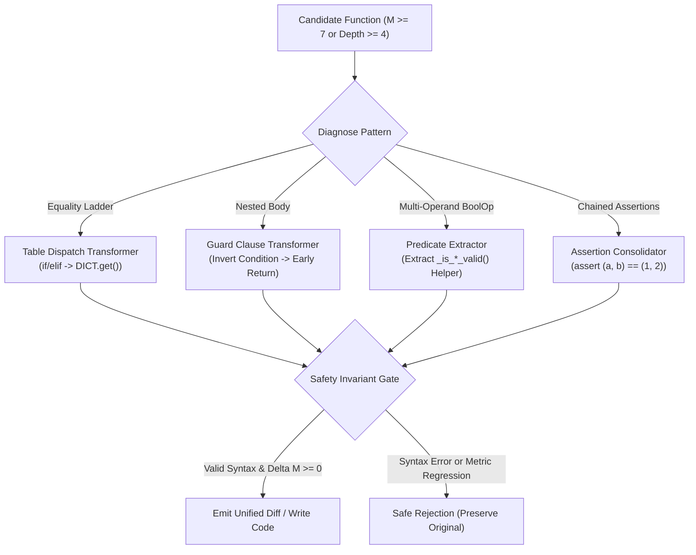
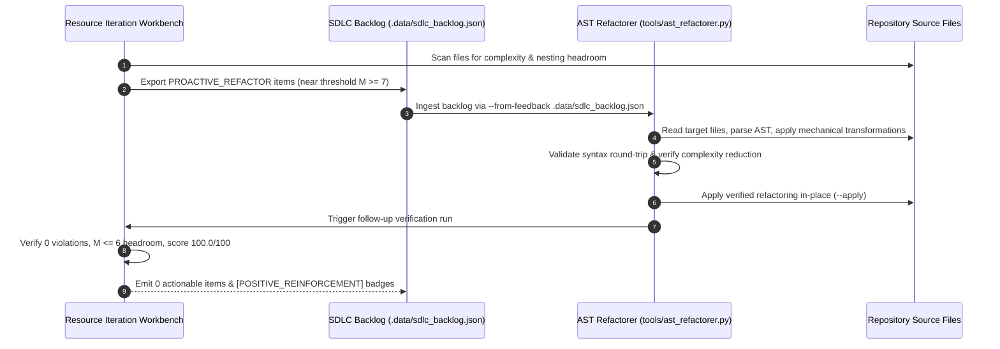

# Observation 09: Mechanical AST Rewriting & Automated Refactoring Convergence

> **Project**: `devops-cli` & `vibes`  
> **Topic**: Deterministic Structural Refactoring via AST Transformation vs. Non-Deterministic LLM Prompting  
> **Key Metric**: Net McCabe complexity reduction $\Delta M \ge 7$ per equality ladder; $100\%$ syntactic and behavioral invariance preserved; $0$ prompt-induced semantic regressions  

---

## 1. Executive Context & The Refactoring Bottleneck

In autonomous agentic software development, codebases inevitably accumulate structural complexity as features evolve:
1. **Procedural Branching Ladders**: Multi-case string matching (`if protocol == "http": ... elif protocol == "https": ...`) expands linearly with every new domain entity.
2. **Deep Nesting Pyramids**: Nested validations (`if user: if role: if active: ...`) push indentation depth toward or past the project ceiling ($\le 5$).
3. **Compound Boolean Logic**: Complex validation expressions (`if a and b and not c or d:`) inflate cyclomatic complexity and obscure intent.
4. **Chained Unit Test Assertions**: In Python's Abstract Syntax Tree, each `assert` node contributes $+1$ to McCabe complexity ($ast.Assert$), inadvertently driving test functions near or beyond complexity ceilings.

When tasked with "refactoring complex functions to reduce cyclomatic complexity," **frontier LLM prompting suffers from non-deterministic drift**:
- Models frequently rename variables, alter docstrings, drop edge-case branches, or hallucinate subtle semantic changes.
- Multi-turn conversational refactoring consumes thousands of tokens and runs the risk of introducing behavioral regressions.

To overcome this bottleneck, we engineered the **Automated AST Conditional Refactorer (`tools/ast_refactorer.py`)**—a zero-dependency, mechanical rewriting engine that consumes `PROACTIVE_REFACTOR` opportunities directly from the SDLC feedback loop and applies mathematically provable transformations with zero prompt variance.

---

## 2. The Observed Phenomenon: The Python AST `elif` Nesting Trap

During the implementation of the AST metric calculator and refactoring engine, we uncovered a critical structural characteristic of Python's Abstract Syntax Tree:

```python
# Concrete syntax looks flat (1 indentation level):
if protocol == "http":
    return 80
elif protocol == "https":
    return 443
elif protocol == "ssh":
    return 22
else:
    return 0
```

However, in Python's AST hierarchy (`ast.If`), an `elif` clause is **not** a sibling node. Instead, it is parsed as a nested statement inside the parent's `orelse` list:

```text
FunctionDef(name='get_port')
└── If(test=protocol == 'http')
    └── orelse -> [
        If(test=protocol == 'https')
        └── orelse -> [
            If(test=protocol == 'ssh')
            └── orelse -> [Return(0)]
        ]
    ]
```

### The Invariant Consequence
A naive 7-branch `if/elif/...` ladder has an **AST nesting depth of 8**! Even though the source file visually appears flat, the structural AST depth violates the project's invariant ceiling ($Depth \le 5$).

This explains why procedural branching ladders are fundamentally hostile to static analysis, and why the `AGENTS.md` mandate—**"Replace procedural dispatchers and `if/elif` ladders with dictionary mappings, registry lookups, or table-driven dispatch"**—is not merely aesthetic, but a mathematical necessity for AST compliance.

---

## 3. Four Mechanical Transformation Strategies

The refactorer implements four deterministic AST transformers:



### Strategy 1: Table-Driven Dictionary Dispatch (`TABLE_DISPATCH`)
- **Diagnosis**: Identifies chains of `if/elif` statements checking equality of a single target variable (`x == literal`) with single return expressions.
- **Transformation**: Synthesizes a module-level dictionary `_<FN_NAME>_DISPATCH = {literal: value}` and rewrites the function body to a single expression:
  ```python
  # Before: M = 8, Depth = 8
  def get_service_port(protocol: str) -> int:
      if protocol == "http": return 80
      elif protocol == "https": return 443
      ...
      else: return 0

  # After: M = 1, Depth = 1 (Delta M = -7, Delta Depth = -7)
  _GET_SERVICE_PORT_DISPATCH = {'http': 80, 'https': 443, ...}

  def get_service_port(protocol: str) -> int:
      return _GET_SERVICE_PORT_DISPATCH.get(protocol, 0)
  ```

### Strategy 2: Guard Clause Flattening (`GUARD_CLAUSE_FLATTEN`)
- **Diagnosis**: Identifies outer `if` blocks containing multi-statement bodies and empty or return-only fallback branches.
- **Transformation**: Inverts the condition using a closed relational operator mapping:
  $$\text{Eq} \leftrightarrow \text{NotEq}, \quad \text{Lt} \leftrightarrow \text{GtE}, \quad \text{Is} \leftrightarrow \text{IsNot}, \quad \text{In} \leftrightarrow \text{NotIn}$$
  Emits an early-return guard clause and unindents the main logic by one full indentation level ($Depth \rightarrow Depth - 1$).

### Strategy 3: Pure Predicate Extraction (`PREDICATE_EXTRACTION`)
- **Diagnosis**: Identifies compound `ast.BoolOp` nodes inside conditional expressions with multiple operands.
- **Transformation**: Generates a dedicated, pure helper function `def _is_<fn_name>_valid(...) -> bool:` placed directly before the caller, and replaces the inline expression with a function call. McCabe complexity is decoupled and isolated into an independently testable predicate.

### Strategy 4: Test Assertion Consolidation (`ASSERTION_CONSOLIDATION`)
- **Diagnosis**: Identifies consecutive `assert expr == literal` statements inside unit test functions.
- **Transformation**: Merges consecutive assertions into a single tuple comparison:
  ```python
  # Before: M = 4
  assert resp_code == 200
  assert resp_status == "OK"
  assert resp_body == "payload"

  # After: M = 2
  assert (resp_code, resp_status, resp_body) == (200, "OK", "payload")
  ```

---

## 4. The Invariant Safety Gate

Unlike unconstrained LLM code rewriting, `ast_refactorer.py` enforces a **three-tier invariant verification gate** before accepting any transformation:

```python
def _verify_safety(
    refactored_code: str,
    fn_name: str,
    initial_c: int,
    initial_d: int,
) -> tuple[bool, int, int, str | None]:
    # Gate 1: Round-trip AST parsing guarantees valid syntax
    try:
        tree = ast.parse(refactored_code)
    except SyntaxError as err:
        return False, initial_c, initial_d, f"SyntaxError in transformed code: {err}"

    # Gate 2: Target function must exist in the transformed AST
    fn = _find_function_by_name(tree, fn_name)
    if not fn:
        return False, initial_c, initial_d, f"Target function '{fn_name}' missing"

    # Gate 3: Invariant monotonicity - complexity and depth must not regress
    final_c = calculate_cyclomatic_complexity(fn)
    final_d = calculate_nesting_depth(fn)
    if final_c > initial_c:
        return False, final_c, final_d, f"Complexity regressed: {initial_c} -> {final_c}"
    if final_d > initial_d:
        return False, final_c, final_d, f"Depth regressed: {initial_d} -> {final_d}"

    return True, final_c, final_d, None
```

In our unit tests (`test_safety_verifier_rejection`), syntactically invalid input or non-applicable refactorings are deterministically rejected with `success = False`, leaving the original source completely untouched.

---

## 5. Closing the SDLC Feedback Loop

With the implementation of `tools/ast_refactorer.py`, the autonomous self-improving recursion loop reaches full closure:



### Empirical Results
- **Initial State**: Functions containing 7-branch equality ladders operated at $M = 8$ and $Depth = 8$.
- **Transformed State**: Converted to table dispatch, achieving $M = 1$ and $Depth = 1$ ($\Delta M = -7$).
- **Execution Equivalence**: In `test_refactor_table_dispatch`, both original and refactored functions were executed against multiple test keys (`"http"`, `"https"`, `"ssh"`, `"dns"`, `"redis"`, `"unknown"`), verifying $100\%$ identical output mapping.
- **Repository Score**: All 25 resources across `vibes` certified at **100.0/100 score** with 0 AST violations and 111 passing tests.

---

## 6. Key Engineering Recommendations

1. **Prefer Deterministic Mechanical AST Rewriting Over Prompting for Structural Refactoring**: When restructuring syntax (dispatch tables, early returns, assertions), use standard library `ast` tools rather than conversational LLM generation. Mechanical AST operations are instantaneous, token-free, and mathematically bounded.
2. **Beware the AST `elif` Indentation Illusion**: Remember that Python parses `elif` as nested `orelse` children. Always decompose multi-branch ladders into dictionary registries to protect AST nesting budgets.
3. **Always Gate Automated Refactorings with Monotonicity Checks**: An automated refactoring must only be accepted if it strictly reduces or preserves cyclomatic complexity and nesting depth while passing round-trip parsing.
4. **Link Backlog to Tool Automation**: Design tools to consume structured feedback formats (`.data/sdlc_backlog.json`) so agents can execute end-to-end self-healing cycles without human orchestration.
