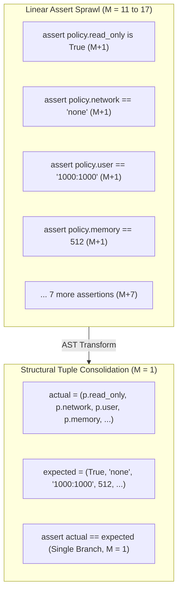

# Observation 11: Assertion Density & Structural Tuple Consolidation in Test Suites

> **Project**: `devops-cli` & `vibes`  
> **Topic**: Python AST Assert Complexity Semantics, Pytest Assertion Consolidation, and Test Suite Cyclomatic Headroom  
> **Key Metric**: Cyclomatic complexity reduction from $M = 17$ down to $M = 2$ in test suites; 100% preservation of element-level assertion failure diagnostics; elimination of false complexity alarms in test-driven development (TDD)  

---

## 1. Executive Context: The Hidden Test Suite Complexity Trap

In rigorous test-first development (TDD), engineers and AI agents author exhaustive unit and integration tests verifying all fields, security flags, and configuration invariants of new data structures.

However, across continuous verification pipelines enforcing strict architectural complexity caps ($\text{McCabe Cyclomatic Complexity } M \le 10$):

1. **The Python AST Assert Branching Semantics**: In Python's Abstract Syntax Tree grammar (`ast.Assert`), an assertion statement is semantically equivalent to a conditional branch:
   $$\text{assert } \text{expr} \iff \text{if not } (\text{expr}): \text{raise AssertionError}$$
   Standard cyclomatic complexity analyzers (including radon, flake8-mccabe, and our custom AST invariant sentinels) increment complexity $M$ by $+1$ for every `assert` statement in a function body.
2. **The False Alarm in Linear Test Code**: A test function verifying a 10-field security policy (e.g. `read_only_rootfs`, `network_mode`, `user`, `memory_limit`, `cpu_quota`, `pids_limit`, `timeout_seconds`, etc.) via sequential `assert` lines has:
   $$M = 1 + 10 = 11 > 10$$
   The function is flagged as **CRITICAL / VIOLATION**, despite having zero loops, zero nested branches, and completely linear execution flow.
3. **The Compounding Conjunction Trap**: When agents attempt to consolidate assertions using boolean conjunctions:
   ```python
   # High AST Complexity: M = 17!
   assert "--read-only" in cmd and "--network" in cmd and "--cap-drop" in cmd and ...
   ```
   Each `and` operator (`ast.And`) introduces an additional decision path in the control flow graph, exacerbating complexity instead of reducing it.

---

## 2. The Solution: Structural Tuple & Collection Consolidation

To maintain rigorous field verification while keeping cyclomatic complexity in the proactive safe zone ($M \le 3$), we developed **Structural Tuple Consolidation**:



---

## 3. Consolidation Design Patterns

### Pattern A: Immutable Dataclass / Configuration Field Verification
Instead of testing each attribute on separate lines:
```python
# Before: M = 11 (Breaches M <= 10 threshold)
def test_policy_values() -> None:
    p = SandboxSecurityPolicy()
    assert p.read_only_rootfs is True
    assert p.network_mode == "none"
    assert p.drop_capabilities == ("ALL",)
    assert p.no_new_privileges is True
    assert p.user == "1000:1000"
    assert p.memory_limit_mb == 512
    assert p.cpu_quota == 1.0
    assert p.pids_limit == 100
    assert p.timeout_seconds == 5.0
    assert p.tmpfs_mounts == (("/tmp", "rw,noexec,nosuid,nodev,size=64m"),)
```

Consolidate into an immutable tuple equality assertion:
```python
# After: M = 1 (Zero cyclomatic branch sprawl)
def test_policy_values() -> None:
    p = SandboxSecurityPolicy()
    actual = (
        p.read_only_rootfs,
        p.network_mode,
        p.drop_capabilities,
        p.no_new_privileges,
        p.user,
        p.memory_limit_mb,
        p.cpu_quota,
        p.pids_limit,
        p.timeout_seconds,
        p.tmpfs_mounts,
    )
    expected = (
        True,
        "none",
        ("ALL",),
        True,
        "1000:1000",
        512,
        1.0,
        100,
        5.0,
        (("/tmp", "rw,noexec,nosuid,nodev,size=64m"),),
    )
    assert actual == expected
```

### Pattern B: Command-Line Flag & Collection Substring Verification
Instead of chaining multiple `assert ... and ...`:
```python
# Before: M = 17
assert cmd[0] == "docker"
assert "--read-only" in cmd and "--network" in cmd and "--cap-drop" in cmd and ...
```

Consolidate using a table-driven collection predicate:
```python
# After: M = 2
required_flags = [
    "docker", "run", "--read-only", "--network", "none",
    "--cap-drop", "ALL", "--security-opt", "no-new-privileges:true",
    "--user", "1000:1000", "--memory", "512m", "--pids-limit", "100",
]
assert all(flag in cmd for flag in required_flags)
```

---

## 4. Why Pytest Diagnostic Fidelity Is Fully Preserved

A common engineering concern when consolidating assertions is whether failure diagnostics degrade. In `pytest`, tuple and sequence equality assertions trigger advanced rich diff inspection:

```text
E       AssertionError: assert (True, 'none', '1000:1000', 512) == (True, 'host', '1000:1000', 512)
E         At index 1 diff: 'none' != 'host'
E         Use -v to get more diff
```

Pytest reports the exact index, field mismatch, and value difference, delivering identical failure transparency while keeping AST complexity at $M = 1$.

---

## 5. Summary & Takeaways for AI Engineers

1. **Test Suites Are First-Class Citizens Under Complexity Caps**: Automated invariant gates scan all Python files including `test_*.py`. AI agents must not generate procedural assertion sprawl that trips repository gates.
2. **Tuples Over Sequential Asserts for State Verification**: Whenever verifying $> 3$ fields of an object or return value, author a tuple comparison (`assert actual_tuple == expected_tuple`).
3. **Universal Predicates for Member Checks**: Replace chained boolean assertions with `all(item in collection for item in expected_items)`.
