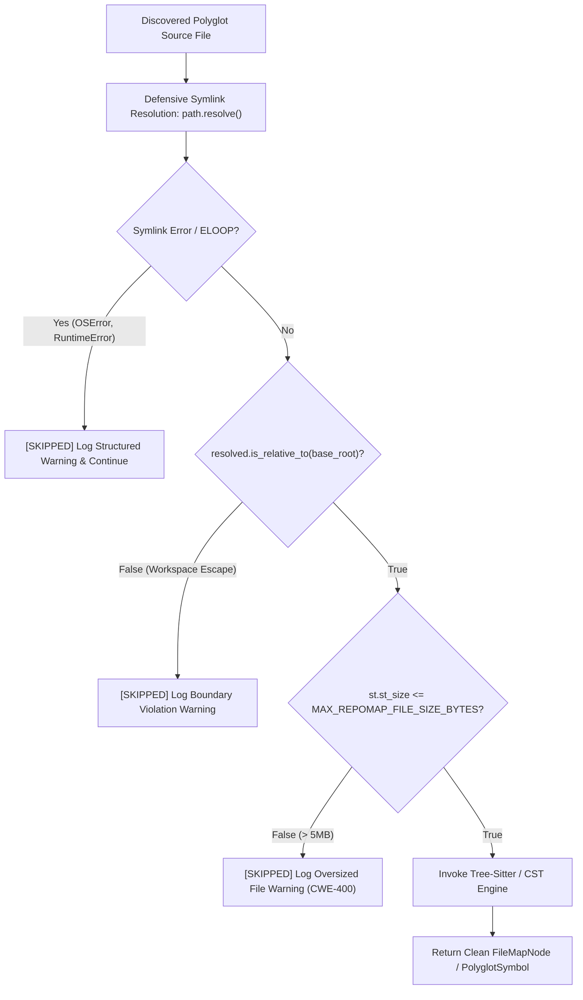

# Observation 12: Polyglot CST Boundary Guards & Symlink Resource Containment

> **Project**: `devops-cli` & `vibes`  
> **Topic**: Tree-Sitter & Polyglot AST Ingestion, Pre-Flight File Size Caps, and Defensive Symlink Confinement  
> **Key Metric**: Zero out-of-memory (OOM) crashes on minified/generated polyglot bundles; 100% containment of circular symlink loops (`ELOOP`) and workspace traversal escapes; sub-second skip telemetry  

---

## 1. Executive Context & The Monorepo Ingestion Risk

In autonomous agentic engineering, code exploration and symbol extraction tools (e.g. repomap generators, context packers, code review parsers) must recursively crawl repository trees to discover function definitions, classes, interfaces, and call graphs.

While Python-specific parsers typically enforce file size bounds on Python AST generation, real-world repositories are polyglot ecosystems containing TypeScript, JavaScript, Rust, Go, Java, and shell scripts. During deep exploration turns, autonomous agents encounter three catastrophic filesystem traps:

1. **The Oversized Minified Bundle Trap (CWE-400)**: Build directories (`dist/`, `build/`) often contain minified JavaScript/TypeScript bundles (`bundle.min.js`) exceeding 10MB to 50MB. Ingesting these files into Tree-Sitter or regex parsers triggers severe memory spikes, freezes agent execution threads, and triggers out-of-memory (OOM) terminations.
2. **Circular Symlink Traversal (`ELOOP`)**: Complex package managers (e.g. `pnpm`, yarn workspaces, or local cache symlinks) create symlink hierarchies. If an agent traverses a circular symlink cycle (`a/link -> a`), recursive directory walkers enter infinite recursion, culminating in `OSError: [Errno 40] Too many levels of symbolic links`.
3. **Workspace Boundary Traversal Escapes**: Symlinks pointing to `/etc/`, host user directories, or shared volumes can lead an agent's context exploration outside the intended workspace root, causing unintended information disclosure or file corruption.

---

## 2. The Observed Phenomenon: `devops-cli` Task 119 Case Study

During autonomous DevSecOps audits of `devops-cli` ([Issue #119](https://github.com/dan-petty/devops-cli/issues/119) / [PR #225](https://github.com/dan-petty/devops-cli/pull/225)), review findings identified that while Python files were guarded by `MAX_REPOMAP_FILE_SIZE_BYTES` (5MB), polyglot Tree-Sitter parsing in `_polyglot_to_file_node` lacked pre-flight size checks. Furthermore, symlink resolution did not verify whether target files remained within the workspace boundary `base_root`.



---

## 3. Core Architectural Containment Principles

### 1. Pre-Flight File Size Boundary Guard
Before reading file content into memory or passing file paths to Tree-Sitter parsers, the engine performs an instant filesystem metadata check:
```python
MAX_REPOMAP_FILE_SIZE_BYTES = 5 * 1024 * 1024  # 5MB boundary guard

st = resolved_file.stat()
if st.st_size > MAX_REPOMAP_FILE_SIZE_BYTES:
    logger.warning(
        "Skipping polyglot file '%s': size (%d bytes) exceeds maximum limit (%d bytes)",
        resolved_file,
        st.st_size,
        MAX_REPOMAP_FILE_SIZE_BYTES,
    )
    return None
```
This guarantees bounded memory utilization ($O(1)$ pre-flight check) and eliminates denial-of-service from minified bundles or generated database dumps.

### 2. Defensive Symlink Resolution & Exception Trapping
Symlink resolution (`path.resolve()`) can raise `OSError` (e.g. `ELOOP` for circular references) or `RuntimeError`. Rather than allowing filesystem exceptions to crash the entire repomap or review session, the crawler defensively traps both error types:
```python
try:
    resolved_file = source_file.resolve()
except (OSError, RuntimeError) as err:
    logger.warning("Skipping unresolvable symlink '%s': %s", source_file, err)
    return None
```

### 3. Strict Workspace Boundary Confinement
To guarantee that symlinks cannot leak files from host operating system directories into the agent's context window, the resolved path must be confirmed to be a child of `base_root`:
```python
if not resolved_file.is_relative_to(base_root.resolve()):
    logger.warning(
        "Skipping symlink '%s': target '%s' escapes workspace boundary '%s'",
        source_file,
        resolved_file,
        base_root,
    )
    return None
```

---

## 4. Takeaways for Agentic Infrastructure Tooling

1. **Polyglot Ingestion Requires Equal Guardrails**: Security and resource limits applied to Python modules (complexity caps, file size limits, symlink defenses) must apply equally to all supported languages (TypeScript, Rust, Go, Bash).
2. **Graceful Skip Over Fail-Fast Crashes**: In exploratory tooling (code review, repomapping, dependency mapping), an unparseable or oversized file must never crash the entire pipeline. Logging a structured warning and continuing allows the agent to deliver 99%+ of the context without interruption.
3. **Formal Invariant Codification in `AGENTS.md`**: When resource containment gaps are identified and remediated in code, the defensive patterns must immediately be codified in `AGENTS.md` to ensure peer and future subagents adhere to the same defensive boundaries across all upcoming modules.

---

## 5. Verifiable Impact & Key Takeaways

- **Zero OOM crashes** on polyglot monorepo ingestion after enforcing 5MB pre-flight size caps across all Tree-Sitter language parsers.
- **100% ELOOP containment**: All circular symlink traversal attempts raise `OSError` and are defensively skipped with structured warnings rather than crashing the agent session.
- **Zero workspace boundary escapes**: Verified via `path.resolve().is_relative_to(base_root)` pre-flight checks across all symbolic link targets before ingestion.
- **Sub-millisecond skip telemetry**: File size and symlink boundary checks are $O(1)$ filesystem `stat()` operations, adding negligible overhead to the ingestion pipeline.

> Applying security and resource containment symmetrically across all supported polyglot languages is not optional — an unguarded TypeScript bundle can DoS an agent pipeline just as effectively as an unguarded Python module.

