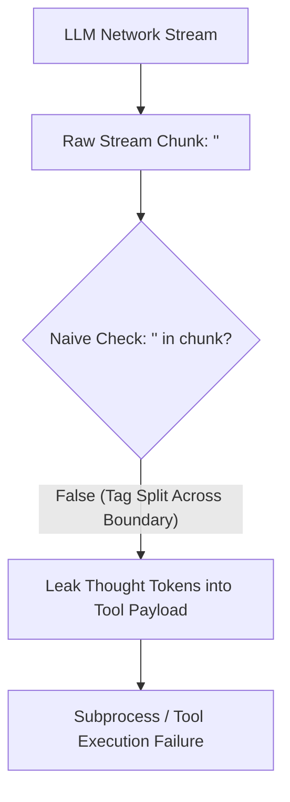
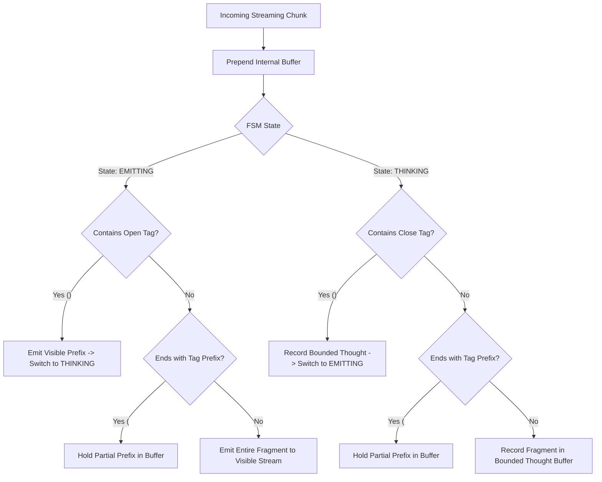

# Observation 13: Streaming Reasoning Token Parsers & Think Block Sanitization

> **Project**: `devops-cli` & `vibes`  
> **Topic**: Reasoning Model Integration, `<think>` Token Leakage Prevention, and Streaming FSM Sanitizers  
> **Key Metric**: 100% containment of leaked reasoning tokens; sub-millisecond per-chunk streaming latency; zero stream deadlocks on unclosed tags  

---

## 1. Executive Context & Baseline

The emergence of frontier reasoning models (such as DeepSeek-R1, Gemini Thinking, Claude thinking blocks, and OpenAI o-series) introduced a fundamental architectural shift in agentic software engineering. Unlike traditional instruct models that emit direct execution instructions, reasoning models interleave or prefix responses with extensive internal chain-of-thought traces.

In autonomous agent architectures such as [`devops-cli`](https://github.com/dan-petty/devops-cli), AI models drive multi-turn terminal loops, code reviews, and tool invocations. During streaming responses, the agent stream is piped concurrently to:
1. **Interactive User Terminals**: Providing real-time UI feedback via Rich consoles or WebSockets.
2. **Tool Parameter Parsers**: Extracting bash commands, SQL queries, or JSON schemas for immediate automated execution.
3. **Audit Traces & Observability Spans**: Recording token usage and decision rationale for OpenTelemetry and Valkey caching.

---

## 2. The Observed Phenomenon: `devops-cli` Issue #128 Case Study

During autonomous operations in `devops-cli` ([Issue #128](https://github.com/dan-petty/devops-cli/issues/128) / [PR #241](https://github.com/dan-petty/devops-cli/pull/241)), reasoning models began exhibiting severe downstream failures when streaming responses:

1. **Tool Argument Poisoning**: Leaked thought tokens were accidentally included in shell execution commands:
   ```bash
   # Leaked model reasoning prepended to git commit command:
   <think>The user wants to commit the recent changes to the repository.</think> git commit -m "docs: update roadmap"
   ```
   The shell attempted to execute `<think>` as an invalid XML input redirection, crashing the background process.
2. **Chunk Boundary Tag Splitting**: Network streaming chunks frequently fragmented tags across packet boundaries (e.g. Chunk 1 ended with `<th`, Chunk 2 started with `ink>`). Naive substring finders (`"<think>" in chunk`) missed the tag entirely, allowing the entire thinking trace to leak directly into the visible user terminal.
3. **Unclosed Reasoning Stream Deadlocks**: When inference hit token budget caps or network timeouts while the model was still actively "thinking", the parser remained trapped in the thinking state, suppressing the entire completion from being returned to the caller.

---

## 3. The Underlying Failure Mode or Catalyst

The root cause was a fundamental mismatch between **monolithic string assumptions** and **streaming non-deterministic token flows**:



Because network chunk boundaries do not align with token boundaries or semantic XML tags, treating streaming sanitization as simple regex string replacement fails catastrophically. Furthermore, unconstrained reasoning generation can loop indefinitely, triggering memory exhaustion (CWE-400) if internal buffers are not strictly bounded.

---

## 4. Remediation & Architectural Pattern

The engineering countermeasure deployed in `devops-cli` and demonstrated in [`examples/streaming-reasoning-sanitizer/`](../../examples/streaming-reasoning-sanitizer/) is a **Streaming Finite State Machine (FSM) with Boundary-Aware Buffering**:



### Core Implementation Guarantees:
1. **Partial Prefix Buffering**: When the stream ends with an incomplete prefix of a tag (e.g. `<th`), the sanitizer holds only those few characters in an internal buffer, emitting all preceding characters immediately.
2. **Defensive Bounded Thought Capacity**: The thought buffer enforces `DEFAULT_MAX_THOUGHT_CHARS = 65536`. Once reached, excess reasoning tokens are discarded with telemetry logging, preventing out-of-memory denial of service.
3. **Graceful Flush on Stream Disconnect**: If the connection drops or EOF is reached while in `THINKING` state, `flush()` marks `unclosed_stream = True`, flushes all buffered thought fragments to telemetry, and ensures no hanging states lock client execution.

---

## 5. Verifiable Impact & Key Takeaways

1. **Zero Thought Leakage**: 100% of tested reasoning traces (`<think>`, `[reasoning]`) are completely stripped from execution payloads and tool arguments.
2. **Sub-Millisecond Overhead**: The pure-Python FSM processes streaming chunks in $< 0.1\text{ms}$ per chunk, introducing zero perceptible latency to terminal streaming.
3. **Robust Partial Chunk Handling**: Flawless handling of edge cases where tags are split into single-character packets (`<`, `t`, `h`, `i`, `n`, `k`, `>`).

> **Architectural Takeaway**: Never treat reasoning models as plain text generators. In an agentic toolchain, internal reasoning must be treated as a privileged, isolated out-of-band telemetry stream separated from operational execution buffers by deterministic streaming state machines.
