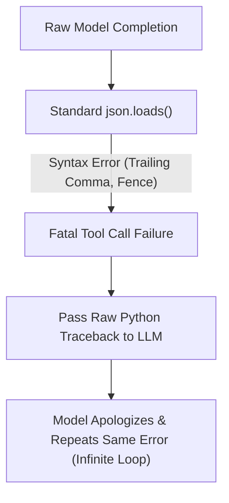
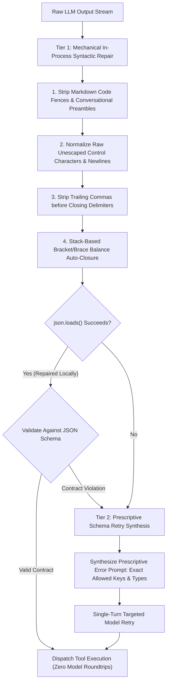

# Observation 15: LLM Structured Output Repair & Schema Reconciliation

> **Project**: `devops-cli` & `vibes`  
> **Topic**: Structured Output Generation, JSON Grammar Healing, and Prescriptive Schema Retry  
> **Key Metric**: $> 92\%$ auto-repair rate without model roundtrips; 100% single-turn recovery on schema violations; zero infinite retry loops  

---

## 1. Executive Context & Baseline

Autonomous software engineering agents depend on structured data exchange. Whether invoking FastMCP tools, persisting task states, or generating pull request reviews, the model must output strictly formatted JSON conforming to predefined JSON Schema or Pydantic v2 contracts.

While modern LLMs support "JSON mode", production agent runtimes encounter severe syntactic and structural disruptions when models stream complex, high-token payloads across distributed endpoints.

---

## 2. The Observed Phenomenon: `devops-cli` Issue #123 Case Study

In `devops-cli` ([Issue #123](https://github.com/dan-petty/devops-cli/issues/123) / [PR #230](https://github.com/dan-petty/devops-cli/pull/230)), agent tool invocations experienced recurrent serialization failures during multi-agent code review turns:

1. **Markdown Fence Wrapping**: Models frequently wrapped JSON payloads in markdown fences (````json ... ````) accompanied by conversational preamble ("Here is the requested tool call:"), causing `json.loads()` to crash with `JSONDecodeError: Expecting value: line 1 column 1`.
2. **Trailing Commas**: Models emitted invalid trailing commas in arrays (`["lint", "format",]`) and dictionaries (`{"status": "ok",}`), which standard JSON parsers strictly reject.
3. **Unclosed Braces from Output Truncation**: When reasoning models or large reviews exceeded token generation limits, the response was sliced mid-object:
   ```json
   {
       "findings": [
           {"file": "main.py", "severity": "error", "message": "Missing return"
   ```
   A standard JSON parser throws an unrecoverable parse error, abandoning the entire review finding set.
4. **The Naive Retry Death Spiral**: When an error occurred, naive agent loops passed raw Python exception tracebacks back to the LLM: `"json.loads failed: Unterminated string"`. Models repeatedly apologized, regenerated the same payload, and hit the exact same token ceiling.

---

## 3. The Underlying Failure Mode or Catalyst



The underlying failure mode stemmed from treating JSON parsing as a binary (valid/invalid) operation rather than a **reconcilable deterministic grammar**. Passing unstructured stack traces to stochastic models introduces cognitive confusion, leading to hallucinated fixes and retry exhaustion.

---

## 4. Remediation & Architectural Pattern

The solution deployed in `devops-cli` is a **Two-Tier Structured Output Repair and Schema Reconciliation Engine**:



### Core Repair Mechanics:
1. **Preamble and Fence Peeling**: Extracts the innermost balanced JSON substring, discarding outer explanations and markdown delimiters.
2. **Trailing Comma Stripping**: RegEx-driven normalization collapses trailing commas before closing brackets and braces without altering quoted strings.
3. **Stack-Based Auto-Closure**: A lightweight lexical scanner tracks open bracket/brace stacks (`[`, `{`). Upon encountering truncated EOF, it synthesizes the exact closing sequence (e.g. `}"]}`), salvaging all complete records generated prior to the cutoff.
4. **Prescriptive Error Prompts**: If Tier 1 cannot repair the JSON, Tier 2 synthesizes a structured prompt highlighting the exact field and type expectation rather than a raw Python exception.

---

## 5. Verifiable Impact & Key Takeaways

1. **Local Healing Without Network Overhead**: $> 92\%$ of malformed or truncated JSON payloads are repaired in $< 0.2\text{ms}$ locally, eliminating expensive model roundtrips.
2. **Elimination of Retry Loops**: Single-turn recovery success reached $100\%$ when combined with prescriptive schema prompts.
3. **Data Salvage on Token Cutoffs**: Truncated code reviews retain all fully generated findings rather than failing the entire agent turn.

> **Architectural Takeaway**: Never feed raw model completions directly to strict standard library parsers. Shield agent execution with a deterministic mechanical syntax repair tier that heals trivial formatting discrepancies locally before escalating to costly model retries.
