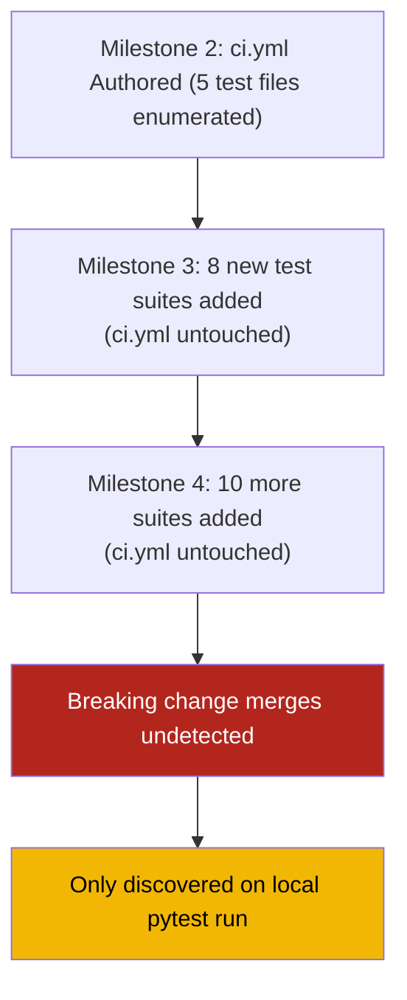

# Observation 16: The CI Milestone Freeze Anti-Pattern

> **Project**: `vibes`
> **Topic**: CI Configuration Staleness, Codelist Enumeration, and Generic Test Runner Contracts
> **Key Metric**: `ci.yml` coverage expanded from 5 hardcoded test files (Milestone 2) to 192 tests across 21 suites; zero manual test list maintenance required going forward

---

## 1. Executive Context & Baseline

Continuous integration configurations are typically authored once — at project inception or at the end of a major milestone — and committed as a stable contract. For small, static projects, this works well. For living repositories with autonomous agentic development cycles, this pattern becomes a **systemic risk**.

The `vibes` repository accumulated four active development milestones across dozens of commits and autonomous sessions, growing from a 5-example showcase (Milestone 2) to a 21-suite, 192-test repository (Milestone 4). Throughout this growth, the GitHub Actions `ci.yml` was never updated. It continued to enumerate exactly the same 5 test files authored in Milestone 2.

---

## 2. The Observed Phenomenon: The Milestone 2 Freeze

During a systematic change management audit in Milestone 5 prep, the `ci.yml` workflow was found to enumerate explicit test file paths:

```text
# What CI was actually running (Milestone 2 vintage):
pytest examples/ast-invariant-sentinel/test_sentinel.py \
       examples/fastmcp-token-bucket-gateway/test_gateway.py \
       examples/cegis-debugging-workbench/test_workbench.py \
       examples/agent-telemetry-trace-generator/test_generator.py \
       tests/test_project_tooling.py \
       benchmarks/test_benchmark_runner.py -v
```

Against the actual repository state:

```text
# What actually existed (Milestone 4+):
tests/test_ast_refactorer.py          ← not in CI
tests/test_docs_validator.py          ← not in CI
tests/test_resource_iteration_workbench.py  ← not in CI
tests/test_resources_validation.py    ← not in CI
tests/test_sdlc_project_manager.py    ← not in CI
examples/adaptive-web-crawler/        ← not in CI
examples/agentic-ide-hook-sentinel/   ← not in CI
examples/binary-search-context-packer/ ← not in CI
examples/ephemeral-container-sandbox/ ← not in CI
examples/go-leak-sentinel/            ← not in CI
examples/polyglot-cst-parser/         ← not in CI
examples/prompt-mutation-fuzzer/      ← not in CI
examples/streaming-reasoning-sanitizer/ ← not in CI
examples/tool-contract-verifier/      ← not in CI
examples/valkey-l2-repomap-cache/     ← not in CI
# ...and more
```

**16 test suites — representing 157 of 192 total tests — were completely invisible to the CI pipeline.** A breaking change in any of these modules would pass CI, merge to main, and only be discovered locally.



The sentinel gates in `pr-sentinel.yml` did cover changed Python files — but only for complexity and sanitization, not for test execution. A module could pass the sentinel with $M \le 10$ while harboring a broken import or runtime assertion error.

---

## 3. The Underlying Failure Mode or Catalyst

The root cause is **explicit file enumeration in CI configurations** — a code list (anti-pattern per `AGENTS.md`) applied to the domain of test suites. The domain of test suites is **open and unbounded**: it grows with every new feature, example, or benchmark added to the repository.

Matching against a bounded subset of an unbounded domain is the defining property of a brittle heuristic. The CI configuration committed the same category of error as a regex matching against `["admin", "login", "dashboard"]` to detect private routes — correct today, silently wrong tomorrow.

Three conditions combined to make this failure invisible:

1. **No growth trigger**: Adding a new `examples/<slug>/test_<slug>.py` file generated no automated notification that CI was unaware of it.
2. **No completeness oracle**: Nothing verified that `ci.yml` covered all discoverable test files.
3. **Partial coverage illusion**: CI showed green because the 5 enumerated tests still passed; the absence of new tests was indistinguishable from "no new tests exist."

---

## 4. Remediation & Architectural Pattern

The fix is a single-line replacement that replaces explicit enumeration with a **generic directory contract**:

```yaml
# Before (Milestone 2 — brittle, closed enumeration)
- name: Execute Automated Unit & Concurrency Tests
  run: |
    pytest examples/ast-invariant-sentinel/test_sentinel.py \
           examples/fastmcp-token-bucket-gateway/test_gateway.py \
           ...

# After (Milestone 5 — open, structure-driven contract)
- name: Execute Full Test Suite (All Milestones)
  run: |
    pytest tests/ examples/ benchmarks/ -v --tb=short
```

`pytest` recursively discovers test files via `test_*.py` naming convention — a **structure-driven enumeration** grounded in the repository's own file system, not in a hand-maintained list. New test suites are included automatically the moment they are committed with a valid `test_*.py` filename.

This is the same principle as replacing `if key in ["admin", "login"]` with a `permissions_registry.has(key)` lookup — the oracle is grounded in the authoritative data, not a stale copy.

The same expansion applied to sentinel and docs validation:

```yaml
# Sentinel: generic tree scan instead of enumerated files
- name: Run AST Invariant Sentinel (All Python Sources)
  run: |
    python examples/ast-invariant-sentinel/sentinel.py examples
    python examples/ast-invariant-sentinel/sentinel.py tools

# Docs validation: directory-level, not file-level
- name: Validate Documentation Quality & Link Integrity
  run: |
    python tools/docs_validator.py --strict
```

---

## 5. Verifiable Impact & Key Takeaways

- **Coverage delta**: CI test coverage expanded from 5 files (35 tests) to 21 suites (192 tests) — a **448% increase** — with zero additional maintenance burden.
- **Durability**: Any future `examples/<slug>/test_<slug>.py` addition is automatically covered without touching `ci.yml`.
- **Discovery latency**: The bug was discovered during a systematic research audit, not from a regression. A future breaking change in the uncovered suites would now be caught at PR time instead of after merge.

> A CI configuration that enumerates test files by name is not CI coverage — it is a curated whitelist with a decaying validity half-life. Structure-driven discovery (`pytest tests/ examples/ benchmarks/`) is the only correct contract for a living repository.

**The anti-pattern to prohibit**: Any CI `run:` step that lists specific `*.py` test files by path belongs to the same class of brittle pattern subsets prohibited by `AGENTS.md §1` — an arbitrary selection from an open, unbounded set. Use directory contracts, glob patterns, or `pytest.ini` `testpaths` instead.

