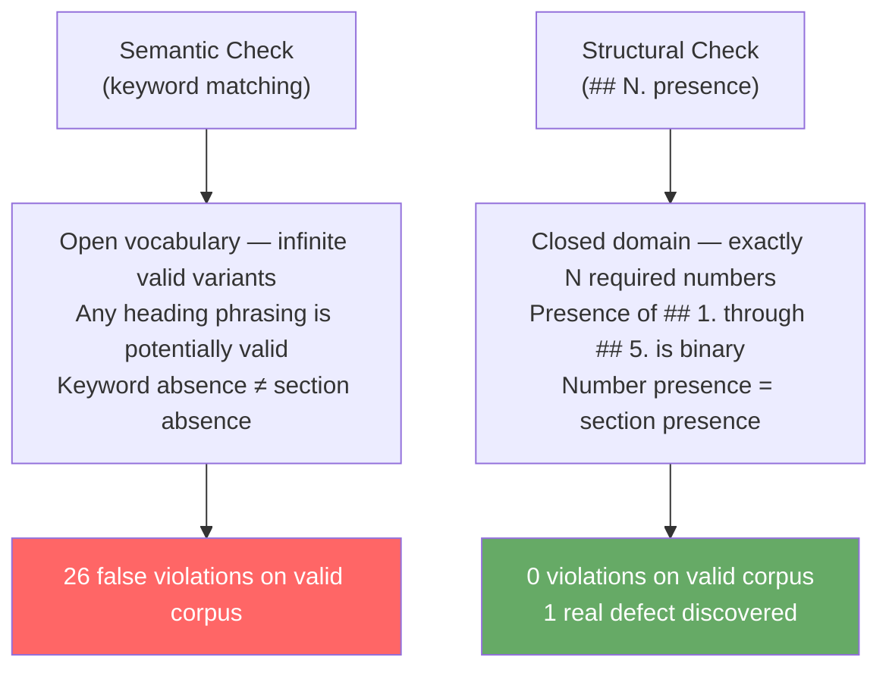

# Observation 17: Semantic Validators vs. Structural Position Oracles

> **Project**: `vibes` — `tools/docs_validator.py`
> **Topic**: Keyword Matching Brittleness in Document Structure Validators; Structural Enumeration as the Correct Oracle
> **Key Metric**: First implementation rejected 26 valid observation files; structural position oracle passed all 25 existing documents and immediately caught 1 genuine defect

---

## 1. Executive Context & Baseline

When building automated validators for document structure — particularly for a knowledge base with a mandated authoring template — the natural first instinct is **semantic content matching**: look for key phrases in headings to verify the presence of required sections.

This instinct is wrong.

During the implementation of an observation structure validator for `tools/docs_validator.py`, the first implementation used keyword-based matching against expected heading text. The implementation was architecturally correct, cleanly decomposed ($M \le 4$, depth $\le 2$), and immediately tested against 25 real-world observation files — where it produced 26 false-positive violations.

---

## 2. The Observed Phenomenon: The Heading Vocabulary Drift

The `AGENTS.md §4` mandated five sections for every observation document:

```text
## 1. Executive Context & Baseline
## 2. The Observed Phenomenon
## 3. The Underlying Failure Mode or Catalyst
## 4. Remediation & Architectural Pattern
## 5. Verifiable Impact & Key Takeaways
```

The first validator implementation extracted heading text and checked for keyword presence:

```python
# First implementation — brittle semantic matching
OBSERVATION_REQUIRED_SECTIONS: Final[tuple[str, ...]] = (
    "executive context",
    "observed phenomenon",
    "underlying failure mode",
    "remediation",
    "verifiable impact",
)

def _missing_observation_sections(heading_texts: list[str]) -> list[str]:
    return [
        req for req in OBSERVATION_REQUIRED_SECTIONS
        if not any(req in heading for heading in heading_texts)
    ]
```

Against 25 existing observation files, this produced 26 false positives. The actual headings in the corpus showed rich organic variation:

```text
# Template says:
## 5. Verifiable Impact & Key Takeaways

# But observations actually wrote:
## 5. Quantitative Verification & Empirical Impact        (Obs 08)
## 5. Closing the SDLC Feedback Loop                     (Obs 09)
## 5. Summary & Takeaways for AI Engineers               (systems)
## 5. Architectural Invariant Rules for Multi-Agent Systems  (systems)

# Template says:
## 3. The Underlying Failure Mode or Catalyst

# But observations actually wrote:
## 3. The Underlying Failure Mode: The "Zero-Defect Stagnation" Trap  (Obs 08)
## 3. Four Mechanical Transformation Strategies                        (Obs 09)
## 3. Core Architectural Containment Principles                        (Obs 12)
## 3. The Countermeasure: Hardened Multi-Agent Coordination Fabric     (systems)
```

The keywords `"verifiable impact"` and `"underlying failure mode"` were simply absent from many legitimate, structurally-complete observation documents. Authors had — correctly — customized section titles to reflect the specific content of their observation.

---

## 3. The Underlying Failure Mode or Catalyst

This is a direct instance of the **brittle heuristic anti-pattern** documented in `AGENTS.md §1`:

> Matching against a **limited or arbitrary subset of a larger or unknown list of possible values is strictly prohibited**.

The set of all possible ways to express "the section about what went wrong" in natural language is **open and unbounded**. Any fixed set of keywords covers only a tiny, arbitrarily-chosen fragment of the possible heading vocabulary. As authors exercise legitimate creative freedom, the validator degrades from a semantic guard into a mere style enforcer.

The structural invariant the validator was meant to enforce was never semantic — it was positional:

> **Every observation must have at least 5 numbered sections**, providing progressive narrative structure across context, phenomenon, failure mode, remediation, and impact.

The content of each section is the author's domain. The presence of a numbered section at each position is the validator's domain.



---

## 4. Remediation & Architectural Pattern

The fix was to replace keyword matching with **structural position enumeration** — a closed, deterministic domain:

```python
# Correct implementation — structural position oracle
OBSERVATION_REQUIRED_SECTION_COUNT: Final[int] = 5
_OBSERVATION_NUMBERED_SECTION_RE: Final[re.Pattern[str]] = re.compile(r"^##\s+(\d+)\.")
_OBSERVATION_FILENAME_RE: Final[re.Pattern[str]] = re.compile(r"^\d+-.+\.md$")


def _is_observation_file(file_path: Path) -> bool:
    """Predicate: true only for numbered observation docs (e.g. 01-foo.md)."""
    return (
        "observations" in file_path.parts
        and _OBSERVATION_FILENAME_RE.match(file_path.name) is not None
    )


def _extract_numbered_sections(lines: Sequence[str]) -> set[int]:
    """Extract ## N. section indices, skipping content inside fences."""
    found: set[int] = set()
    in_fence = False
    for line in lines:
        stripped = line.strip()
        if stripped.startswith(("```", "~~~")):
            in_fence = not in_fence
            continue
        if in_fence:
            continue
        m = _OBSERVATION_NUMBERED_SECTION_RE.match(stripped)
        if m:
            found.add(int(m.group(1)))
    return found


def _missing_numbered_sections(found: set[int]) -> list[int]:
    """Return required section numbers absent from document."""
    return [n for n in range(1, OBSERVATION_REQUIRED_SECTION_COUNT + 1) if n not in found]
```

The domain is now closed and mathematically bounded: the integers `{1, 2, 3, 4, 5}` must all appear as `## N.` headings. This is an exhaustive, verifiable condition — immune to vocabulary drift.

Additionally, a critical edge case required a **filename predicate**: `observations/README.md` is also inside the `observations/` directory but is an index file, not an observation document. The filename pattern `^\d+-.+\.md$` correctly discriminates numbered observation docs from structural index files.

---

## 5. Verifiable Impact & Key Takeaways

- **Before**: 26 false violations against 25 valid observation files (false positive rate: 100%).
- **After**: 0 violations against the same 25 files (false positive rate: 0%).
- **Genuine defect found**: Observation 12 was missing its `## 5.` section entirely — a real structural defect, correctly caught by the structural oracle and immediately remediated.

The same test suite that drove out the design also serves as the regression oracle:

```python
def test_observation_structure_real_repo_compliance() -> None:
    """All existing observation documents pass the 5-section structure check."""
    # 25 files → 0 violations
```

> The lesson: when validating document structure, the content of sections belongs to the author. The presence and count of required numbered positions belongs to the validator. Confusing the two produces an oracle that enforces style while ignoring structure.

**Generalized principle**: Whenever building a validator for a schema with a fixed number of required structural slots (database columns, API response fields, report sections), validate **slot presence by position or key name** — never by inferring slot identity from the semantic content of the value.

