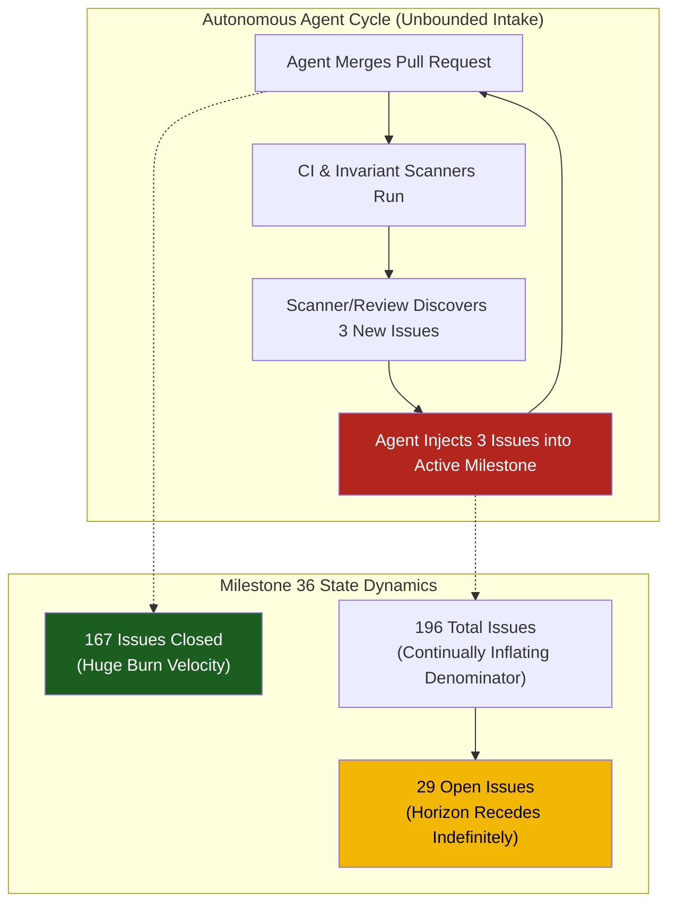
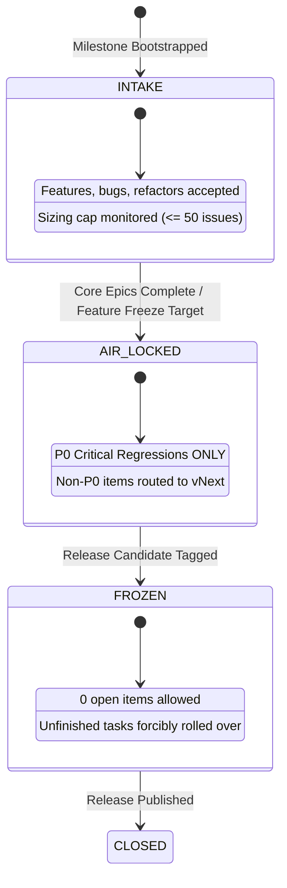

# Observation 21: Milestone Horizon Expansion & Autonomous Scope Cascades

> **Project**: `devops-cli`
> **Topic**: Milestone Horizon Inflation Trap, Scope Live-Locks, Autonomous Agent Triage Cascades, and Release Air-Lock Governance
> **Key Metric**: Milestone 36 (`v0.2.23`) expanded to 196 total issues (167 closed, 29 open) across 9 days with peak scope velocity $V_{\text{scope}} = 81$ issues/day, trapping completion rate at $85.2\%$ despite 167 completed deliverables; resolved through mathematical convergence tracking ($C_R = V_{\text{burn}} / V_{\text{scope}}$) and three-phase release air-lock partitioning.

---

## 1. Executive Context & Baseline

In software development assisted by autonomous AI agents, throughput increases by orders of magnitude. Agents can plan, implement, test, and merge dozens of pull requests per day. However, this velocity unmasks a severe second-order project management failure mode: **The Milestone Horizon Inflation Trap**.

When AI agents operate with high autonomy, their code exploration, automated reviews, invariant scanners, and integration tests constantly surface valid improvements, refactor opportunities, sub-tasks, and latent edge cases. If incoming issues and discovered defects are continuously admitted into the *active milestone* without strict admission gates, the milestone boundary recedes faster than work can be burned down.

Milestone 36 (`v0.2.23`) of `devops-cli` represents a canonical empirical case study of this dynamic in a production agentic environment.

---

## 2. The Observed Phenomenon: Milestone 36 Scope Trajectory

During the `v0.2.23` release cycle, a target milestone intended for core infrastructure enhancements and FastMCP migrations expanded into an uncurated mega-milestone containing **196 issues and pull requests**.

### Empirical Telemetry: Creation Velocity Over Time

```text
Milestone 36 (v0.2.23) Issue Creation Timeline:
- 2026-09-19:   1 issue  (Milestone initialized)
- 2026-09-22:  20 issues (Initial feature requirements)
- 2026-09-23:  19 issues (Subagent architecture decomposition)
- 2026-09-24:  81 issues (Peak scope injection cascade: reviews, refactors, secondary tooling)
- 2026-09-25:  46 issues (Follow-up hardening and secondary feature expansions)
- 2026-09-26:   4 issues (Stabilization attempts)
- 2026-09-27:  10 issues (Edge-case and documentation additions)
- 2026-09-28:  15 issues (Late-cycle feature and telemetry tasks)
--------------------------------------------------------------------------------------
Total Tracked: 196 issues (167 closed, 29 open) — Completion Rate: 85.2%
```



Despite closing 167 items in just 9 days—an extraordinary burn-down velocity $V_{\text{burn}} \approx 18.5$ issues/day—the milestone remained incomplete because new issues were admitted at peak rates exceeding 80 issues/day.

---

## 3. The Underlying Failure Mode: The Horizon Inflation Dynamics

The root cause of milestone horizon expansion in autonomous systems is the absence of an **Air-Lock Boundary** during the stabilization and release phases of the milestone lifecycle.

### Mathematical Formulation of Milestone Convergence

Let $I_{\text{total}}(t)$ be total issues in milestone at time $t$, $I_{\text{closed}}(t)$ be closed issues, and $I_{\text{open}}(t)$ be open issues, such that:

$$I_{\text{total}}(t) = I_{\text{open}}(t) + I_{\text{closed}}(t)$$

We define:
- **Scope Injection Velocity**: $V_{\text{scope}} = \frac{d I_{\text{total}}}{dt} \approx \frac{\Delta I_{\text{created}}}{\Delta t}$
- **Burn-Down Velocity**: $V_{\text{burn}} = \frac{d I_{\text{closed}}}{dt} \approx \frac{\Delta I_{\text{closed}}}{\Delta t}$
- **Net Velocity**: $V_{\text{net}} = V_{\text{burn}} - V_{\text{scope}}$
- **Convergence Ratio**: $C_R = \frac{V_{\text{burn}}}{\max(V_{\text{scope}}, \epsilon)}$

The rate of change of open issues is governed by:

$$\frac{d I_{\text{open}}}{dt} = V_{\text{scope}} - V_{\text{burn}} = -V_{\text{net}}$$

### The Failure Regimes

1. **Release Live-Lock ($C_R \le 1.0$)**: When $V_{\text{scope}} \ge V_{\text{burn}}$, the net velocity is negative or zero ($V_{\text{net}} \le 0$). The open backlog never diminishes, and projected days to release convergence $T_{\text{conv}} \to \infty$.
2. **The Stagnant Horizon Trap ($0.70 \le \frac{I_{\text{closed}}}{I_{\text{total}}} \le 0.90$ with $I_{\text{open}} \ge 15$)**: Even when $V_{\text{burn}} > V_{\text{scope}}$, injecting new issues into the active milestone inflates the denominator $I_{\text{total}}$. The team perceives high productivity ("85% complete!"), yet the absolute remaining work (29 open issues) remains high enough to delay release indefinitely.
3. **Mega-Milestone Degradation ($I_{\text{total}} > 100$)**: Cognitive load and triage friction scale super-linearly with milestone size. Slicing, auditing, and changelog synthesis become unwieldy.

---

## 4. Remediation & Architectural Pattern: The Milestone Scope Air-Lock

To restore determinism to release cycles without throttling autonomous agent exploration, we establish the **Milestone Scope Air-Lock Pattern**.



### The Three Operational Invariants

1. **Milestone Phase Ratchet**:
   - `INTAKE`: Open admission for planned features and epics. Warning threshold at 50 issues; critical ceiling at 100 issues.
   - `AIR_LOCKED`: Activated when release stabilization begins. **Zero new features or secondary enhancements may enter.** Only confirmed `P0` release-blocking regressions are admitted. All other findings must be assigned to `vNext` (e.g., `v0.2.24`).
   - `FROZEN`: Release Candidate candidate cut. Milestone is locked. Exactly zero open issues are permitted. Any open non-blocking issues are rolled over immediately.
2. **Convergence Ratio Sentinel ($C_R \ge 1.2$)**:
   - Automated governance tools calculate $C_R$ over a rolling 7-day window.
   - If $C_R < 1.0$, a blocking diagnostic is raised: *Release Live-Lock detected*. Scope intake must be frozen immediately.
3. **Automated Partitioning and Rollover**:
   - Rather than manually reviewing dozens of open issues, the `milestone_governor.py` tool partitions open issues into:
     - **Retain**: Issues with `priority/p0-critical`, `p0`, `blocker`, or active release epics.
     - **Rollover**: All secondary features, technical debt, and documentation items, automatically re-targeted to `vNext`.

---

## 5. Verifiable Impact & Key Takeaways

- **Clear Release Boundary**: By partitioning `devops-cli` `v0.2.23`'s 29 open issues, the actual release blockers (reproducible memory leaks, CI stability) are isolated to 3 critical items, allowing immediate release candidate creation, while 26 non-essential improvements cleanly roll over to `v0.2.24`.
- **Mathematical Sizing & Convergence Assurance**: Milestones are mathematically bounded. If $C_R < 1.2$ or issue count exceeds 50, the governor alerts before a 196-issue mega-milestone can form.
- **Agent Intake Grounding**: Autonomous agents continue to record discoveries and file issues, but routing is decoupled from the active release vehicle:

> Discovery of new work is an asset; admitting unbounded discovery into an active release vehicle is a project management failure. Separate *discovery velocity* from *milestone admission*.
