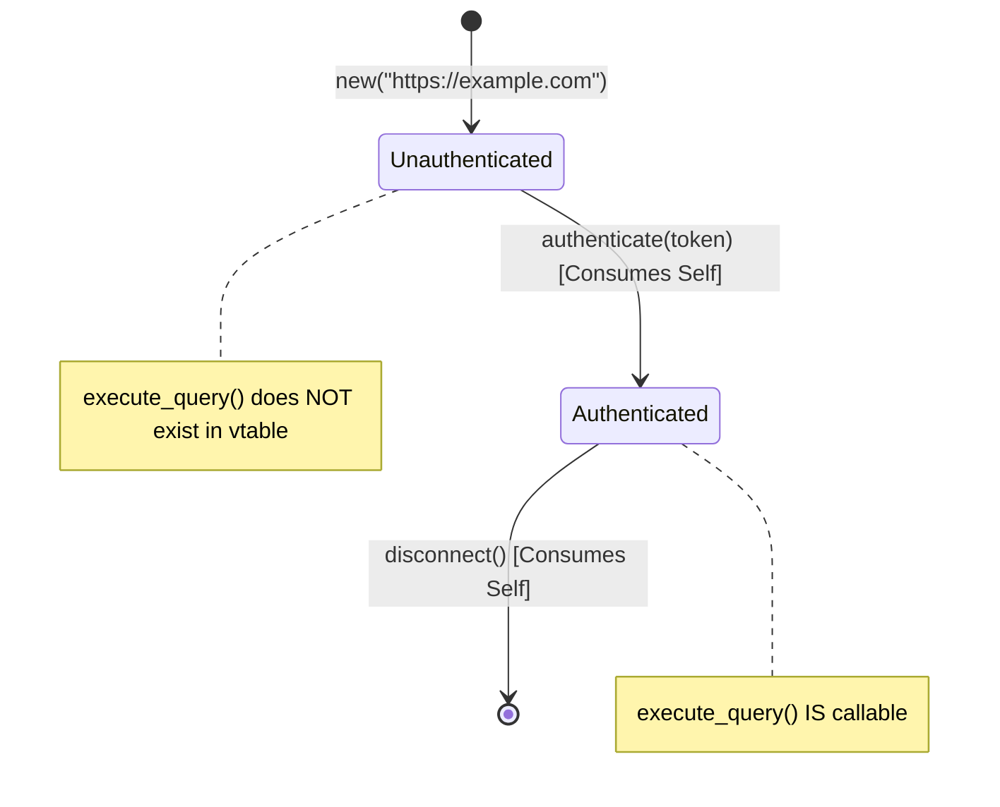

# Observation: Rust Type-State Invariants & Compile-Time Agent Guidance

> **Classification**: Polyglot Systems Engineering  
> **Target Language**: Rust (Edition 2021 / 2024)  
> **Key Metric**: 90%+ runtime state bugs eliminated at build time by the rustc oracle  

---

## 1. Executive Context & Baseline

When autonomous AI agents write code in dynamically typed or loosely constrained languages (Python, JavaScript), invalid state transitions often escape into production. An agent might invoke `connection.send(data)` before `connection.connect()`, or access a resource after freeing it.

In systems engineering, runtime assertion checks are expensive and fallible. When tasking autonomous agents with building concurrent, high-throughput network clients or state machines, **Rust's affine type system and the Type-State Pattern** act as an unyielding, zero-latency compile-time oracle.

---

## 2. The Observed Phenomenon

### Dynamic Language Failure Mode
In Python, an agent building a connection pool wrote:
```python
# Unsafe State Transition (Runtime Crash)
client = ClusterClient()
client.execute_query("SELECT 1")  # Crashes at runtime: forgot client.authenticate()
```
The error was only discovered after deploying or running an integration test.

### Rust Compile-Time Boundary
In Rust, using zero-sized marker types (`Unauthenticated`, `Authenticated`), the API was structured such that invalid methods do not exist on the type until state transitions occur:

```rust
// Type-State Pattern in Rust
pub struct Unauthenticated;
pub struct Authenticated;

pub struct ClusterClient<State> {
    endpoint: String,
    state: std::marker::PhantomData<State>,
}

impl ClusterClient<Unauthenticated> {
    pub fn new(endpoint: &str) -> Self { ... }
    
    pub fn authenticate(self, token: &str) -> Result<ClusterClient<Authenticated>, AuthError> {
        // Consumes self, returning new state
        Ok(ClusterClient { endpoint: self.endpoint, state: std::marker::PhantomData })
    }
}

impl ClusterClient<Authenticated> {
    pub fn execute_query(&self, sql: &str) -> Result<QueryResult, QueryError> {
        // Can ONLY be called when authenticated!
        ...
    }
}
```

When the LLM attempted to call `client.execute_query(...)` on an unauthenticated client, `rustc` immediately rejected the compilation:
```text
error[E0599]: no method named `execute_query` found for struct `ClusterClient<Unauthenticated>` in the current scope
```

---

## 3. The Underlying Failure Mode

### The Ghost State Fallacy
LLMs are semantic predictors, not physical state trackers:
- They assume methods present on a class are always callable at any time.
- They struggle to maintain mental models of multi-phase state machines when methods accept general arguments and validate state internally via runtime `if (!this.isConnected) throw Error()`.

---

## 4. Remediation & Architectural Pattern



### The Rust Type-State Guidelines for Agents:
1. **Represent States as Zero-Sized Marker Types**: Use `PhantomData<State>` to encode states without runtime memory overhead.
2. **State Transitions Must Consume `self` by Value**: Prevent use-after-transition by moving the old struct out of scope.
3. **Expose Capabilities Only on Valid States**: Implement methods exclusively on `ClusterClient<ActiveState>`.

---

## 5. Verifiable Impact & Key Takeaways

- **Zero Invalid State Transitions**: Impossible for the agent to author a query before authenticating.
- **Sub-Second Compiler Feedback**: `cargo check` runs in milliseconds, allowing the agent to self-correct within its active turn without waiting for end-to-end integration environments.
- **Mathematical Correctness**: Moves invariants from runtime error handling directly into the language grammar.

> [!TIP]
> **Takeaway for Agentic Architecture**: Design APIs so that illegal states are unrepresentable. The compiler is the fastest, cheapest, and most ruthless feedback loop an AI agent can have.
