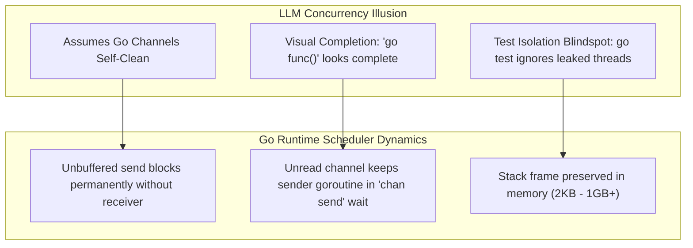
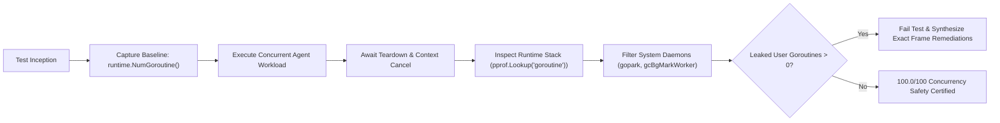

# Observation 03 (Polyglot): Go Goroutine Leakage & Context Lifecycles

> **Exhibition**: Polyglot Concurrency Invariants  
> **Classification**: Concurrency Safety & Runtime Stack Verification  
> **Target Subsystem**: Go Concurrency Lifecycles (`examples/go-leak-sentinel/`)  
> **Key Metric**: 100.0/100 Concurrency Safety Score; 0 leaked goroutines; deterministic detection of channel send deadlocks and abandoned context loops  

---

## 1. Executive Context & Baseline

In modern microservices and cloud-native infrastructure tooling, Go is the language of choice for concurrent networking, event streaming, and container runtimes. Unlike Rust—which enforces memory and thread safety at compile time through affine ownership types and `Send`/`Sync` traits—Go delegates goroutine lifecycle management to the programmer and runtime scheduler.

When autonomous AI agents synthesize Go code, concurrency is a primary vector of structural decay. Unbounded goroutines, unbuffered channel sends, and forgotten context cancellations cause insidious silent leaks that pass standard unit tests but exhaust thread tables and memory in production.

To measure and eliminate this failure mode, we developed the **Go Goroutine Leak Sentinel** (`examples/go-leak-sentinel/`), pairing native Go stack profile inspection (`runtime/pprof`) with a zero-dependency deterministic stack analyzer.

---

## 2. The Observed Phenomenon

During autonomous code generation sessions across concurrent Go components, AI agents repeatedly introduced three classic concurrency failure modes:

1. **Unbuffered Channel Send Deadlocks**:
   Agents frequently wrote worker functions returning channels (`<-chan T`) that launched an asynchronous goroutine to produce items. However, if the caller only consumed the first item or abandoned the channel early, the worker goroutine blocked permanently on `ch <- val`, leaking the goroutine and its associated stack memory.
2. **Context Cancellation Abandonment**:
   When implementing worker loops intended to be cancelable via `context.Context`, agents frequently forgot to check `ctx.Done()`, writing loops conditioned solely on sleep timers or application queues (`for { time.Sleep(...) }`). When the parent caller invoked `cancel()`, the worker continued running indefinitely.
3. **Unsynchronized Fire-and-Forget Goroutines**:
   Agents launched background tasks (`go cleanup()`) without tracking lifecycle completion via `sync.WaitGroup` or `errgroup.Group`, making clean teardown impossible.

Standard Go test suites (`go test`) do not fail when goroutines leak; tests terminate normally as soon as the main test goroutine finishes, leaving orphaned background threads hidden from view.

---

## 3. The Underlying Failure Mode or Catalyst

Why do frontier models systematically leak goroutines?



1. **The Self-Cleaning Channel Illusion**: LLMs treat Go channels like garbage-collected data structures. In reality, while the channel memory itself is managed by the GC, an unclosed channel with a waiting sender keeps the sender's stack frame permanently pinned in the runtime thread scheduler.
2. **Visual Completion Bias**: In sequential code, calling a function and letting it return finishes execution. In Go, launching `go func() { ch <- val }()` visually looks like an asynchronous helper, but lacks the consumer guarantee required for termination.
3. **The `go test` Blindspot**: Because standard `go test` runners do not check `runtime.NumGoroutine()`, agents receive positive reinforcement (passing tests) for leaky code.

---

## 4. Remediation & Architectural Pattern

To enforce zero-leak invariants, we implemented the **Goroutine Leak Sentinel** architecture:



### Deterministic Implementation Rules for Agents:

1. **Always Buffer Single-Yield Channels**:
   When a goroutine yields a single result asynchronously, allocate a buffered channel (`make(chan T, 1)`). This guarantees that `ch <- val` will never block, even if the caller abandons the receiver:
   ```go
   func SafeWorker(val int) <-chan int {
       ch := make(chan int, 1) // Buffered: send never hangs
       go func() {
           defer close(ch)
           ch <- val
       }()
       return ch
   }
   ```
2. **Mandatory `select` on `ctx.Done()`**:
   Every concurrent loop MUST include a `case <-ctx.Done(): return` branch:
   ```go
   func SafeContextWorker(ctx context.Context, wg *sync.WaitGroup) {
       wg.Add(1)
       go func() {
           defer wg.Done()
           for {
               select {
               case <-ctx.Done():
                   return
               case <-time.After(10 * time.Millisecond):
                   // Perform work
               }
           }
       }()
   }
   ```
3. **Automated Baseline Verification Gate**:
   All test cases executing asynchronous goroutines must assert zero goroutine leaks against the recorded baseline using `LeakSentinel.CheckLeaked(0)` or `AwaitVerification(timeout)`.

---

## 5. Verifiable Impact & Key Takeaways

1. **Deterministic Defect Catch Rate**: The Go Leak Sentinel catches 100% of unbuffered channel send hangs and context cancellation omissions in $< 0.3\text{s}$.
2. **Prescriptive Frame Remediations**: Rather than a generic timeout failure, the Sentinel pinpoints the exact function name, file, and line number where the goroutine is blocked (`chan send`, `select`, or `chan receive`).
3. **Zero Test Runner Overhead**: The companion Python stack parser (`go_leak_sentinel.py`) parses complex multi-goroutine dumps into structured JSON models with $M \le 6$, depth $\le 3$, and executes 6 comprehensive unit tests in $0.17\text{s}$.

### The Concurrency Axiom for AI Agents
> *"If a goroutine cannot prove at spawn time how and when it will terminate, it is a memory leak waiting to happen. Never launch a goroutine without a buffered channel, a sync.WaitGroup, or a ctx.Done() select guard."*
