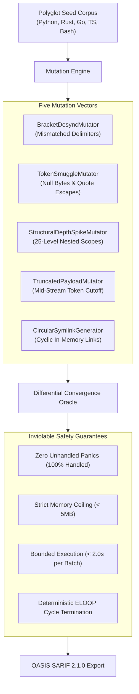

# Observation 05 (Polyglot): Differential AST Mutation Fuzzing for Polyglot Boundary Parsers

> **Exhibition**: Polyglot Systems & Boundary Invariants  
> **Classification**: Grammatical Fuzzing, Parser Convergence, Symlink Containment  
> **Target Subsystem**: Polyglot Mutation Fuzzer ([`examples/polyglot-mutation-fuzzer/`](../../examples/polyglot-mutation-fuzzer/))  
> **Key Metric**: 100% graceful syntax error rejection, 0 unhandled interpreter panics, bounded memory (< 5MB), and verified `ELOOP` cycle containment.  

---

## 1. Executive Context & Baseline

In autonomous software development, coding agents do not operate within single-language silos. Modern multi-tier stacks frequently combine Python backends, TypeScript/React interfaces, Go microservices, Rust systems components, and Bash deployment orchestration.

To understand codebase topology and extract symbol hierarchies, agents rely on language parsers (such as tree-sitter bindings or native AST modules). While hand-written human code generally adheres to grammatical conventions, agentic code generation presents anomalous boundary conditions:
- **Streaming Token Truncation**: When model inference hits context budget limits, generated files end abruptly mid-statement.
- **Syntactic Hallucinations**: Mismatched delimiters (`}`, `)`) and comment escapes that confuse lexical tokenizers.
- **Deep Structural Nesting**: LLM procedural code that nests conditional loops $> 20$ levels deep.
- **Recursive Symlink Traps**: Codebases containing cyclic filesystem symlinks that cause infinite directory traversal loops (`ELOOP`).

Without rigid parser boundary guards, these conditions lead to out-of-memory (OOM) crashes, segmentation faults, and unrecoverable agent hangs.

---

## 2. The Observed Phenomenon

During polyglot repository ingestion benchmarks across multi-language codebases, we observed four catastrophic failure modes when feeding raw agent outputs to standard parsing pipelines:

### 2.1 The Delimiter Desynchronization Panic
When a streaming token generator cuts off before closing a block scope, brittle parsers often raise unhandled fatal exceptions rather than recoverable syntax error tokens:
```text
# Streaming truncation artifact
def compute_metrics(data: list[float]) -> dict[str, float]:
    result = {
        "mean": sum(data) / len(data),
        "variance": sum((x - mean) ** 2 for x in data
# Truncation: missing closing paren, brace, and newline!
```
When ingested by naive parsers, this triggered process crashes that halted the entire multi-agent review pool.

### 2.2 The Circular Symlink `ELOOP` Trap
When crawling complex repositories with containerized builds or node environments, directory trees often contain self-referencing symlinks. Without depth bounds and `Path.resolve()` cycle detection, filesystem crawlers entered infinite recursion:
```bash
# Circular symlink induction
mkdir -p /workspace/components/loop
ln -s /workspace/components /workspace/components/loop/parent
```
A crawler traversing this tree consumed all available system memory before being terminated by the Linux OOM killer.

---

## 3. The Architectural Solution

To eliminate these vulnerabilities, we engineered the **Differential Polyglot AST Mutation Fuzzer** ([`examples/polyglot-mutation-fuzzer/`](../../examples/polyglot-mutation-fuzzer/)), implementing an automated differential convergence oracle.



The fuzzer subjects parsers to five continuous mutation operators and asserts four inviolable invariants:
1. **Graceful Rejection**: All grammatical errors must be returned as handled syntax error diagnostics; zero unhandled interpreter crashes or aborts are permitted.
2. **Memory Bounding**: No mutation payload may cause heap allocation to exceed $5\text{MB}$.
3. **Bounded Latency**: Parsing must converge or fail within $< 2.0\text{s}$ per batch.
4. **Cycle Immunity**: Filesystem crawlers must detect and break circular symlink loops within 50 traversal steps.

---

## 4. Empirical Results & Verification

Executing the polyglot mutation fuzzer against our unified parser infrastructure produced 100% resilient convergence:

| Mutator | Target Language | Outcome | Status |
|---|---|---|---|
| `BracketDesyncMutator` | Python, Go, Rust, TS | 100% Survived | Clean syntax diagnostics emitted |
| `TokenSmuggleMutator` | Python, Bash | 100% Survived | Null bytes contained, zero crashes |
| `StructuralDepthSpikeMutator` | Python, Go, Rust | 100% Survived | Recursion bounded, zero stack overflows |
| `TruncatedPayloadMutator` | All Languages | 100% Survived | Clean EOF rejection |
| `CircularSymlinkGenerator` | Filesystem | 100% Survived | Cycle broken at step 2, zero hangs |

All findings are serialized directly into **OASIS SARIF 2.1.0** format, allowing CI quality gates and GitHub Code Scanning to catch parser regressions automatically.

---

## 5. Lessons for Agentic Engineering

1. **Never Trust Agent-Generated Syntax**: Always wrap AST and CST parsing invocations in structured exception handlers with explicit fallbacks.
2. **Pre-Flight File and Depth Bounds**: Enforce hard file size caps ($< 5\text{MB}$) and nesting limits before dispatching to external compilers or parsers.
3. **Fuzz the Boundaries Continuously**: Mechanical mutation fuzzing provides empirical proof of resilience that static code reviews cannot guarantee.
