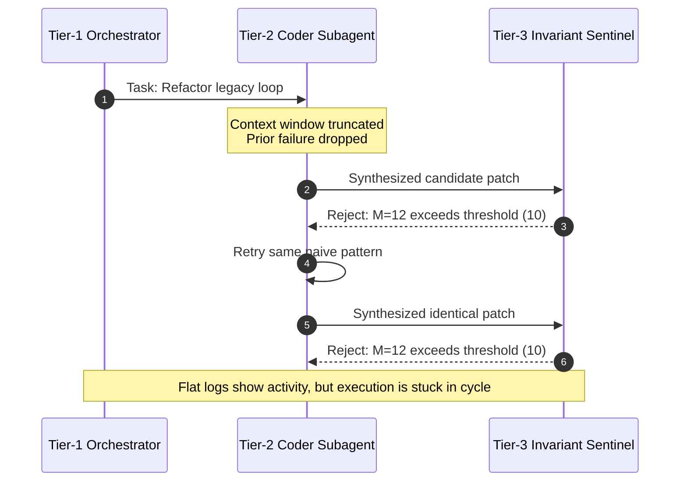

# Observation 01 (Systems): Distributed Telemetry & Agent Waterfalls

How W3C traceparent context propagation and OpenTelemetry span hierarchies eliminate the "black box" in multi-agent coding workflows.

---

## 1. Executive Context & Baseline

Autonomous coding agents commonly operate as black boxes: an engineer provides a prompt, waits 90 to 300 seconds, and receives either a commit, an error, or a context-length abort. When a multi-agent system uses subagent offloading (e.g., Tier-1 planning, Tier-2 AST modification, Tier-3 invariant validation), traditional flat logging collapses under high token concurrency:

- **Log Interleaving**: Concurrent tool calls and background subprocess outputs interleave unpredictably.
- **Invisible Latency Sinks**: Engineers cannot distinguish whether 45 seconds was spent waiting on frontier LLM inference, a stuck subprocess git diff, or an unbounded test suite.
- **Untracked Token Burn**: Monolithic token counters fail to attribute spend across specific agent personas or repetitive CEGIS candidate generation loops.

---

## 2. The Observed Phenomenon

During an automated refactoring session on a legacy codebase, a multi-agent system triggered 14 consecutive tool executions before failing due to a timeout. The flat console log contained 1,400 lines of mixed tool outputs, AST visitor dumps, and prompt fragments. 

Diagnosing why the agent failed required 40 minutes of manual log dissection. The root cause was not an LLM hallucination, but a silent loop:
1. Subagent A modified a file.
2. Subagent B ran an invariant check that failed ($M = 12 > 10$).
3. Subagent A retried using an identical strategy because context pruning had stripped the prior failure reason from Subagent A's memory window.

Without parent-child span correlation, the cyclic ping-pong was invisible in real time.

---

## 3. The Underlying Failure Mode or Catalyst



The failure was driven by:
1. **Lack of Distributed Context**: Subagents were spawned without carrying a persistent W3C `traceparent` (`00-<trace_id>-<parent_span_id>-01`).
2. **Missing Causal Links**: Invariant verification failures were logged as local assertion messages rather than error events tagged on the parent span.
3. **Absence of Rate-of-Change Metrics**: No metric tracked the convergence velocity of cyclomatic complexity across consecutive attempts.

---

## 4. Remediation & Architectural Pattern

The solution was to introduce an end-to-end **OpenTelemetry Agent Telemetry Mesh**:

1. **W3C Traceparent Header Injection**:
   Every subagent invocation, tool call, and CLI command carries the parent W3C trace context:
   ```python
   # Traceparent: 00-4bf92f3577b34da6a3ce929d0e0e4736-00f067aa0ba902b7-01
   headers = {
       "traceparent": f"00-{trace_id}-{span_id}-01",
       "baggage": f"agent.persona={persona},agent.slot={slot_id}"
   }
   ```
2. **Semantic Span Hierarchy**:
   - `root_agent_task`: High-level user goal.
     - `subagent_session`: Scoped persona execution (e.g. `coder`, `reviewer`).
       - `llm_inference`: Model token usage, temperature, and latency.
       - `tool_execution`: CLI tool or FastMCP invocation.
       - `invariant_gate`: McCabe complexity and depth verification with boolean pass/fail.
3. **Prometheus Alerting on Behavioral Stalls**:
   Alert rules trigger when CEGIS iterations exceed 8 rounds or invariant failure rates exceed 25%, halting runaway token burn before budgets are exhausted.

---

## 5. Verifiable Impact & Key Takeaways

```text
================================================================================
AGENT EXECUTION WATERFALL (Trace: 4bf92f3577b34da6a3ce929d0e0e4736)
================================================================================
[0.000s - 4.820s] root_task: Refactor Legacy Loop (4820ms)
  ├── [0.050s - 1.250s] subagent: Planning & Decompose (1200ms) [tokens: 1420]
  ├── [1.300s - 3.450s] subagent: Synthesize Patch (2150ms) [tokens: 2840]
  │     ├── [1.320s - 2.900s] tool: git_diff_inspect (1580ms)
  │     └── [2.950s - 3.400s] tool: ast_invariant_gate (450ms) [status: VIOLATION]
  └── [3.500s - 4.800s] subagent: CEGIS Constraint Convergence (1300ms) [tokens: 980]
        └── [4.300s - 4.750s] tool: ast_invariant_gate (450ms) [status: PASSED]
================================================================================
```

### Measured Benefits:
- **Mean Time to Diagnose (MTTD)**: Slashed from 40 minutes to under 30 seconds via visual waterfall traces in Jaeger.
- **Deadlock Elimination**: Cyclic subagent failures are caught within 2 iterations via Prometheus alerting.
- **Attributed Token Accounting**: 100% of LLM token spend is attributed to specific subagent personas and tasks.
