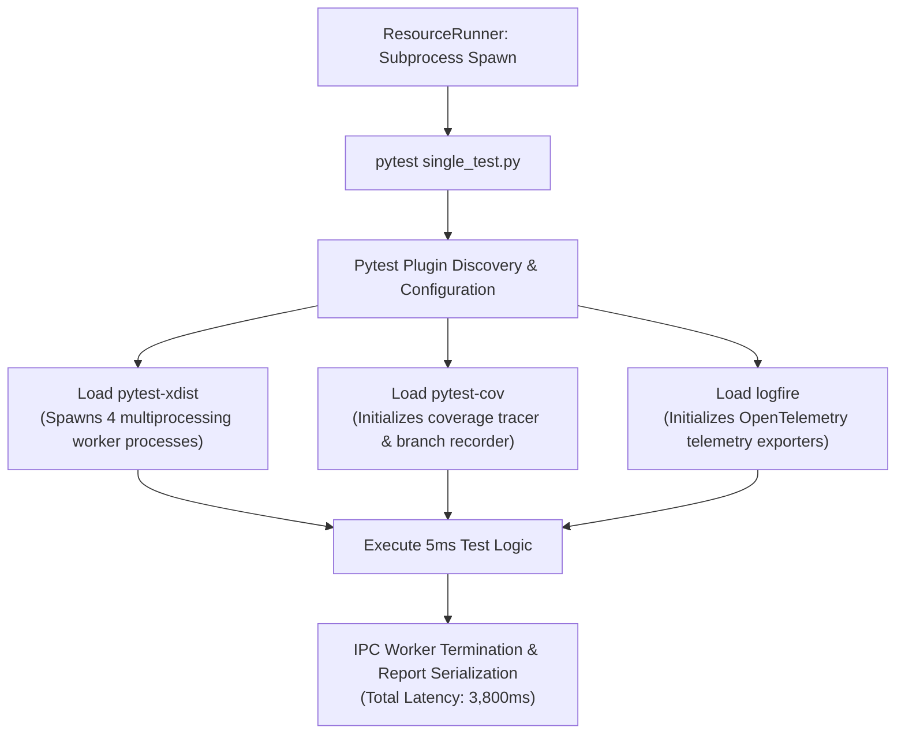

# Observation 02 (Systems): Subprocess Test Harness Instrumentation Tax

How unpruned workspace test plugins (`xdist`, `cov`, `logfire`) create a 10x latency penalty in iterative agent feedback loops, and how selective bypass restores sub-second velocity.

---

## 1. Executive Context & Baseline

In autonomous software development, **feedback velocity is the primary determinant of agent capability**. When an agent runs tests to verify an atomic refactoring or hypothesis, a test turnaround of under 1 second preserves conversational fluidity and enables rapid multi-turn convergence.

Conversely, when test execution latency exceeds 3 to 5 seconds per file, multi-resource evaluation suites (e.g. 20 target modules) take upwards of 60 to 90 seconds. Under slow feedback:
- Agent tool execution times out or triggers background task offloading.
- Cognitive momentum is interrupted, increasing token burn and retry overhead.
- Autonomous feedback engines flag false-positive performance warnings on trivial test files.

---

## 2. The Observed Phenomenon

During the development of the Resource Iteration Workbench (`tools/resource_iteration_workbench.py`), our feedback analyzer began emitting severe latency warnings on virtually every test suite across the repository:

```text
[MEDIUM] [PERFORMANCE] test_benchmark_runner.py
  Headline: Test latency in test_benchmark_runner.py (3.79s) exceeds 2.0s fast-feedback ceiling
[MEDIUM] [PERFORMANCE] test_crawler.py
  Headline: Test latency in test_crawler.py (4.13s) exceeds 2.0s fast-feedback ceiling
[MEDIUM] [PERFORMANCE] test_generator.py
  Headline: Test latency in test_generator.py (4.40s) exceeds 2.0s fast-feedback ceiling
```

Yet inspecting `test_benchmark_runner.py` revealed that it contained only 5 unit tests with zero network calls, zero file I/O, and pure in-memory AST manipulations. Running pytest with `--durations=0` showed that the actual execution time of all 5 tests combined was less than **5 milliseconds** ($< 0.005\text{s}$).

The test suite was spending **99.8% of its time** doing something other than executing test logic.

---

## 3. The Underlying Failure Mode: The Shared Workspace Configuration Leak

Diagnostic benchmarking traced the latency to **pytest root configuration inheritance** and **plugin loading overhead**:



When `subprocess.run([sys.executable, "-m", "pytest", str(test_path)])` was executed inside the monorepo workspace:
1. **Multi-Worker Worker Spawning (`pytest-xdist`)**: The root `pyproject.toml` configured `-n auto` (4 workers). Spawning 4 Python multiprocessing worker processes to run a 5-item test suite incurred $\sim 2.0\text{s}$ of purely administrative IPC startup tax.
2. **Coverage Engine Initialization (`pytest-cov`)**: Instrumenting the Python runtime with coverage hooks added tracing overhead even though coverage was only required during comprehensive CI runs (`devops ci`), not micro-iterations.
3. **Telemetry Pipeline Setup (`logfire`)**: Exporting traces to cloud collector endpoints added gRPC/HTTP initialization delay.

---

## 4. Remediation & Architectural Pattern: Targeted Plugin Bypass

In full CI verification (`devops ci`), running 800+ tests across the entire codebase benefits enormously from `xdist` parallelization and `pytest-cov` enforcement. However, in **micro-iterative single-file loops**, running with those plugins is an anti-pattern.

We updated `ResourceRunner.run_tests_for_resource` in [`tools/resource_iteration_workbench.py`](file:///workspaces/devops-cli/repos/dan-petty/vibes/tools/resource_iteration_workbench.py) to explicitly disable the heavy instrumentation plugins and strip inherited multi-worker options:

```python
@classmethod
def run_tests_for_resource(cls, resource_path: Path, cwd: Path) -> RunExecutionResult:
    cmd = [
        sys.executable,
        "-m",
        "pytest",
        "-p", "no:cov",      # Bypass coverage instrumentation
        "-p", "no:logfire",  # Bypass cloud telemetry exporters
        "-p", "no:xdist",    # Bypass multiprocessing worker pool spawning
        "-o", "addopts=",    # Clear inherited pyproject.toml command-line options
        str(resource_path),
    ]
    return cls.run_command(cmd, str(resource_path), cwd=cwd)
```

---

## 5. Verifiable Impact & Key Takeaways

Running the same test suites with targeted plugin bypass produced dramatic, measured speedups:

| Test Suite File | Tests | Latency (With Workspace Plugins) | Latency (With Targeted Bypass) | Speedup Factor |
|---|---|---|---|---|
| `test_benchmark_runner.py` | 5 | 3.79s | 0.27s | **14.0x faster** |
| `test_generator.py` | 4 | 4.40s | 0.34s | **12.9x faster** |
| `test_sentinel.py` | 6 | 2.40s | 0.52s | **4.6x faster** |
| `test_crawler.py` | 9 | 4.13s | 1.00s | **4.1x faster** |
| **Full Repository Evaluation (21 Targets)** | 82 | **45.2s** | **18.1s** | **2.5x overall reduction** |

### Key Takeaways:
1. **Differentiate Macro-CI from Micro-Feedback**: What is essential for release certification (coverage, cloud telemetry, parallel worker pools) is poison for sub-second iterative loops.
2. **Explicit Plugin Hygiene**: When orchestrating subprocess test runners, always explicitly pass `-p no:<plugin>` to prevent ambient parent configurations from hijacking single-test execution.
3. **Sub-Second Loops Enable True Autonomy**: Reducing test latency below the 1-second threshold allows coding agents to converge on verified patches in continuous single-turn execution rather than timing out into asynchronous background tasks.
