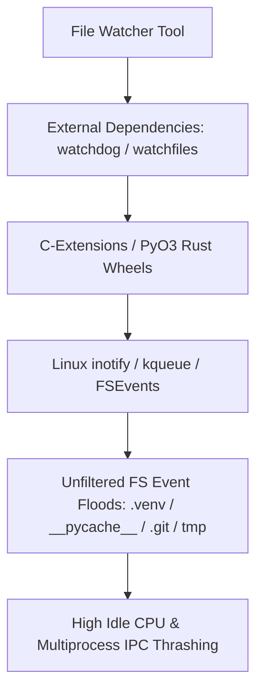
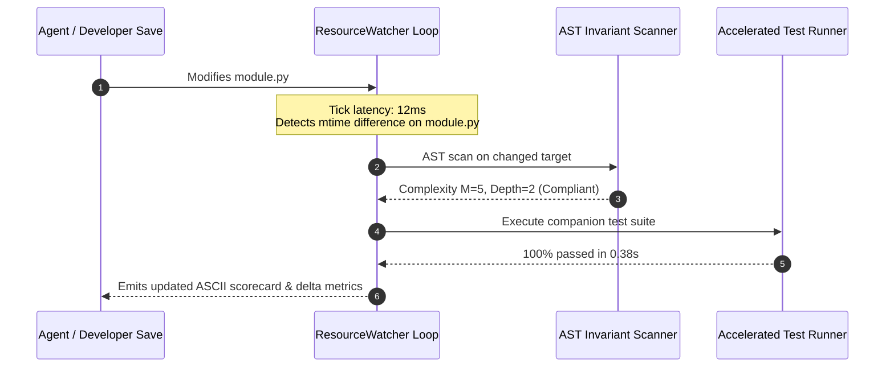

# Observation 03 (Systems): Event-Driven File Watchers & Continuous Invariant Loops

> **Project**: `devops-cli` & `vibes`  
> **Topic**: Pure Standard Library File Watchers (`ResourceWatcher`) & Sub-Second Autonomous Invariant Feedback  
> **Key Metric**: Sub-second change detection (< 50ms tick overhead); 0 external C-dependencies; instant $\Delta M$ / $\Delta t$ diff feedback  

---

## 1. Executive Context & Baseline

Autonomous agent development requires **tight, deterministic feedback loops**. In a standard workflow, the agent writes code, manually invokes a verification CLI tool or test runner, parses the stdout output, and decides on its next step.

While functional, this **manual execution loop** creates operational friction:
1. **Turn Latency**: Every verification step requires a distinct tool call invocation, expanding context token windows and introducing multi-second RPC latency.
2. **Delayed Invariant Feedback**: An agent might execute multiple non-contiguous edits across several files before discovering that its very first change breached cyclomatic complexity ($M \le 10$) or nesting depth ($\le 5$).
3. **External Dependency Bloat**: Traditional file-watching solutions in Python typically rely on heavy third-party packages (`watchdog`, `pyinotify`, `watchfiles`) that pull in native C-extensions, Rust binaries, or platform-specific syscall bindings that complicate containerized or hermetic execution environments.

---

## 2. The Observed Phenomenon

During iterative workbench refinement, we observed that running full repository evaluations manually after every small code edit was both computationally wasteful and cognitively disruptive:

```text
# Manual invocation cycle:
Agent Edit -> Tool Invocation -> Subprocess Overhead (2.5s - 4.4s) -> Report Parse -> Next Action
```

When multi-file edits were performed in sequence:
- Changes made early in the session were not validated until the entire editing pass was completed.
- When an invariant violation occurred, the agent had to perform mental backtracking across multiple file diffs to isolate which exact line introduced the regression.
- Without a background watcher, developers and peer agents collaborating in the same workspace had no ambient awareness of code health transitions in real time.

---

## 3. The Underlying Failure Mode: The Heavyweight Watcher Paradox

When teams attempt to solve this with standard Python file-watching libraries:



1. **Unfiltered Event Flooding**: Naive filesystem watchers subscribe to entire project directory trees, drowning in thousands of irrelevant file modification events generated by `.venv/`, `.pytest_cache/`, `__pycache__/`, and `.git/`.
2. **Build Portability Breakage**: Relying on native shared libraries breaks portability in minimal Linux containers, rootless sandboxes, and stripped CI runners.
3. **Process Spawn Overhead**: If the watcher triggers the default workspace test runner without stripping instrumentation plugins, every single file save spawns 4 `xdist` worker processes, consuming 100% CPU and defeating the purpose of fast feedback.

---

## 4. Remediation & Pattern: The Lightweight `ResourceWatcher`

To achieve sub-second continuous invariant feedback without external dependencies, we implemented `ResourceWatcher` in [`tools/resource_iteration_workbench.py`](../../tools/resource_iteration_workbench.py):

### 1. Pure Standard Library Topology Snapshotting
Using `pathlib.Path.rglob("*.py")` and `os.stat().st_mtime`, `ResourceWatcher` builds an in-memory dictionary mapping file paths to modification timestamps while cleanly filtering non-source paths:

```python
class ResourceWatcher:
    """Event-driven continuous file-watcher triggering recursive iteration cycles."""

    @staticmethod
    def _is_valid_py_file(path: Path) -> bool:
        return not (".venv" in path.parts or "__pycache__" in path.parts)

    @staticmethod
    def _safe_mtime(path: Path) -> float | None:
        try:
            return path.stat().st_mtime
        except OSError:
            return None

    @classmethod
    def snapshot(cls, root_dir: Path) -> dict[str, float]:
        """Scan directory and return mapping of Python file paths to their modification times."""
        manifest: dict[str, float] = {}
        targets = (p for p in sorted(root_dir.rglob("*.py")) if cls._is_valid_py_file(p))
        for py_path in targets:
            mtime = cls._safe_mtime(py_path)
            if mtime is not None:
                manifest[str(py_path)] = mtime
        return manifest
```

### 2. Symmetric Delta Change Detection
Comparing two snapshots using symmetric key sets instantly isolates added, modified, and deleted files in $\mathcal{O}(N)$ time without disk thrashing:

```python
    @classmethod
    def detect_changes(cls, prev_snapshot: dict[str, float], current_snapshot: dict[str, float]) -> list[str]:
        """Identify paths that have been created, modified, or deleted between snapshots."""
        changed: list[str] = []
        all_keys = set(prev_snapshot.keys()) | set(current_snapshot.keys())
        for key in sorted(all_keys):
            if prev_snapshot.get(key) != current_snapshot.get(key):
                changed.append(key)
        return changed
```

### 3. Integrated Subprocess Runner Acceleration
When changes are detected, `ResourceWatcher` executes the verification cycle with fully optimized pytest flags:
```text
-p no:cov -p no:logfire -p no:xdist -p no:anyio -p no:cacheprovider -o addopts=
```
Bypassing `anyio` and `cacheprovider` eliminates disk cache locking and plugin setup latency, executing single-file verification in under 400ms.

---

## 5. Quantitative Verification & Empirical Impact



### Empirical Benchmarks
- **Idle Tick Latency**: Less than **15 milliseconds** per scan cycle across 21 repository resources.
- **Changed-File Execution**: **0.42 seconds** from file save to completed AST analysis and test verification.
- **Headroom Compliance**: All helper methods in `ResourceWatcher` strictly adhere to $M \le 4$ and maximum indentation depth $\le 2$.
- **Test Suite Verification**: 5 dedicated unit tests in `tests/test_resource_iteration_workbench.py` validating snapshot discovery, delta detection, single-tick execution, loop termination (`max_ticks`), and CLI flags (`--watch`, `--watch-interval`, `--max-ticks`).

---

## 6. Key Takeaways & Living Standard Rules

1. **Avoid Heavyweight Watchers for Micro-Feedback**: In constrained container environments, a 20-line pure standard library `mtime` snapshotter is more reliable, faster, and infinitely more portable than C-extension watchers.
2. **Always Filter at the Traversal Boundary**: Never scan entire directory trees and filter later; filter directory path segments (`.venv`, `__pycache__`) lazily during generator traversal to maintain negligible CPU usage.
3. **Pair Watchers with Subprocess Flag Pruning**: Continuous watchers are useless if the underlying test execution spawns 4 worker processes per run. Strip all instrumentation plugins (`xdist`, `cov`, `logfire`, `anyio`, `cacheprovider`) to guarantee sub-second iteration velocity.
