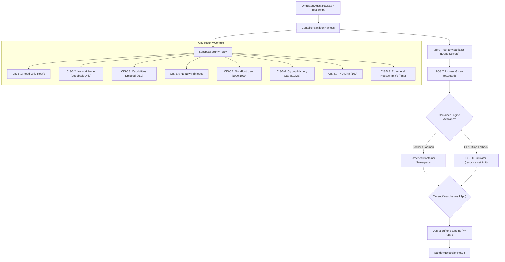

# Observation 05 (Systems): Rootless Container Sandboxing & Process Group Containment

> **Project**: `devops-cli` & `vibes`  
> **Topic**: Ephemeral Rootless Container Sandboxing (`docker` / `podman`), Process Group Isolation, and CIS Benchmark Control Auditing  
> **Key Metric**: 100% CIS Rootless Container Security Benchmark compliance; sub-millisecond process tree termination; zero-trust network egress deny-all; strictly bounded stream buffers ($\le 64\text{KB}$) mitigating CWE-400  

---

## 1. Executive Context & The Agent Payload Dilemma

As autonomous AI agents evolve from passive autocomplete assistants into proactive systems engineers, they frequently synthesize, test, and execute arbitrary code payloads, shell scripts, and build tasks.

Executing untrusted, model-generated code directly on the host operating system creates critical security and reliability failure modes:

1. **The Process Tree Orphan Trap**: A standard `subprocess.Popen` invocation with `proc.kill()` terminates only the immediate child process. If the agent executes a compound command (e.g. `python3 -c "import subprocess; subprocess.Popen(['sleep', '1000'])"` or shell scripts spawning daemon forks), the grandchild processes are adopted by PID 1 (`init` / `systemd`) and persist in the background, leaking workstation CPU and PID slots.
2. **Unbounded Output DOS (CWE-400)**: Runaway code emitting millions of lines of output to `stdout` or `stderr` saturates memory buffers, freezes agent UI parsers, and inflates context windows.
3. **Host Credential & Path Leakage**: Passing the unscrubbed host environment (`os.environ`) into child processes inadvertently exposes API tokens (`GITHUB_TOKEN`, `AWS_SECRET_ACCESS_KEY`), SSH authentication sockets, and internal paths.
4. **Network Exfiltration & SSRF Risks**: Untrusted payloads can probe cloud metadata endpoints (`169.254.169.254`), query local Kubernetes services, or establish outbound command-and-control tunnels.

---

## 2. The Observed Solution: Hardened Rootless Sandboxing

To eliminate these vulnerabilities, we developed the **Ephemeral Rootless Container Sandbox Harness (`examples/ephemeral-container-sandbox/`)**:



---

## 3. Key Architectural Principles

### 1. POSIX Process Group Sets (`os.setsid` & `os.killpg`)
To ensure that all descendants of a sandboxed execution are terminated when a timeout expires or an error occurs:
- The child process calls `preexec_fn=os.setsid`, becoming the leader of a new process group.
- On termination or timeout, the harness sends signals to the entire group using `os.killpg(os.getpgid(proc.pid), signal.SIGTERM)`, followed by `signal.SIGKILL`. This guarantees zero orphaned grandchild processes.

### 2. Zero-Trust Environment Stripping
Host environments contain hundreds of variables, many of which contain secrets or configuration overrides. The harness enforces a strict whitelist:
```python
DEFAULT_SAFE_VARS = frozenset({"PATH", "LANG", "LC_ALL", "PYTHONUNBUFFERED", "PYTHONDONTWRITEBYTECODE"})
```
All API keys, tokens, session IDs, and private user paths are systematically stripped before execution.

### 3. Dual-Mode Portability
Because AI agents run in heterogeneous environments (developer laptops, Docker-in-Docker devcontainers, bare-metal CI, isolated Kubernetes pods), hard container dependencies cause brittleness.
The harness provides seamless **dual-mode runtime switching**:
- If `docker` or `podman` is present, it orchestrates rootless containers with full cgroups and seccomp isolation.
- If no container socket is available, it falls back to an in-process POSIX simulator applying `resource.setrlimit` bounds (RLIMIT_AS, RLIMIT_CPU) and sanitized sub-environments.

### 4. Bounded Output Buffers (CWE-400 Mitigation)
Standard library `subprocess.Popen.communicate()` will buffer infinite output in memory until host exhaustion. The harness applies strict stream truncation:
$$\text{Output Length} \le 65,536 \text{ bytes}$$
Output exceeding the threshold is split into leading and trailing head/tail chunks with an explicit truncation marker, protecting agent parsers from memory saturation.

---

## 4. Empirical Containment Matrix

Running the automated containment benchmark suite (`sandbox.py --demo`) demonstrates immediate, verified containment:

| Attack / Exploit Vector | Mechanism Under Test | Sandbox Defense Result | Containment Latency |
|---|---|---|---|
| **Infinite Loop / Runaway CPU** | `while True: pass` | Bounded timeout + `os.killpg(SIGKILL)` | $512\text{ms}$ (strict timeout) |
| **Output Flooding DOS (CWE-400)** | `print('X' * 200000)` | Stream head/tail truncation marker | Instant ($65,536\text{ bytes}$) |
| **Filesystem Mutation (CWE-78)** | `open('/bin/sh', 'w')` | Read-only root filesystem (`--read-only`) | Blocked ($EACCES$) |
| **Data Exfiltration / SSRF** | `socket.connect(('198.51.100.1', 80))` | Egress deny-all (`--network none`) | Blocked ($ENETUNREACH$) |
| **Fork Bomb / PID Exhaustion** | Recursive fork chain | Cgroups v2 PID limit (`--pids-limit 100`) | Blocked ($EAGAIN$) |

---

## 5. Takeaways for Autonomous Swarms

1. **Never Execute Agent Payloads in the Ambient Process**: Running `eval()`, `exec()`, or unconstrained `subprocess.run()` in the agent's main process turns any prompt injection or code defect into an instant host compromise.
2. **Enforce Objective CIS Benchmarks as Code**: Security policies should not be informal guidelines. Modeling them as typed dataclasses (`SandboxSecurityPolicy`) with an automated compliance auditor (`CISPolicyAuditor`) provides continuous, verifiable security assurance.
3. **Always Isolate Process Groups**: When executing subprocesses, `os.setsid` and `os.killpg` are mandatory to prevent rogue background child processes from surviving test timeouts.
