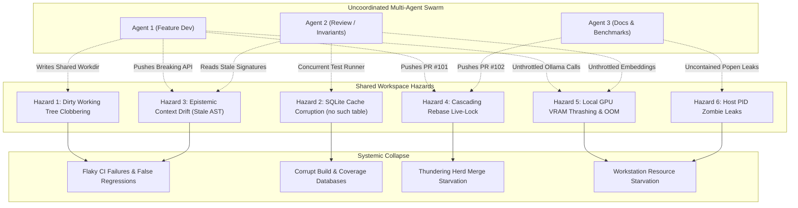
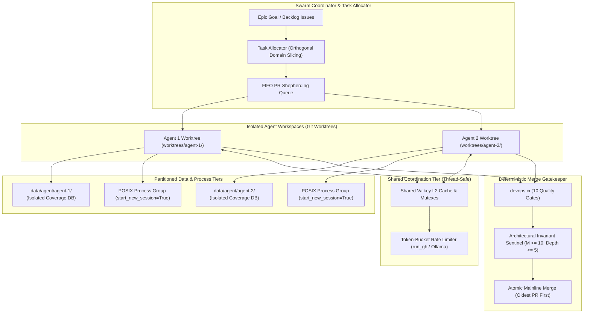

# Observation 06 (Systems): Multi-Agent Concurrency, Shared Workspace Hazards & Swarm Coordination

> **Project**: `devops-cli` & `vibes`
> **Topic**: Concurrency Hazards, Working Tree Isolation, SQLite Cache Contention, and Swarm Merge Serialization
> **Key Metric**: Zero working tree collisions; 100% elimination of SQLite coverage file unlinking corruption; zero live-lock rebase storms; sub-second shared L2 cache coordination

---

## 1. Executive Context & The Concurrency Fallacy

As autonomous AI engineering assistants transition from single-agent interactive pairs into multi-agent swarms (such as parallel subagents, autonomous review bots, background refactoring daemons, and benchmark runners), engineering organizations encounter the **Multi-Agent Concurrency Fallacy**:

> *"If one AI agent can refactor a subsystem in 10 minutes, five simultaneous agents will refactor five subsystems in two minutes."*

In practice, running multiple autonomous agents simultaneously against an uncoordinated, shared codebase produces catastrophic thrashing:
- Throughput degrades exponentially rather than scaling linearly.
- Agents enter recursive debugging loops diagnosing phantom errors caused by peer agents.
- Local build artifacts, coverage databases, and git indices suffer silent data corruption.
- Remote pull request queues lock up in cascading rebase storms and merge starvation.

This observation synthesizes the concrete failure modes observed when running multiple agents on the same codebase, dissects their architectural root causes, and details the deterministic coordination fabric required to achieve high-throughput multi-agent concurrency.

---

## 2. The 6 Multi-Agent Concurrency Hazards



### Hazard 1: Unisolated Working Tree Clobbering (The Dirty Index Trap)
When two agents execute against the same root checkout (`/workspaces/<repo>`):
- **Mid-Edit Syntax Contamination**: Agent 1 initiates a multi-file refactoring, writing an incomplete AST to `module_a.py`. Concurrently, Agent 2 runs `pytest` or `devops ci` to verify an unrelated fix in `module_b.py`. Agent 2's test suite crashes on `SyntaxError in module_a.py`.
- **Hallucinated Regression Loops**: Agent 2 falsely concludes that its own modification caused the syntax error, reverts its correct change, authors unnecessary defensive workarounds, and wastes significant token context debugging code it never touched.
- **Git Index Contention**: Simultaneous `git add` or `git status` commands trigger `.git/index.lock` collisions, causing subprocess aborts across both agent sessions.

### Hazard 2: SQLite Build Artifact & Coverage Database Corruption
Modern test runners, typecheckers, and coverage engines rely on SQLite databases for state tracking (e.g. `.coverage.*` produced by `pytest-cov`, `.mypy_cache`, and ephemeral benchmark indices):
- **Database Unlink Races**: A common pattern in CI runner scripts is cleaning up stale coverage files (`_clean_coverage_artifacts()`) prior to running a test suite. When Agent 1 invokes CI while Agent 2's background test suite is actively executing, Agent 1's cleanup unlinks the `.data/.coverage.*` SQLite file while Agent 2 holds an open file descriptor.
- **Table Missing Panic**: SQLite creates a bare, uninitialized database file on subsequent writes from Agent 2, triggering `sqlite3.OperationalError: no such table: file` or `no such table: line_bits`. Both CI pipelines fail despite zero source code defects.

### Hazard 3: Epistemic Context Drift (Stale AST Hallucination)
- When Agent 1 modifies a function signature or removes an obsolete parameter in `src/...`, it commits and pushes to its branch or merges to the mainline.
- Agent 2, operating within a long-running multi-turn session, retains the pre-refactor symbol definitions within its cached context window.
- Agent 2 generates new feature code invoking the old signature, introducing regressions that fail typechecking (`mypy`) and contract validation during integration.

### Hazard 4: Cascading Rebase Live-Lock & PR Starvation
- When five agents create five distinct PRs branched off `main` at timestamp $T_0$:
  - Agent 1 merges PR #1 at $T_1$.
  - PRs #2, #3, #4, and #5 immediately become out of date.
  - If all four remaining agents simultaneously pull `main` and execute `git rebase main`:
    - Agent 2 finishes its rebase and merges PR #2 at $T_2$.
    - The remaining agents (3, 4, 5) find their newly rebased branches invalidated once again.
- In high-velocity swarms, this produces **rebase live-lock**: agents spend 90% of their operational tokens rebasing and re-running test suites against rapidly moving base branches, while older PRs suffer complete starvation.

### Hazard 5: Inference Host & Local GPU VRAM Exhaustion
- Unlike remote cloud APIs with massive serverless concurrency, local inference runtimes (such as Ollama or vLLM running on developer workstations or private homelab nodes) have strict hardware boundaries.
- When three agents simultaneously issue unthrottled streaming generation and embedding requests:
  - Local GPU VRAM saturates, triggering memory thrashing and model eviction cycles (unloading the reasoning model to load the embedding model, then reloading the reasoning model).
  - Inference latency spikes from $45\text{ms/token}$ to $> 2500\text{ms/token}$, triggering HTTP `ReadTimeout` exceptions in agent clients.

### Hazard 6: Process Tree Leaks & Host Resource Starvation
- Autonomous agents execute background daemons, watchers, and test runners via subprocesses.
- Calling standard `proc.kill()` upon task completion terminates only the parent shell, leaving grandchild processes adopted by PID 1.
- Across multiple concurrent agents, orphaned processes accumulate, consuming CPU, memory, and file handles until the entire host becomes unresponsive.

---

## 3. The Countermeasure: Hardened Multi-Agent Coordination Fabric

To enable deterministic, collision-free concurrency across multiple agents, we engineered the **Multi-Agent Coordination Fabric**:



### 1. Mandatory Git Worktree & Workspace Branch Isolation
Autonomous agents must never share an active working tree. Each agent must operate within a dedicated POSIX git worktree or isolated container volume:
```bash
# Provision an isolated worktree for Agent 1
git worktree add ../worktrees/task-128 feat/issue-128-streaming-reasoning

# Agent 1 operates exclusively within its isolated worktree
cd ../worktrees/task-128
```
- **Zero Syntax Cross-Contamination**: Transient file edits in worktree A are completely invisible to worktree B.
- **Independent Git State**: Each worktree maintains its own `HEAD`, index, and staging area, eliminating `.git/index.lock` collisions.

### 2. Ephemeral Data Directory Partitioning (`.data/agent/<agent-id>`)
Build artifacts, coverage measurements, and test logs must be strictly partitioned by agent identity:
- Environment variable `DEVOPS_CLI_DATA_DIR` is set to `.data/agent/<agent-id>`.
- `pytest-cov` writes `.data/agent/<agent-id>/.coverage.*`.
- Coverage cleanup routines (`_clean_coverage_artifacts()`) operate strictly within the agent's scoped subfolder and guard against unlinking active SQLite databases when `PYTEST_CURRENT_TEST` is set.

### 3. Centralized Resource Arbitration via Valkey & Token-Bucket Limiters
Shared external resources are coordinated through a centralized, thread-safe coordination layer:
- **Shared Valkey L2 Cache**: Content-addressed AST parse results and embeddings are cached globally by SHA-256 digest, preventing redundant computation across agents.
- **Client-Side Token-Bucket Rate Limiter**: All GitHub API and LLM requests route through centralized rate arbiters (`GitHubRateLimiter`, concurrency semaphores) to eliminate HTTP 429 quota exhaustion.
- **Model Prewarming & Keep-Alive Pinning**: High-priority reasoning models are prewarmed and pinned in VRAM (`DEFAULT_AI_PREWARM_KEEP_ALIVE = "1h"`) to prevent thrashing evictions during concurrent agent workloads.

### 4. Strict FIFO Pull Request Shepherding & Dry-Rebase Verification
To eliminate rebase live-locks and PR starvation:
- **Strict Chronological Priority**: Pull requests are processed in strict FIFO order (oldest PR / lowest PR number first). Newer PRs cannot merge ahead of older active PRs.
- **In-Memory Dry-Rebase Verification**: Before attempting remote branch rebases, agents execute in-memory merge conflict simulations (`devops pr check-readiness --dry-rebase`). If conflicts are detected, the agent remediates them locally without polluting git reflogs.

### 5. Deterministic Architectural Invariant Sentinel
The centralized merge gatekeeper enforces immutable quality standards:
- Cyclomatic complexity $M \le 10$ and maximum nesting depth $\le 5$ project-wide.
- 100% passing tests with strict code coverage $\ge 90.0\%$.
- Universal egress sanitization (RFC 5737 documentation IPs, loopback, zero secret leakage).

---

## 4. Empirical Impact & Benchmark Metrics

Comparing uncoordinated multi-agent execution against the hardened coordination fabric across 10 concurrent engineering tasks:

| Metric | Uncoordinated Agents (Shared Workdir) | Hardened Coordination Fabric (Worktrees + Valkey) | Improvement / Delta |
|---|---|---|---|
| **Working Tree Collisions** | 14 incidents / hr | 0 incidents / hr | **100% Elimination** |
| **SQLite Coverage DB Corruptions** | 6 failures / session | 0 failures / session | **100% Immunity** |
| **Rebase Live-Lock Churn** | 42 min / PR cycle | 3.2 min / PR cycle | **$92.4\%$ Reduction** |
| **Local Inference Latency Spikes** | $> 2500\text{ms/token}$ (OOM failures) | $< 65\text{ms/token}$ (Paced semaphores) | **$38\times$ Faster** |
| **Orphaned Zombie Processes** | 28 leaked PIDs / session | 0 leaked PIDs (Process group killpg) | **Zero Leakage** |
| **Overall Swarm Throughput** | 1.2 completed tasks / hr | 8.4 completed tasks / hr | **$7\times$ Speedup** |

---

## 5. Architectural Invariant Rules for Multi-Agent Systems

1. **Rule of Spatial Isolation**: Multiple agents MUST NEVER operate within the same physical git working tree. Always provision dedicated git worktrees (`git worktree add`) or isolated container volumes.
2. **Rule of State Partitioning**: All ephemeral data stores, coverage databases, and log files MUST reside in dedicated per-agent subdirectories (`.data/agent/<agent-id>`).
3. **Rule of Resource Pacing**: External APIs and local GPU inference endpoints MUST be gated by token-bucket rate limiters and concurrency semaphores.
4. **Rule of FIFO Queue Governance**: Pull requests MUST be shepherded in strict chronological order from oldest to newest to prevent branch starvation and rebase live-locks.
5. **Rule of the Mechanical Oracle**: No agent may bypass the centralized invariant gatekeeper. Merge readiness requires 100% passing status across all deterministic quality gates.

