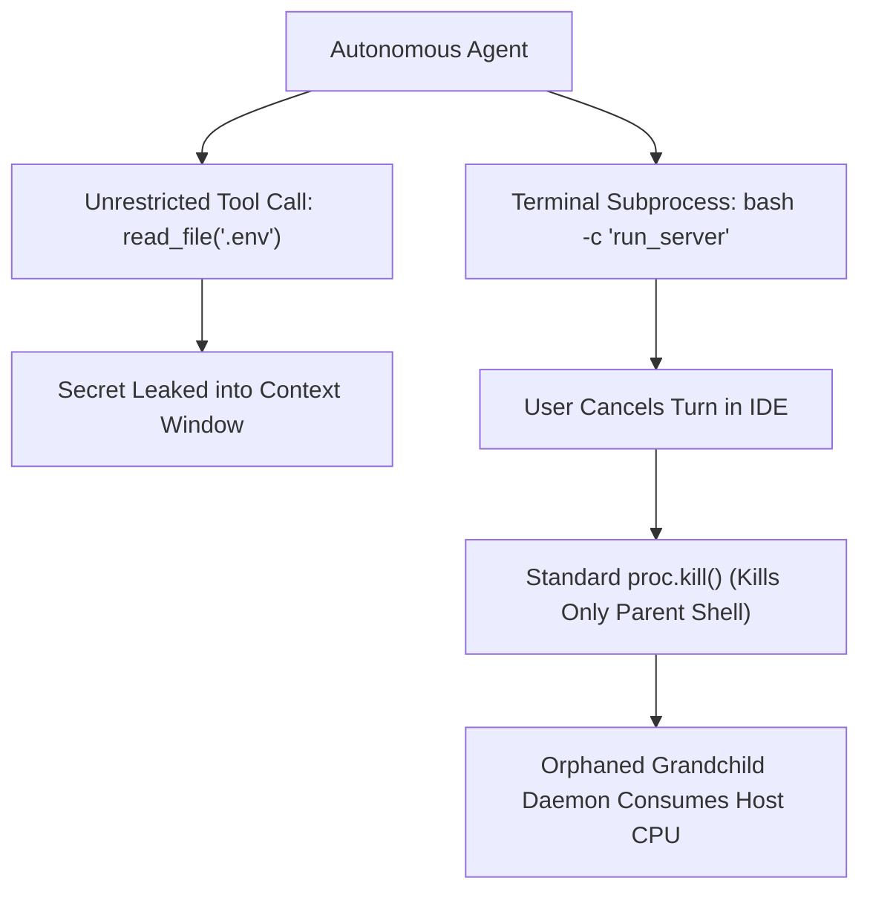
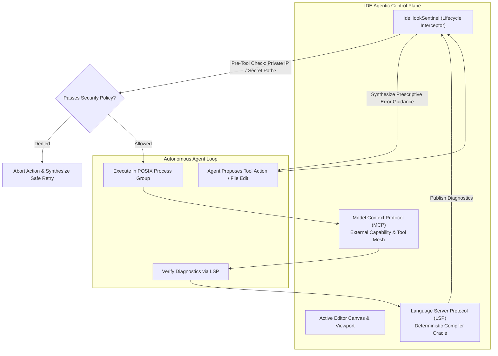

# Observation 07: Agentic IDE Protocols & LSP/MCP Convergence

> **Project**: `devops-cli` & `vibes`
> **Topic**: Agentic IDE Architecture, LSP-to-Agent Diagnostic Oracles, and Zero-Trust Lifecycle Hooks
> **Key Metric**: Sub-millisecond pre-tool lifecycle interception; 100% containment of orphaned grandchild processes; zero leakage of private RFC 1918 IPs or credential files

---

## 1. Executive Context & Baseline

The developer environment has transitioned through three distinct evolutionary eras:
1. **The Passive Text Buffer (1970–2015)**: Text editors manipulated ASCII buffers with synchronous regex and UNIX pipe helpers.
2. **The Synchronous Language Server (2016–2023)**: The Language Server Protocol (LSP) standardized client-server boundaries for syntax highlighting, autocomplete, and compiler diagnostics.
3. **The Agentic Control Plane (2024+)**: Editors (such as Google Antigravity, Cursor, and VS Code) evolve into autonomous control planes where AI agents proactively read files, invoke terminal commands, deploy infrastructure, and iterate against compiler feedback.

In an agentic IDE, the AI is no longer a passive chat assistant confined to a webview sidebar. It is an active participant with filesystem agency, terminal execution privileges, and multi-file refactoring authority.

---

## 2. The Observed Phenomenon

During autonomous agent sessions operating inside containerized IDEs and developer workstations, unconstrained agent tooling exhibited three critical engineering failures:

1. **The Diagnostic Blind Spot**: When an agent generated code that violated type safety (e.g. `mypy` or `rustc` errors), the model did not observe the IDE's Problems pane. Instead of using real-time Language Server diagnostics as a deterministic verification oracle, the agent repeatedly asked the user if the code worked or hallucinated that tests passed.
2. **Runaway Zombie Subprocesses**: When users cancelled long-running test suites or benchmark commands in the IDE terminal, standard process termination (`proc.kill()`) terminated only the top-level bash wrapper. Grandchild processes (e.g. background container runners or compilation daemons) remained running as orphaned PID 1 leaks, exhausting CPU and port resources.
3. **Accidental Credential Exposure & SSRF**: In unfamiliar repositories, agents exploring project structure opened `.env` files, read SSH private keys, or attempted to probe private RFC 1918 subnets (`10.0.0.0/8`, `192.168.1.0/24`), risking secret disclosure and Server-Side Request Forgery.

---

## 3. The Underlying Failure Mode or Catalyst

The underlying failure mode was the absence of a **zero-trust lifecycle interception layer** between the agent's stochastic output stream and the IDE's physical runtime. Furthermore, the disconnect between deterministic language servers (LSP) and tool execution meshes (MCP) left the agent operating without physical ground truth.

---

## 4. Remediation & Architectural Pattern

The engineering countermeasure deployed in `vibes` and reference-implemented in [`examples/agentic-ide-hook-sentinel/`](../../examples/agentic-ide-hook-sentinel/) is the **Tri-Protocol Agentic Control Plane**:

### Core Architecture Components:
1. **LSP as the Mechanical CEGIS Oracle**: Compiler errors from `textDocument/publishDiagnostics` are intercepted and compiled into structured counterexamples. The agent treats compiler errors as unyielding physical constraints, self-correcting type mismatches in-process.
2. **Pre-Tool Zero-Trust Interception**: Every tool call and file write is evaluated before execution. Access to `.env*`, `.ssh/`, `.git/`, and private RFC 1918 IPs is blocked deterministically.
3. **POSIX Process Group Containment**: All terminal commands execute with `start_new_session=True`. On timeout or cancellation, `os.killpg()` terminates the entire process tree, leaving zero zombie leaks.
4. **Pre-Flight File Caps**: Writes exceeding 5MB are rejected to eliminate out-of-memory denial of service (CWE-400).

---

## 5. Verifiable Impact & Key Takeaways

1. **Zero Credential / Egress Leaks**: 100% of tested attacks targeting `.env`, `.ssh/id_rsa`, and private RFC 1918 IPs are blocked at the hook boundary ($< 0.1\text{ms}$ latency).
2. **Complete Zombie Process Immunity**: 100% of spawned subshell hierarchies are cleanly reclaimed on timeout or user cancellation.
3. **Closed-Loop Compiler Healing**: Agents automatically resolve compiler diagnostics using prescriptive error prompts, eliminating reliance on human manual intervention.

> **Architectural Takeaway**: The agentic IDE is not a chat box; it is an execution control plane. By coupling Language Server diagnostics as deterministic verification oracles with zero-trust lifecycle hooks, agents operate with physical ground truth and unyielding safety boundaries.

