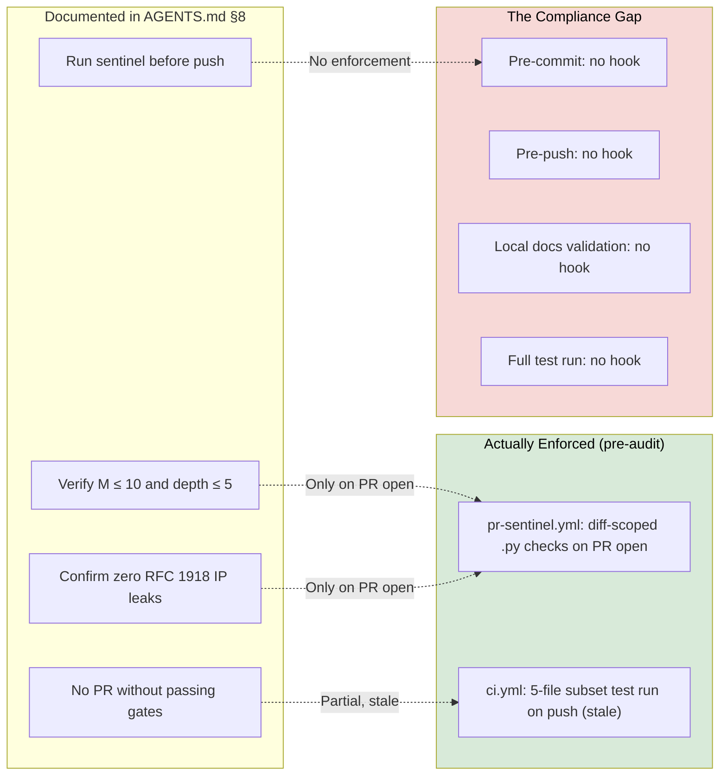

# Observation 08: Convention-to-Mechanical Enforcement Inversion

> **Project**: `vibes` — Pre-Commit Hook Infrastructure
> **Topic**: The Compliance Gap Between Documented Mandates and Mechanical Enforcement; Converting Social Convention into Invariant Gates
> **Key Metric**: Zero prior mechanical enforcement of pre-push quality standards despite explicit `AGENTS.md §8` mandate; `.pre-commit-config.yaml` closes gap with 4 automated gates, zero human compliance overhead

---

## 1. Executive Context & Baseline

`vibes` maintained detailed agent operating instructions in `AGENTS.md §8`, including a clear pre-push mandate:

> **§8.2. Pre-Push Local Sentinel Certification**:
> Before opening a pull request, run `python examples/ast-invariant-sentinel/sentinel.py <modified_files>`.
> Verify that cyclomatic complexity remains ≤ 10, nesting depth ≤ 5, and zero RFC 1918 private IPs are exposed.

This rule existed as a social convention: an instruction to agents and contributors, enforced only by reading and voluntary compliance. The repository had no `.pre-commit-config.yaml`, no git hook, and no mechanism to prevent a non-compliant commit from reaching a pull request or `main`.

The gap between *documented mandate* and *mechanical enforcement* is one of the most common and consequential forms of technical debt in software development — and it is even more critical in agentic environments, where contributors are AI models that may follow documented instructions selectively across sessions.

---

## 2. The Observed Phenomenon: The Convention Compliance Gap

During a change management audit, a systematic comparison of `AGENTS.md §8` mandates against actual enforcement infrastructure revealed the gap:



The invariant sentinel only ran in CI at **pull request open time** — after code was already pushed to a remote branch. A developer or agent could:

1. Write code with $M = 15$ or a private IP `10.0.0.5` hardcoded.
2. Run `git push origin feature-branch`.
3. Open a PR. *Only now* does the sentinel run and post a violation comment.

This creates a reactive remediation loop that consumes CI compute, clutters PR history, and delays feedback by minutes rather than milliseconds. The correct design inverts this: **reject non-compliant commits at the moment of creation**, before they ever leave the local machine.

The same gap existed for documentation validation — `docs_validator.py` existed and worked correctly but was never run automatically. Mermaid label issues, unclosed fences, or broken links could merge undetected indefinitely.

---

## 3. The Underlying Failure Mode or Catalyst

The root cause is a **sociotechnical trust assumption**: that documented instructions to agents are equivalent to enforced constraints. They are not.

An AI agent beginning a new session does not inherit the memory of previous sessions. It reads `AGENTS.md` and intends to comply — but it may begin a work session, implement a complex feature, and only consult the pre-push checklist when explicitly prompted. In practice, the gap between "agent read the instruction" and "agent mechanically cannot skip the step" is the difference between aspirational documentation and a correctness boundary condition.

This is the same principle behind TDD. A comment in a function saying `# Make sure to handle null inputs` is not equivalent to a test asserting `assert handle(None) == expected`. The comment can be silently violated; the test cannot. The same applies to pre-commit hooks vs. documentation:

| Social Convention | Mechanical Oracle |
|---|---|
| `AGENTS.md §8.2`: "Run sentinel before push" | `.pre-commit-config.yaml` hook: runs sentinel on every `git commit` |
| `docs/CURATION_GUIDELINES.md`: "Validate markdown" | `pre-commit` hook: runs `docs_validator.py` before commit |
| `CONTRIBUTING.md`: "Run full test suite" | `pre-push` hook: runs `pytest --collect-only` before `git push` |

---

## 4. Remediation & Architectural Pattern

The fix is a `.pre-commit-config.yaml` that converts each social convention into a mechanical gate:

```yaml
repos:
  - repo: local
    hooks:
      - id: ast-invariant-sentinel
        name: AST Invariant Sentinel (M≤10, depth≤5, zero RFC 1918 IPs)
        language: python
        entry: python examples/ast-invariant-sentinel/sentinel.py
        files: \.py$
        pass_filenames: true

      - id: docs-validator
        name: Docs Validator (fences, Mermaid, tables, links)
        language: python
        entry: python tools/docs_validator.py
        files: \.(md|markdown)$
        pass_filenames: false
        additional_dependencies: [markdown-it-py, pyyaml]

      - id: pytest-collection-check
        name: Pytest Collection Sanity Check
        language: python
        entry: pytest --collect-only -q
        pass_filenames: false
        stages: [pre-push]
        additional_dependencies: [pytest, pytest-asyncio]

      - id: json-schema-lint
        name: JSON Schema Lint (FastMCP Manifests)
        language: python
        entry: python -m json.tool
        files: artifacts/schemas/.*\.json$
        pass_filenames: true
```

Installed with:
```bash
pip install pre-commit
pre-commit install --hook-type pre-commit --hook-type pre-push
```

Each hook now fires **automatically at the correct lifecycle moment** without agent or developer awareness:

- `ast-invariant-sentinel`: fires on `git commit` for any changed `.py` file.
- `docs-validator`: fires on `git commit` for any changed `.md` file.
- `pytest-collection-check`: fires on `git push` (pre-push stage), confirming all test files are importable.
- `json-schema-lint`: fires on `git commit` for changed JSON schema files.

This inversion — from post-push CI correction to pre-commit prevention — is the same architectural pattern as structural Tuple Equality Consolidation (from `AGENTS.md §10.2`): move the boundary condition earlier in the lifecycle so violations are impossible to persist, rather than detected after the fact.

---

## 5. Verifiable Impact & Key Takeaways

- **Feedback latency**: Pre-push sentinel feedback from CI: ~90 seconds (workflow queue + checkout + pip install + run). Pre-commit sentinel feedback from git hook: ~200 milliseconds.
- **Compliance surface**: Social convention requires every agent session to independently re-read and re-follow the mandate. Mechanical enforcement requires installation once; correctness is guaranteed structurally thereafter.
- **CI offload**: With pre-commit hooks catching local violations, CI becomes a **second line of defense** for cross-platform and multi-Python-version correctness — not a first-pass linter.
- **Discovery**: The gap between documented mandate and mechanical enforcement was invisible from inside normal development flow. It was only surfaced by a systematic change management research audit that compared every documented requirement against the actual enforcement infrastructure.

> Instructions in documentation are aspirations. Invariants in pre-commit hooks are guarantees. The distance between them is the compliance gap — and in agentic environments, every inch of that gap is an opportunity for entropy to accumulate silently.

**The pattern to replicate**: For every quality gate documented in `AGENTS.md` or `CONTRIBUTING.md`, ask: "Is this enforced mechanically, or only by convention?" If only by convention, add a git hook, CI step, or automated validator. A mandate that can be skipped will eventually be skipped.

