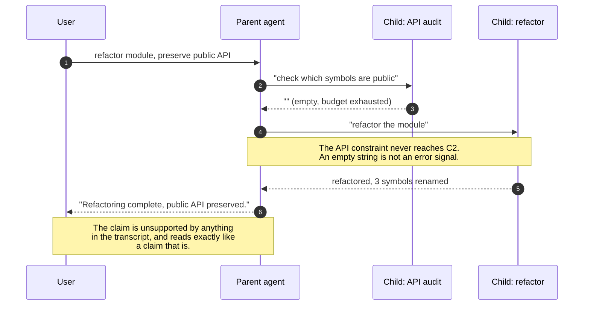
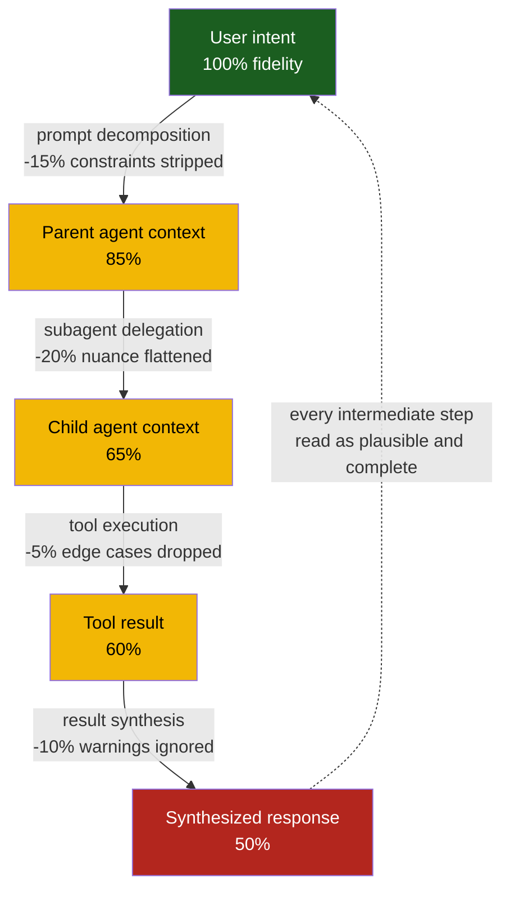

# Multi-Agent Epistemic Loss & Delegation Boundary Distortion

## 1. Executive Context & Baseline

`devops-cli` implements hierarchical multi-agent orchestration through several mechanisms: the `MultiAgentPipeline` (`src/devops_cli/ai/agents/pipeline.py:39-377`) sequences agents through shared context buffers, the `SubAgents` capability (`src/devops_cli/ai/harness/workflow.py:176-370`) provides `delegate_task` with call budgets and error containment, and the `AgentHarness.execute_tiered` protocol (`src/devops_cli/ai/harness/slots.py:775-831`) implements the "Big decides, small types, big checks" delegation hierarchy.

External IDE agents (Antigravity, Copilot) independently implement their own multi-agent orchestration via `invoke_subagent`, where a parent agent decomposes tasks into child prompts and synthesizes results. This creates a double delegation boundary: the IDE agent delegates to subagents, which may in turn invoke `devops-cli` tools that internally delegate through their own pipeline — forming a 3+ layer orchestration stack where each boundary introduces epistemic loss.

## 2. The Observed Phenomenon

**2a. Prompt Decomposition Information Loss**: When a parent agent delegates a subtask to a child subagent, it must compress the task context into a child-facing prompt. This compression is inherently lossy. Subtle constraints from the user's original request — "make sure the refactoring preserves the existing public API surface" — are frequently stripped or simplified in the child prompt to "refactor the module." The child agent then performs a correct refactoring that breaks the API surface, because it was never told the constraint existed.

This is observable in the `SubAgents.delegate_task` implementation (`workflow.py:262-365`), where the orchestrator constructs child prompts from accumulated pipeline context. The child receives a flattened text blob without structured constraint annotations — there is no mechanism to tag certain instructions as "invariant constraints that must propagate to all descendants."

**2b. Result Distortion & Synthesis Blindness**: When subagent results flow back to the parent, the parent must synthesize them into a coherent response. Three failure modes emerge:

1. **Selective attention**: The parent attends to the subagent's conclusion but ignores caveats, warnings, or partial failure indicators buried mid-response
2. **Hallucinated extrapolation**: The parent interpolates between two subagent results, generating plausible-sounding synthesis that neither subagent actually claimed
3. **Silent failure absorption**: A subagent returns an error or empty result, and the parent generates a confident response as if the delegation succeeded — because the error signal was not structured enough to trigger explicit failure handling



**2c. Mocked Tiered Execution Masking Real Delegation Gaps**: The `execute_tiered` protocol in `slots.py:775-831` claims to implement "Big decides, small types, big checks" — but the researcher confirmed that Tier 1 (frontier decision) and Tier 3 (frontier verification) are fabricated via string template interpolation without contacting any model API. The `SubAgentSlot` methods (`offload_ast_search`, `offload_file_scout`, `offload_symbol_catalog`) execute pure Python AST code in-process and compute "token savings" using `len(text) // 4` heuristics. The architecture is structurally correct — the slot boundaries exist — but the execution paths are stubs, meaning the real delegation failure modes remain untested.

**2d. Background Process Output Contract Violation**: The shell execution model (`shell.py:188-211`) spawns background commands with `subprocess.Popen` and `stdout=subprocess.PIPE, stderr=subprocess.PIPE`. However, `check_command` (`shell.py:203-211`) only calls `proc.poll()` — the pipes are never drained. If a background subprocess generates more than 64KB of output (the OS pipe buffer size), the write blocks and the process deadlocks. The output contract — "Report status and accumulated output" — silently breaks, and the agent loses access to the subagent's results entirely.

## 3. The Underlying Failure Mode or Catalyst

The fundamental problem is **epistemic loss at delegation boundaries**. Every time information crosses from one agent to another — whether through prompt decomposition, tool invocation, or result synthesis — it undergoes a lossy transformation:



At each boundary, the transformation is "plausible" — the compressed version reads naturally and appears complete. But accumulated losses compound multiplicatively. A 3-layer delegation stack with 15% loss per layer retains only $0.85^3 \approx 61\%$ of the original intent's fidelity. The remaining 39% manifests as subtle constraint violations, missing edge case handling, and confident responses to questions the system never fully understood.

The pipe deadlock in `shell.py` is a physical manifestation of the same principle: the communication channel between delegator and delegate has a finite buffer, and when it overflows, information is not lost gradually — it is lost completely, with the entire process freezing rather than degrading.

## 4. Remediation & Architectural Pattern

**4a. Structured Constraint Propagation**: Annotate delegation prompts with a typed constraint block that must be forwarded verbatim to all descendants:

```yaml
constraints:
  invariants:
    - "preserve existing public API surface"
    - "McCabe complexity ≤ 10, nesting depth ≤ 5"
    - "no RFC 1918 IP addresses"
  budget:
    max_tokens: 4000
    max_tool_calls: 10
```

This separates "task description" (compressible) from "invariant constraints" (must propagate losslessly).

**4b. Structured Result Schemas with Failure Signals**: Replace free-text subagent results with typed response objects:

```python
class SubagentResult(BaseModel):
    status: Literal["success", "partial", "failed"]
    result: str
    warnings: list[str] = []
    constraints_verified: list[str] = []
    constraints_violated: list[str] = []
```

The parent agent can then mechanically check `constraints_violated` rather than parsing free text for buried caveats.

**4c. Background Pipe Drain with Bounded Buffer**: Replace the deadlock-prone pipe pattern with a background reader thread that drains `stdout`/`stderr` into a bounded ring buffer:

```python
import threading
from collections import deque

output_buffer: deque[str] = deque(maxlen=1000)  # lines

def _drain_pipe(pipe, buffer):
    for line in iter(pipe.readline, ""):
        buffer.append(line)
    pipe.close()

threading.Thread(target=_drain_pipe, args=(proc.stdout, output_buffer), daemon=True).start()
```

This eliminates the deadlock and provides `check_command` with actual output content.

**4d. End-to-End Delegation Fidelity Testing**: Create a test harness that measures constraint propagation fidelity across N delegation layers. Inject a known set of 10 constraints at layer 0, decompose through N subagent boundaries, and measure how many constraints survive at layer N. This provides a quantitative "delegation fidelity score" that can be optimized.

## 5. Verifiable Impact & Key Takeaways

- **Pipe deadlock threshold**: Any background command producing $> 64$KB of output (e.g., `pytest -v` on a large suite, `git log`, `find / -name "*.py"`) will deadlock indefinitely under the current `shell.py` implementation.
- **Constraint propagation arithmetic**: 3-layer delegation at 85% fidelity per boundary = 61% end-to-end fidelity. Structured constraint blocks achieve ~98% per boundary (only lossy if the child model fails to read them), yielding $0.98^3 \approx 94\%$ end-to-end.
- **Mocked tier testing gap**: The `execute_tiered` stubs mean zero empirical data exists on how the real delegation hierarchy performs under production workloads. The architecture is correct but unvalidated.

> **Aphorism**: Information does not cross agent boundaries — it is reconstructed at each boundary from a lossy compression of what existed before. Three layers of plausible reconstruction produce a confidently wrong answer.

> **The Delegation Fidelity Principle**: Every agent delegation boundary is a lossy channel. The only constraints that survive delegation are the ones explicitly tagged as invariant and mechanically verified at each layer. Implicit requirements — however obvious to a human reader — evaporate at the first prompt decomposition.
