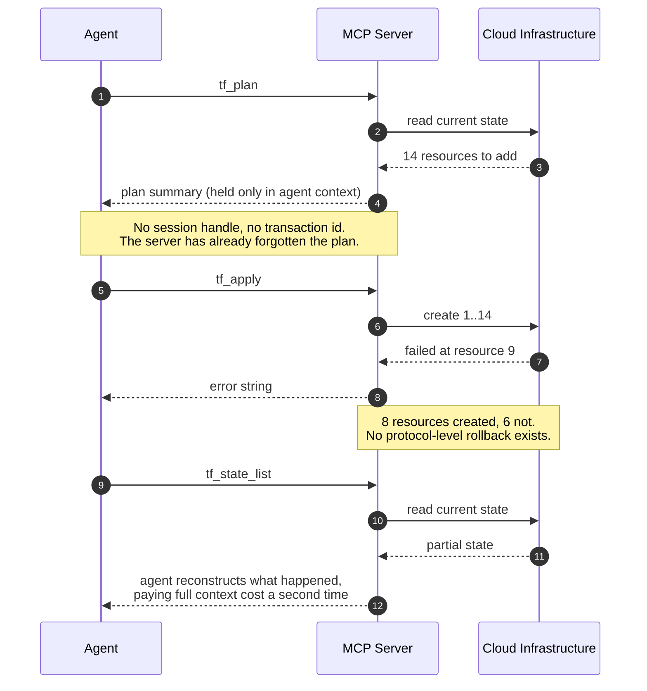
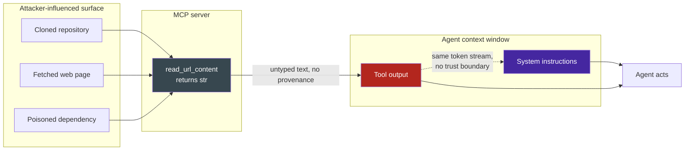

# MCP Protocol Boundaries & Stateless Transport Constraints

## 1. Executive Context & Baseline

The Model Context Protocol (MCP) has become the dominant interface between AI coding assistants and developer tools. `devops-cli` exposes over 100 FastMCP tools across 15+ namespaces, served via `stdio` transport for local IDE connections. The protocol defines three primitive types — **Tools** (callable functions with JSON Schema parameters), **Resources** (URI-addressable static data), and **Prompts** (templated instruction fragments) — providing a structured alternative to raw subprocess invocation.

However, MCP's design philosophy of stateless, request-response tool calls introduces fundamental constraints that shape how agentic systems can operate. These constraints are not bugs to be fixed but architectural boundaries that must be understood and designed around.

## 2. The Observed Phenomenon

**2a. Statelessness vs. Session Continuity**: MCP tools are stateless functions — each invocation receives parameters and returns results with no guaranteed session context between calls. When an agent performs a multi-step workflow (e.g., `tf_plan` → review plan → `tf_apply`), the protocol provides no transaction boundary or rollback mechanism. If `tf_apply` fails halfway, there is no protocol-level way to undo the partial application. The agent must reconstruct the failure state from scratch by calling diagnostic tools.

This statelessness is by design — it simplifies tool implementation and eliminates server-side session management — but it forces the agent to maintain all workflow state in its own context window, which compounds the context accumulation problem from Observation 19.



The protocol has no place to put the fact that a transaction is in flight. The agent's context window is the only durable store in the system, which is why the transaction journal in section 4 below is agent-side rather than server-side.

**2b. Tool Discovery Scalability Pressure**: When an MCP client connects to a server exposing 100+ tools, the `tools/list` response serializes every tool's JSON Schema into a single response payload. For `devops-cli`'s tool surface, this payload exceeds 30,000 tokens. The client must either:

1. Inject all schemas into the model's context (consuming 25%+ of the window), or
2. Implement lazy schema resolution, loading tool definitions on-demand

The MCP specification supports both eager and lazy loading, and `devops-cli` explicitly categorizes tools as `Eager:` or `Lazy:` in its server manifest. But most client implementations (Copilot, Cursor) default to eager loading, negating the server's lazy intent.

**2c. Resource Underutilization**: MCP Resources provide URI-addressable, cacheable, subscription-capable data endpoints (e.g., `resource://ai/research/mental_model`, `resource://dashboard/k8s`). Unlike Tools, Resources are designed for read-heavy, stable data that changes infrequently — perfect for configuration, status dashboards, and cached analysis results. Yet in practice, agent frameworks default to dynamic Tool calling for every data access, even when a Resource would provide cheaper, cached, deterministic results. The `devops-cli` roadmap defines 20+ planned MCP Resources across milestones v0.2.20-v0.2.23, but current implementations rely almost exclusively on Tools.

**2d. Security Surface of Tool Return Strings**: MCP tool responses are untyped text strings returned to the agent's context. An attacker who controls tool output (e.g., via a compromised git repository, a malicious web page fetched by `read_url_content`, or a poisoned dependency) can inject instructions that the agent interprets as system-level directives — a form of **indirect prompt injection** through the tool response channel. The MCP protocol provides no mechanism for marking tool output as "untrusted user data" versus "trusted system instructions."



Both arrows into `Agent acts` carry equal authority. The trust boundary that exists in every other part of the stack — between data and code — has no representation in the token stream.

## 3. The Underlying Failure Mode or Catalyst

MCP's constraints stem from its foundational design principle: **tools as pure functions**. This is the correct abstraction for single-step operations (read a file, run a command, query a database), but it creates friction for three categories of agentic work:

1. **Multi-step transactions**: Workflows requiring atomic commit/rollback semantics (infrastructure provisioning, database migrations, multi-file refactoring) have no protocol-level transactional envelope. The agent must implement its own transaction log in context memory.

2. **Streaming and long-running operations**: MCP's request-response model assumes tools complete in bounded time. Long-running operations (build processes, deployment rollouts, benchmark suites) must either block until completion (risking timeout) or return immediately with a polling handle — pushing the polling loop into the agent's turn budget.

3. **Bidirectional communication**: MCP is unidirectional (client → server → response). There is no server-initiated push mechanism in the core protocol. If a deployment finishes 5 minutes after the agent's last poll, the agent won't know until it polls again. SSE transport partially addresses this, but `stdio` transport — the default for local IDE connections — does not.

These are not deficiencies in MCP's design; they are the natural trade-offs of a protocol optimized for simplicity, composability, and security isolation. The failure mode occurs when agentic systems treat MCP as a general-purpose RPC framework rather than a constrained tool interface.

## 4. Remediation & Architectural Pattern

**4a. Agent-Side Transaction Journals**: For multi-step workflows, maintain an explicit transaction log in the agent's context:

```python
transaction = {
    "id": "tf-apply-20240918",
    "steps_completed": ["tf_plan"],
    "steps_pending": ["tf_apply"],
    "rollback_commands": ["tf destroy -auto-approve"],
    "state_snapshot": "plan_output_hash_abc123",
}
```

On failure, the agent consults the journal to determine rollback steps rather than relying on protocol-level undo.

**4b. Resource-First Data Access**: Default to MCP Resources for read-heavy, stable data. Reserve Tools for mutation and dynamic computation:

| Use Case | Correct Primitive | Why |
|---|---|---|
| Current pod status | Resource (`resource://k8s/pods`) | Cacheable, subscribable, cheap |
| Deploy a stack | Tool (`k8s_deploy_stack`) | Mutating, requires parameters |
| Gateway health | Resource (`resource://ai/gateway/status`) | Stable, polled frequently |
| Trigger failover | Tool (`ai_gateway_failover`) | Mutating, requires confirmation |

**4c. Tool Output Sandboxing via Content Tagging**: Treat all MCP tool return strings as untrusted input. Apply the same sanitization pipeline used for user input — strip potential instruction injections, validate against expected output schemas, and cap output length to prevent context flooding.

**4d. Lazy Tool Discovery with Domain Routing**: Implement client-side lazy tool resolution that queries `tools/list` with domain filters rather than loading the full manifest:

See pattern: [tool-cardinality-budget-management](../../patterns/tool-cardinality-budget-management.md)

## 5. Verifiable Impact & Key Takeaways

- **Resource vs Tool cost**: A Resource lookup is a cached read (~0 tokens of schema overhead, ~100 tokens of result). A Tool call requires schema in context (~80 tokens overhead) plus parameter serialization (~30 tokens) plus result (~200 tokens). For read-heavy patterns, Resources are 3× cheaper.
- **Transaction journal cost**: ~200 tokens per transaction state snapshot — negligible compared to the cost of reconstructing failure state from scratch via diagnostic tool calls (~2,000+ tokens).
- **Security surface**: Every tool response is an injection vector. The MCP protocol's lack of content tagging means the agent cannot distinguish "file contents returned by `view_file`" from "instructions crafted by an attacker embedded in file contents." Sanitization must happen at the agent framework layer.

> **Aphorism**: MCP tools are pure functions, not RPC endpoints. The protocol gives you simplicity and composability; it does not give you transactions, subscriptions, or trust boundaries. Design your agent architecture around what the protocol provides, not what you wish it provided.

> **The Resource-First Principle**: If you're calling a Tool to read data that hasn't changed since the last call, you should be using a Resource. Tools are for mutation; Resources are for observation. Confusing the two wastes tokens and increases latency.
