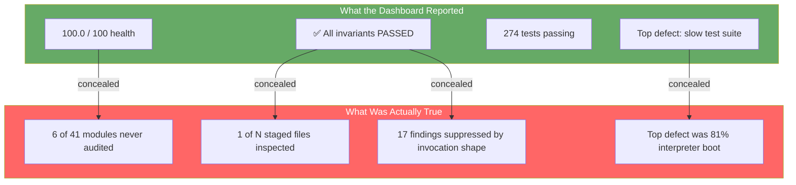

# Observation 11: Silent Certification Failure — When the Gate Reports Success Over Work It Never Did

> **Project**: `vibes` — Mechanical Enforcement Infrastructure
> **Topic**: Gates That Pass Without Auditing; Oracles That Measure Their Own Scaffolding; Verdicts That Depend on Invocation Shape
> **Key Metric**: 1 of 3 supplied files actually audited per pre-commit invocation (`✅ All architectural invariants PASSED!` printed over the other 2); 6 of 41 Python modules ungated in CI; top-ranked repository defect (score 370.0) was 81% interpreter boot

---

## 1. Executive Context & Baseline

[Observation 08](./08-convention-to-mechanical-enforcement-inversion.md) closed the gap between documented mandate and mechanical enforcement: `AGENTS.md §8` stopped being a social convention and became `.pre-commit-config.yaml`, with the AST Invariant Sentinel wired as a `pass_filenames: true` hook firing on every commit.

The infrastructure reported total success. The Resource Iteration Workbench certified **100.0/100 repository health**, 274 passing tests, and zero complexity violations. The sentinel printed `✅ All architectural invariants PASSED! Zero violations.` The SDLC Project Manager, finding no blockers, had inverted to Phase 2 proactive elevation and nominated a performance item as the single highest-value action in the repository.

This observation records what an autonomous session found when it took that green dashboard at face value and started working.

---

## 2. The Observed Phenomenon

Three independent gates were each reporting success over work they had not performed.

**(a) The oracle measured its own harness.** The workbench's top-ranked item — score 370.0, the highest in the backlog — read:

```text
[MEDIUM] [PERFORMANCE] test_crawler.py
  Headline: Test latency in test_crawler.py (2.04s) exceeds 2.0s fast-feedback ceiling
  Next Action: Profile slow fixtures, parallelize independent cases, or isolate mock timeouts.
```

Running that suite directly reported `9 passed in 0.38s`. The oracle timed a `subprocess.run(["python", "-m", "pytest", <file>])` call with a stopwatch, charging every suite ~1.66s of fixed interpreter boot, plugin loading, and collection. No possible edit to `test_crawler.py` could satisfy the threshold — the floor already exceeded it. The repository's top-priority defect was **unfixable by construction**, and had been directing agent attention for an unknown number of sessions.

**(b) The gate read one of N inputs.** `AGENTS.md §8.2` instructs agents to run `sentinel.py <modified_files>` — plural. `.pre-commit-config.yaml` sets `pass_filenames: true`, handing the sentinel every staged Python file in one invocation. The entrypoint read `argv[1]`:

```python
target_path = Path(argv[1]) if argv and len(argv) > 1 else Path(".")
```

Every trailing argument was discarded in silence. A three-file audit printed `Checked 1 Python files.` followed by `✅ All architectural invariants PASSED!`. When the same three files were genuinely audited, **two ZeroTrustSanitization violations appeared** that the gate had been concealing. `docs_validator.py` carried the same defect in a louder form (`nargs="?"` raised `unrecognized arguments` rather than discarding them).

**(c) The verdict depended on invocation shape.** `_collect_py_targets` honored `skip_tests=True` when expanding a directory, but returned any explicitly named file unconditionally:

```python
def _collect_py_targets(root_path: Path, skip_tests: bool) -> list[Path]:
    if root_path.is_file():
        return [root_path] if root_path.suffix == ".py" else []   # skip_tests ignored
    return [p for p in root_path.rglob("*.py") if not (skip_tests and _is_test_file(p))]
```

`sentinel.py tests/` skipped the module that `sentinel.py tests/test_x.py` audited. The same code received opposite verdicts depending on how it was named on the command line.

**(d) Nothing was audited, successfully.** A nonexistent path expanded to zero files and reported a clean audit. Fixing (b) then exposed (c), which exposed a fourth gap: `ci.yml` enumerated `examples`, `tools`, and one benchmark file, leaving all 6 modules in `tests/` ungated — the [structure-driven CI directory contract](../../patterns/structure-driven-ci-directory-contracts.md) anti-pattern this repository already documents, recurring in the very workflow that enforces it.



---

## 3. The Underlying Failure Mode or Catalyst

**Success is the default return value.** Every one of these gates was written so that *doing nothing* produces a pass. Zero files audited is zero violations. A discarded argument is an argument with no findings. A missing path contributes an empty list. The detection logic was correct in each case — the sanitization visitor, the complexity visitor, the latency comparison all worked exactly as designed. What failed was everything *around* the detection: input coverage, measurement scope, and the arithmetic that turns "no findings" into "clean".

Three structural catalysts:

1. **Asymmetric review attention.** Detection logic is the interesting part and gets tested thoroughly — `test_sentinel.py` had 10 tests covering complexity, nesting, RFC 1918 IPs, and subdomain rules, and zero tests covering `main()`. Plumbing is assumed correct because it is boring, and it is precisely the plumbing that decides how much code the interesting logic ever sees.
2. **Harness/artifact conflation.** An oracle that observes a subprocess measures the subprocess, not the artifact inside it. Wall-clock around `python -m pytest` is a legitimate number that answers a question nobody asked. The metric was never wrong; it was never *about* the test suite.
3. **Contract drift between instruction and implementation.** `AGENTS.md` said `<modified_files>`; the code said `argv[1]`. The prose and the implementation disagreed for as long as both existed, and nothing compared them — the instruction file is not itself under test.

The compounding property is what makes this failure class expensive: **a false green is not neutral, it actively redirects effort.** The workbench did not merely fail to find real defects; it ranked a phantom at 370.0 and pointed every subsequent autonomous session at it.

---

## 4. Remediation & Architectural Pattern

The countermeasure is [Gate Integrity & Total Input Coverage](../../patterns/gate-integrity-and-total-input-coverage.md): a gate must account for every input it was handed, and report on the artifact rather than on itself.

1. **Measure the artifact, not the scaffolding.** `RunExecutionResult` now parses pytest's self-reported summary duration (`9 passed in 0.38s`) into `execution_seconds` and evaluates the ceiling against it, exposing the irreducible `harness_overhead_seconds` separately so runner inefficiency remains visible as its own roadmap item instead of smearing across every resource.
2. **Total input coverage.** Both entrypoints parse `nargs="*"` through `argparse`, aggregate findings across all targets (`audit_targets`, `_merge_reports`), deduplicate overlapping directory and file arguments, and reject unknown flags non-zero rather than filtering them by prefix.
3. **Unaudited input is a failure, not a pass.** A target that does not exist raises `TargetIntegrity` instead of certifying zero files as clean.
4. **Uniform auditing with auditable waivers.** The `skip_tests` exemption is removed; all 41 modules are audited identically regardless of how they are named. Because a detector's negative fixtures must embed the strings it hunts, fixture modules declare a justified module-header waiver:

   ```python
   """Unit tests for the egress guard."""

   # sentinel: allow[ZeroTrustSanitization] — negative fixtures asserting the detector fires
   ```

   Waivers are read from real `COMMENT` tokens via `tokenize`, so a pragma smuggled into a string literal cannot disarm the gate, and are honored only within the first 15 lines where a reviewer sees them above the code they cover. **Only `ZeroTrustSanitization` is waivable** — `CyclomaticComplexity` and `NestingDepth` are not, because a metric you can opt out of is not an invariant. A malformed waiver, one naming a non-waivable invariant, or one carrying under 12 characters of justification raises `WaiverIntegrity` *and* leaves the original finding reported.
5. **Directory contracts over enumeration.** `ci.yml`, `pr-sentinel.yml`, and `CONTRIBUTING.md` run one consolidated audit over `tools examples tests benchmarks`.

---

## 5. Verifiable Impact & Key Takeaways

| Gate | Before | After |
|---|---|---|
| Sentinel files audited per invocation | 1 of N supplied | All N, deduplicated |
| Repository modules under audit | 35 of 41 (`tests/` ungated) | 41 of 41 |
| Findings surfaced by uniform auditing | 0 (suppressed) | 17, all classified as fixtures and waived with written justification |
| Structural violations in test modules | Unknown (never audited) | 0 — §10.2 discipline was holding unmeasured |
| Latency ceiling measures | Subprocess wall-clock (~1.66s floor) | Test execution only |
| Top-ranked backlog defect | Phantom, unfixable (370.0) | Retired; backlog now actionable |
| Nonexistent audit target | `✅ PASSED` | `TargetIntegrity` failure |
| Test coverage of gate plumbing | 0 tests on `main()` | 14 tests across argv, waivers, dedupe, missing targets |

Final state: **209 tests passing**, 41 modules clean, 82 documentation files valid, workbench health retained at 100.0/100 — the same number as before, now describing something real.

> [!IMPORTANT]
> **A gate that cannot fail is not a gate; it is a decoration with a checkmark.**

- **Success is the default return value.** Audit the path where nothing happens: zero inputs, zero files, a discarded argument. If that path is indistinguishable from a genuine pass, the gate is decorative.
- **Test the plumbing, not just the detector.** The interesting logic gets the tests; the argument parser decides how much code the interesting logic ever sees.
- **Measure the artifact, never the harness that carries it.** If no possible change to the target can satisfy a threshold, the defect is in the oracle.
- **A verdict that depends on invocation shape is not a verdict.** The same file must receive the same judgement whether it arrives as a directory sweep or a named argument.
- **Trust the instruction file least of all.** `AGENTS.md` and the implementation drifted apart and stayed apart, because prose is the one artifact in the repository that nothing executes.
