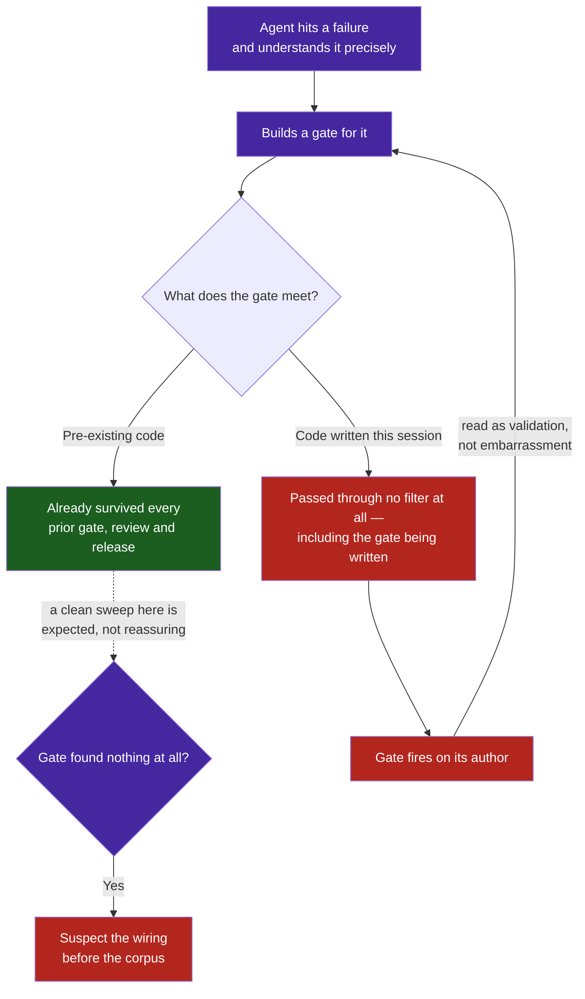

# Observation 12: Gates Catch Their Author First

> **Project**: `vibes` — Mechanical Enforcement Infrastructure
> **Topic**: Who a New Gate Actually Fires On; Why a Clean First Run Is Evidence Against the Gate
> **Key Metric**: 6 gates added in one session; 5 caught their own author's work within 2 commits of being written; the 1 that found nothing on its first run was not wired up

---

## 1. Executive Context & Baseline

A single autonomous session added six mechanical gates to a repository already certified at 100.0/100 health with a fully green test suite:

| Gate | Enforces |
|---|---|
| Multi-path auditing (`sentinel.py`, `docs_validator.py`) | Every supplied path is audited, not just `argv[1]` |
| Mermaid render gate (`verify_mermaid.mjs`) | Every diagram parses with the real engine |
| Mermaid contrast rule (`docs_validator.py`) | WCAG AA fill/label contrast, no theme-inherited label colour |
| Directory map oracle (`docs_validator.py`) | Embedded trees match the filesystem |
| Workflow lint (`actionlint`) | No expression injection or shell quoting defects |
| Gate manifest test (`test_gate_manifest.py`) | Every documented gate is a gate that runs |

The expectation going in was ordinary: a new gate audits an existing corpus, finds historical debt, and the debt gets paid down. What happened instead was consistent enough across all six to be worth recording.

---

## 2. The Observed Phenomenon

**Every gate's first finding was its own author's work**, usually within minutes of the gate existing.

| Gate | First thing it caught | Distance from its own commit |
|---|---|---|
| Multi-path auditing | 2 violations in the 3 files the agent was auditing at that moment, hidden by the defect being fixed | same command |
| Mermaid render gate | 2 diagrams written earlier in the same session, both breaking on `;` as a sequence-diagram statement separator | same commit |
| Workflow lint | The agent's own explanatory comment, containing a literal `${{ }}` that `actionlint` rejects as an unparsable expression | ~1 minute |
| Directory map oracle | The agent's own new files missing from the map, three separate times across three commits | next commit, then twice more |
| Gate manifest test | A gate row the agent had added to `CONTRIBUTING.md` two commits earlier and never wired into `ci.yml` | 2 commits |
| Mermaid contrast rule | 17 pre-existing styled nodes — the only gate whose first catch was genuinely historical | n/a |

The directory map oracle is the clearest case. It was built specifically because a map had drifted and needed regenerating by hand. It then caught the same author's new files in the very next commit, and twice more after that, each time within minutes of the file being created.

A second regularity showed up alongside the first: **the initial measurement was frequently of the instrument rather than the artifact.**

- The workbench's top-ranked defect, scored 370.0, was a 2.04s test whose body ran in 0.38s; the rest was interpreter boot. No edit to the file could have satisfied the threshold.
- The new error budget engine reported a **20x burn rate** on its first iteration, because burn rate divides by elapsed window and one iteration is 5% of a twenty-iteration window.
- Its toil indicator read `0.000` off a denominator of **one**.
- A roadmap entry written early in the session claimed the per-file interpreter cost was "~1.7s × N". Measured properly it was 0.27s × 23 — the 1.7s figure was a cold-start artifact promoted to a planning assumption.

---

## 3. The Underlying Failure Mode or Catalyst

The pattern is not coincidence, and it is not a statement about this particular agent's carelessness. Three structural forces converge:

1. **The author holds the sharpest model of the failure class, at the moment they are producing the most instances of it.** Writing a gate requires understanding a failure precisely enough to make it mechanically decidable. That same session is, by construction, the one generating the highest volume of new artifacts in exactly that category — new diagrams while writing a diagram gate, new files while writing a map gate, new workflow steps while writing a workflow linter.

2. **The existing corpus is already survivorship-filtered; new work is not.** Everything in the repository before the gate existed has survived every gate that did exist, plus review, plus time. Code written after the gate is conceived but before it runs is the only code in the repository that has passed through *no* filter at all. It is the least-audited material present, and the gate meets it first.

3. **A gate arrives exactly when the surrounding code is changing fastest.** Gates get written during active work on the thing they govern, not during quiet periods. The blast radius of a new gate is centred on the current diff by default.

The measurement failures share a root with the gate failures. A new instrument is calibrated against nothing; its first readings are the only ones with no prior to compare against, and its early-window arithmetic is at its least stable. Trusting the first number a new instrument produces is the measurement equivalent of shipping a gate without checking that it fires.

---

## 4. Remediation & Architectural Pattern

This phenomenon is not a defect to be eliminated. It is the gate working, arriving at precisely the moment it is most useful, and the remediation is to build around it rather than against it.

1. **Treat a self-catch as validation.** A gate that fires on its author within minutes has demonstrated end-to-end that it is wired, that its predicate discriminates, and that its failure message is actionable — verified against a case whose ground truth the author already knows. That is a stronger signal than a clean sweep of an unfamiliar corpus.

2. **Invert the reading of a clean first run.** *A new gate that finds nothing on its first run is evidence against the gate, not for the corpus.* The directory map oracle in this session reported zero findings on its first execution. The repository was not clean; the rule had been registered in `validate_content` but not in `validate_file`, so the CLI never ran it. The clean result was the bug. Before believing a green first run, deliberately break something the gate should catch and confirm it fails — the same discipline a test suite demands, applied to the gate itself.

3. **Write the gate during the work, not after it.** The conventional instinct is to finish the work and then add enforcement. Reversing that order puts the gate's sharpest period — its first hours — over the diff most likely to contain the failure it was built for.

4. **Calibrate instruments before trusting their first readings.** Any metric derived from a window, a rate, or a ratio needs a minimum-sample floor before it is allowed to drive a decision. Both guards added to the error budget engine in this session exist because the live repository tripped them immediately: a three-iteration floor before burn-rate alerting, and a `min_valid_events` floor below which an objective reports `INSUFFICIENT_DATA` rather than a ratio over three events.

See [Gate Integrity & Total Input Coverage](../../patterns/gate-integrity-and-total-input-coverage.md) for the structural rules a gate must satisfy, and [Observation 11](./11-silent-certification-failure-and-gate-integrity.md) for the silent-success failure class these gates were built to close.

---

## 5. Verifiable Impact & Key Takeaways

Across one session, the six gates and their self-catches produced:

| Measure | Result |
|---|---|
| Gates added | 6 |
| Gates whose first catch was their own author's work | 5 of 6 |
| Longest delay between a gate existing and catching its author | 2 commits |
| Defects found by gates on the author's same-session work | 9 (2 hidden violations, 2 unrenderable diagrams, 1 unparsable workflow expression, 3 map omissions, 1 unwired gate) |
| Instrument calibration defects found by first use | 4 (harness-timed latency, 20x burn rate, single-event toil ratio, a cold-start figure promoted to a planning assumption) |
| Gates whose clean first run turned out to be a wiring defect | 1 of 6 |

> [!IMPORTANT]
> **A new gate's first catch is almost always its author. If it catches nobody, check the wiring before congratulating the codebase.**

- **The newest code is the least-audited code in the repository.** Everything older has survived filters the new work has not yet met.
- **Building the gate is not the same as running it.** The gap between the two is where a green first run comes from.
- **A self-catch is the cheapest possible end-to-end test of a gate,** because the author already knows the ground truth of the case it fired on.
- **A new instrument's first reading measures the instrument.** Windows, rates and ratios need sample floors before they are permitted to steer anything.
