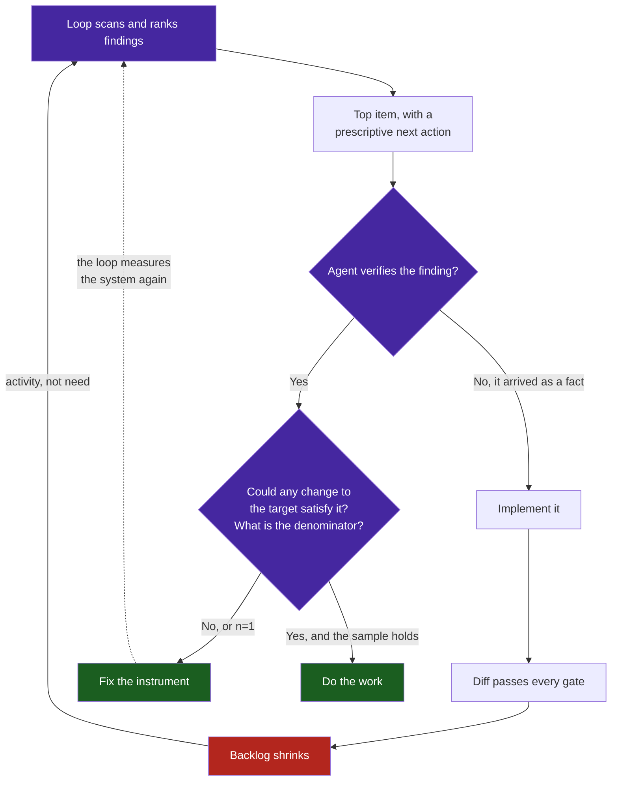

# Observation 13: Verify the Finding Before You Fix It

> **Project**: `vibes` — Feedback Loop & Instrumentation
> **Topic**: Loops That Manufacture Work; Why a New Instrument's First Reading Measures the Instrument
> **Key Metric**: 4 of 5 backlog items were measurement error, not work; 6 separate first readings across one session were artifacts of the instrument rather than facts about the system

---

## 1. Executive Context & Baseline

A self-improving loop has two halves. One finds work, the other does it. Enormous attention goes to the second half — can the agent implement, refactor, test — and almost none to the first, because a finding arrives already framed as a fact.

This repository's loop scans every resource, ranks the findings, and hands an agent the top item with a prescriptive next action. Over one autonomous session it produced a steady stream of such items and the agent worked them, which is what the loop is for. Then a toil indicator fired: *over a third of your backlog is machine-fixable, automate it.* Acting on that instruction is where the trouble started, and where the instruction turned out to be right for the wrong reason.

---

## 2. The Observed Phenomenon

**Most of the backlog did not exist.** Of five items, four were artifacts of how the loop measured, not defects in what it measured:

| Reported item | What was actually true |
|---|---|
| `doc_core.py` has no test suite | 97% covered by `tests/test_docs_validator.py` |
| `doc_rules_mermaid.py` has no test suite | 100% covered, same file |
| `doc_rules_structure.py` has no test suite | 97% covered, same file |
| 2 public functions lack docstrings | Both were closures inside a decorator factory, unreachable from outside the module |

The test-parity check tested for a companion *filename*. Satisfying it meant creating three redundant test files to match a naming pattern, proving nothing and adding maintenance. An agent that trusted the finding would have produced pure waste that looked exactly like progress — three new files, three green checkmarks, a shrinking backlog.

**The same failure had already occurred five other times in the session, each time on a newly built instrument:**

| Instrument | First reading | What it was measuring |
|---|---|---|
| Test latency oracle | Top-ranked defect, score 370.0 | 81% interpreter boot; no edit to the file could satisfy the threshold |
| Error budget burn rate | 20x, apparently critical | One iteration is 5% of a twenty-iteration window |
| Toil ratio | 0.000, budget exhausted | A denominator of one |
| Per-file interpreter cost | "~1.7s × N", written into the roadmap | A cold-start artifact; measured properly, 0.27s × 23 |
| Parallel test execution | `-n auto` at 0.54s, a 10x win | The command had failed; run properly it is 26% *slower* than serial |
| Suite latency | 3.74s against a 2.0s ceiling | Host filesystem: 0.764ms per `is_dir()` on a bind mount against 0.001ms on tmpfs |

Each reading was plausible, precise, and wrong. Precision is what makes them dangerous: `370.0` and `20x` and `0.764ms` all carry the texture of measurement.

---

## 3. The Underlying Failure Mode or Catalyst

Three mechanisms, and they compound.

**A proxy breaks exactly where the system is unusual.** Every one of these instruments measures something cheap that correlates with something expensive: a filename for verification, wall-clock for work done, a decorated function for public API. The correlation holds across the ordinary corpus, which is why the proxy survived review. It breaks on the unusual case — a module tested through its façade, a closure inside a factory, a suite whose cost is interpreter boot. Unusual is precisely what new work is, so the proxy fails most often on exactly the code the loop was built to examine.

**A new instrument's first reading has no prior.** A metric derived from a window, a rate, or a ratio is least stable when it has the least data, and that is exactly when it is first consulted. Burn rate divides by elapsed window; on iteration one it reads catastrophic by construction. A ratio over three events reads `0.000` the moment one fails. There is nothing to compare against, so the reading is accepted.

**A work-generating loop has no cost signal for generating wrong work.** The half of the loop that finds work is rewarded for finding things. Nothing in the system penalises a finding that turns out to be phantom, because the agent that acts on it produces a diff, the diff passes the gates, and the backlog shrinks. The feedback loop is closed on *activity*, not on *whether the activity was needed*.

The bottom-left path is indistinguishable from good engineering while it is happening. Three redundant test files, each with passing assertions, is a green diff.

---

## 4. Remediation & Architectural Pattern

Four checks, applied to the finding rather than to the code it points at:

1. **Actionability.** Ask whether *any* change to the named target could satisfy the threshold. If the answer is no, the defect is in the oracle. A 2.04s suite against a 2.0s ceiling where 1.66s is interpreter boot fails this immediately.
2. **Denominator.** A ratio without its sample size is not a measurement. `0/1` and `0/1000` are the same number and different facts. Objectives here declare `min_valid_events` and report `INSUFFICIENT_DATA` below it rather than rounding a non-measurement to a percentage.
3. **Proxy distance.** Ask what the check actually tests versus what it claims. "Has a companion test file" claims verification and tests naming. Replacing the proxy with something closer to the truth — import reachability across the module graph, transitively — removed three phantom items and kept the one real signal.
4. **Reproduce before acting.** Re-run the measurement. Two of the six readings above did not survive a second run, and one reversed sign entirely. This is nearly free and catches host noise, load spikes, and commands that failed silently.

A fifth check applies to the objectives themselves: **what does a breach mean?** *This must not ship* and *we should work on this next* are different claims, and only the first should block a release. Wiring a latency or backlog-composition indicator to a build gate makes a healthy repository unshippable, which discredits the instrument the first time it fires — as it did here, twice.

---

## 5. Verifiable Impact & Key Takeaways

| Measure | Result |
|---|---|
| Backlog before verification | 5 items |
| Backlog after fixing the instruments | 0 items |
| Items that were measurement error | 4 of 5 |
| Redundant test files avoided | 3 |
| First readings across the session that measured the instrument | 6 |
| Readings that did not survive a second run | 2 |
| Release gates blocking on non-defects, removed | 3 |

> [!IMPORTANT]
> **A finding is a hypothesis about the system. Test it before you act on it, because the cheapest thing to fix is the instrument, and the most expensive thing to build is work nobody needed.**

- **The newest instrument is the least trustworthy thing in the loop**, and it is consulted with the most confidence, because it was just built to answer exactly this question.
- **A proxy is a bet that the unusual case will not come up.** New work is the unusual case.
- **Precision is not accuracy.** `370.0`, `20x` and `0.764ms` are all exact, and three of them were measuring the wrong thing.
- **A shrinking backlog is not evidence of progress** if nothing checks whether the items were real. Activity closes the loop just as well as need does.
