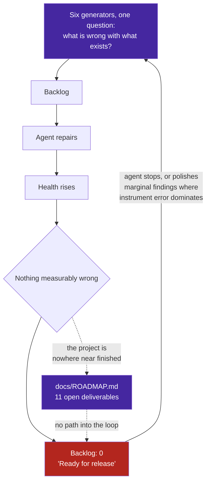

# Observation 14: Defect-Shaped Loops and the Feature Blind Spot

> **Project**: `vibes` — Self-Improvement Loop & Backlog Generation
> **Topic**: Why an Autonomous Loop Converges to Zero Work While the Project Is Unfinished; Prioritizing Intent Against Measurement
> **Key Metric**: Repository certified at 100.0/100 with **0 backlog items** against **11 open roadmap deliverables**; 6 of 6 work generators defect-shaped; 83% of one backlog was measurement error

---

## 1. Executive Context & Baseline

This repository runs a closed feedback loop. A workbench scans every resource, an AST sentinel enforces complexity and nesting invariants, a documentation validator checks structure and links, a smell quantifier measures maintainability and duplication, an SLO engine tracks error budgets, and an SDLC prioritizer ranks whatever the others produce and names the next action.

The loop works. Over one extended session it drove dozens of repairs, and it ended by reporting:

```text
Overall Health: [HEALTHY]  Score: 100.0/100
Prescriptive Action: All repository resources certified. Ready for push or release.
Backlog: 0 items
```

At that moment `docs/ROADMAP.md` contained **eleven open deliverables**, none of them started.

---

## 2. The Observed Phenomenon

**The loop had run out of work while the project had barely any of its work done.** Every generator feeding it answers the same question in a different vocabulary:

| Generator | Produces | Question answered |
|---|---|---|
| Resource workbench | complexity, decay, test parity, doc drift | What is wrong with what exists? |
| AST sentinel | invariant breaches | What is wrong with what exists? |
| Documentation validator | structure, links, diagrams | What is wrong with what exists? |
| Smell quantifier | duplication, cohesion, dead code | What is wrong with what exists? |
| Reliability SLO engine | budget breaches | What is wrong with what exists? |
| Vulture, radon | unused code, maintainability | What is wrong with what exists? |

Six generators, one question. Nothing in the system answered *what should exist next*, so the backlog was structurally incapable of containing a feature.

Worse, the loop reports the empty state as success. "Ready for push or release" is a true statement about quality and a false impression of progress, and an autonomous agent taking it at face value stops — or, having nothing else, starts polishing. In the same session the loop's top-ranked item was twice a threshold artifact: once a latency oracle measuring interpreter boot, and once a backlog of which **83% were measurement error** from a detector counting method calls as instance attributes.

A defect-shaped loop at convergence does not go quiet. It gets quieter and less useful at the same time, because the remaining findings are the marginal ones, and marginal findings are where instrument error dominates signal.



---

## 3. The Underlying Failure Mode or Catalyst

**Defects are discoverable by inspection; intent is not.** A complexity breach can be derived from the code that contains it. A feature cannot be derived from a codebase that lacks it — its absence is indistinguishable from a deliberate decision not to build it. So a loop built entirely from inspection tools can only ever find defects, however many tools it accumulates. Adding a seventh scanner does not help; it produces the same shape of work.

Three forces make the gap invisible while it grows:

1. **Convergence looks like success.** Every metric the loop reports improves monotonically toward the empty state. There is no metric whose value falls when the roadmap stalls, because the roadmap is not among the things being measured.
2. **Intent lives in prose.** The roadmap is a markdown document written for humans. It is not parsed, not scored, and not connected to anything that schedules work — the one artifact that states the project's purpose is the one artifact the loop cannot read.
3. **The prioritizer was already capable.** In this repository `SDLCResource` carried `business_value`, `effort_points`, `milestone` and `depends_on`, and the scorer computed a value-over-effort ratio. The machinery for ranking features had existed all along and had never been handed one. The blind spot was not in the ranking; it was that nothing populated the input.

---

## 4. Remediation & Architectural Pattern

Connect the document that states intent to the queue that schedules work, and let one prioritizer rank both.

1. **Parse intent into the same shape as defects.** [`tools/roadmap_ingest.py`](../../tools/roadmap_ingest.py) reads open deliverables from the roadmap and emits them as backlog tasks, merged into the same file the workbench writes.
2. **Take sizing from where the judgement was already recorded.** Value and effort come from the prioritization matrix rather than being re-derived from item text, which would replace a deliberate decision with a guess.
3. **Rank features against defects by one arithmetic.** Defects outrank features by construction, so a healthy repository advances the roadmap and an unhealthy one repairs itself first.
4. **Never schedule rejected work.** Anti-pattern rows record decisions *not* to build; a loop that queues them has inverted the decision it was given.
5. **Mark assumptions as assumptions.** An item with no matrix row is ranked on defaults and says so, rather than presenting a guessed rank with the confidence of a recorded one.
6. **Do not drop entries silently.** The first regex skipped an item ending `(partially delivered)`, reporting a shorter backlog than the project had. An ingester that quietly loses input is the same failure class as a gate that certifies unread code.

```bash
python3 tools/resource_iteration_workbench.py --export-backlog .data/sdlc_backlog.json
python3 tools/roadmap_ingest.py --backlog .data/sdlc_backlog.json
python3 tools/sdlc_project_manager.py next --file .data/sdlc_backlog.json
```

---

## 5. Verifiable Impact & Key Takeaways

| Measure | Before | After |
|---|---|---|
| Backlog at 100.0/100 health | 0 items | 11 deliverables ranked |
| Work generators answering "what should exist next" | 0 of 6 | 1 |
| Roadmap deliverables visible to the prioritizer | 0 of 11 | 11 of 11 |
| Items ranked on recorded value/effort | n/a | 3 of 11, the rest marked as assumptions |
| Rejected anti-patterns schedulable | n/a | 0, by construction |

> [!IMPORTANT]
> **A loop built only from inspection tools converges to silence, and silence is indistinguishable from completion.** The measure of a self-improving system is not whether its backlog empties but whether emptying it means the work is done.

- **Defects are derivable from the artifact; intent is not.** No number of scanners will produce a feature, because a feature's absence looks exactly like a decision not to build it.
- **Check what question your generators answer.** Six tools in six vocabularies answering one question is one tool with better coverage, not six perspectives.
- **Convergence deserves suspicion.** When the backlog empties, ask what the loop is structurally unable to see rather than treating the empty state as a finish line.
- **The capability is often already there.** The ranking machinery for features had existed for months; what was missing was a path from the document stating the project's purpose into the queue that schedules its work.
