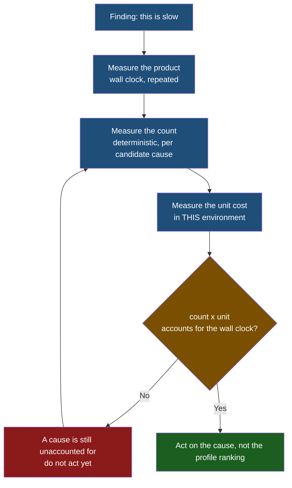

# Observation 15: A Count Is Not a Cost

> **Project**: `vibes` — Feedback Loop & Instrumentation
> **Topic**: Why Two Successive Measurements Both Misidentified the Same Bottleneck
> **Key Metric**: A profiler attributed 11.4s to a function that ran for well under one; the syscall count that corrected it was then read as exonerating the true cause, which was 60% of the runtime

---

## 1. Executive Context & Baseline

The loop reported a real defect: one test file took 2.46s against a 2.0s fast-feedback ceiling, and a single test carried it — the sweep that validates all 95 documents in the corpus. Unlike the findings in [Observation 13](./13-verify-the-finding-before-you-fix-it.md), this one was not an artifact. The test really was slow.

What failed was not the finding but the diagnosis. Two separate measurements were taken before acting, exactly as the verify-first discipline requires, and both pointed at the wrong thing.

---

## 2. The Observed Phenomenon

**First measurement — the profiler inverted the answer.** `cProfile` sorted by cumulative time put `pathlib.is_dir` at the top with 11.4s against a 2.6s wall clock, and `check_directory_maps` second at 6.0s. Both numbers are impossible on their face, and both have the same two causes: `cumtime` double-counts recursive frames, and the sweep runs twenty worker threads whose time the profiler sums rather than overlaps. The ranking it produced was not merely imprecise; it was ordered by how deeply a function recursed and how many threads entered it.

**Second measurement — the correction was misread.** Counting filesystem calls directly gave 547 operations for the whole sweep. Against a 2.64s runtime that looked negligible, and the conclusion recorded at the time was "filesystem is not the bottleneck." That conclusion was wrong. On this virtualised bind mount a single `stat` costs ~1.8ms against ~0.001ms on tmpfs. 547 operations were roughly a second of the 2.64s — the largest single contributor, and precisely what the profiler had been gesturing at through its distorted numbers.

The count was accurate. The inference from it was not, because it was compared against an unexamined intuition about what a filesystem call costs.

---

## 3. The Underlying Failure Mode

### Cost equals count times unit cost, and an instrument usually reports one of them

Every measurement here yielded half the product:

| Instrument | Reports | Silently assumed |
|---|---|---|
| `cProfile` cumulative time | An aggregate that conflates threads and recursion | That frames are disjoint and serial |
| Syscall counting | Count | A unit cost, imported from the reader's intuition |
| Wall clock | The product | Nothing — but attributes it to nobody |

The syscall count felt like the rigorous move because it replaced a noisy timing with a deterministic integer. Determinism is genuinely worth having on a host whose wall clock swings 2–5× under load. But determinism is not the same as completeness: a deterministic count still has to be multiplied by a cost that varies by three orders of magnitude between a tmpfs and a network or virtualised mount, and that multiplier was never measured, only assumed.

The deeper trap is that the assumed unit cost came from experience on ordinary local disks, where 547 stats really would be negligible. The environment had changed; the intuition had not, and nothing in the measurement surfaced the discrepancy.

---

## 4. Remediation & Architectural Pattern

The rule adopted is that **a performance claim must state a count and a unit cost, and at least one of the two must have been measured in the environment under test.**

The reconciliation step is what catches both failures. Had 547 operations been multiplied by a measured 1.8ms rather than an assumed one, the product would have accounted for most of the runtime immediately, and the "filesystem is not the bottleneck" conclusion could not have survived being written down next to the wall clock it was meant to explain.

Applied to the actual defect, this identified two distinct sources of the same operation: a directory-map rule that scanned correctly but scoped its cache to a single document, rebuilding the same answers 95 times, and a link rule that stat'd every target with no cache at all across a corpus that links to the same files repeatedly. One `scandir` per directory, shared across the sweep, answers both.

> [!IMPORTANT]
> A profiler's ranking is a hypothesis about *where* time goes, never evidence of *how much*. Under threads or recursion it is not even reliably a hypothesis — treat any `cumtime` exceeding the wall clock as a notice that the instrument is summing what the system overlapped.

---

## 5. Verifiable Impact & Key Takeaways

- **Corpus sweep 2.60s → 0.61s**; the enclosing test file 4.00s → ~1.1s across three runs, back under the 2.0s fast-feedback ceiling that raised the finding.
- **Filesystem round trips 560 → 322**, with the survivors shared across all 95 documents instead of repeated per document.
- **The unit cost is now recorded in the code** — `~1.8ms per stat here against ~0.001ms on tmpfs` — so the next reader inherits the measurement rather than the intuition it displaced.
- **Scoping a cache is a design decision, not an implementation detail.** The expensive version was not missing a cache; it had one, correctly implemented, built fresh for each of 95 documents. Correct code at the wrong scope reads as optimised.
- **Two wrong diagnoses did not cost anything, because neither was acted on.** Verifying before fixing ([Observation 13](./13-verify-the-finding-before-you-fix-it.md)) is what converted both errors into cheap intermediate steps instead of a refactor of the wrong module — the same discipline, applied one level deeper, to the explanation rather than the finding.
