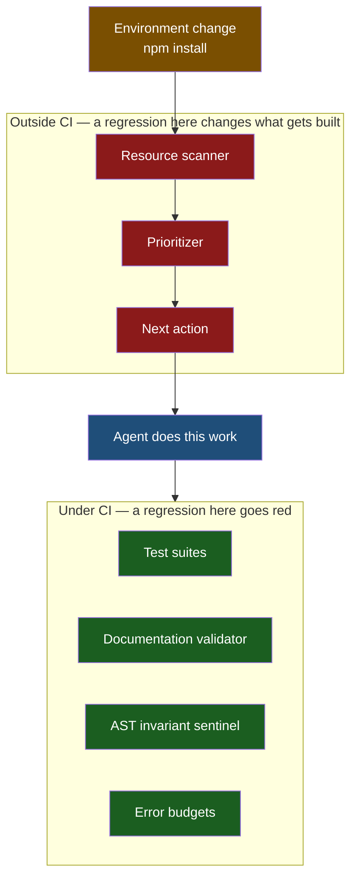

# Observation 16: The Prioritizer Is Not Under Test

> **Project**: `vibes` — Feedback Loop & Instrumentation
> **Topic**: Every Gate Guards the Product; Nothing Guards the Instrument That Chooses the Work
> **Key Metric**: Installing a documentation dependency moved the repository's self-reported health from 100.0/100 to 91.2 CRITICAL and put a vendored package's README at the top of the backlog — a defect no CI gate could have detected, because no gate runs the tool that produced it

---

## 1. Executive Context & Baseline

This repository runs eleven quality gates. They check tests, coverage floors, complexity invariants, documentation integrity, Mermaid rendering, workflow syntax, JSON manifests, and error budgets. Every one of them asks the same kind of question: *is the product correct?*

The loop that decides **which work happens next** is a separate tool. It scans the repository, scores every resource, ranks the findings, and hands the top item to an agent. Nothing in CI runs it.

---

## 2. The Observed Phenomenon

A Mermaid diagram needed verifying, which meant `npm install --no-save mermaid@11 jsdom`. That is a routine, correct action with no relationship to the loop.

The next scan reported:

| Signal | Before the install | After |
|---|---|---|
| Overall health | 100.0/100 HEALTHY | 91.2/100 **CRITICAL** |
| Open findings | 2 advisories | 47 |
| Top-ranked work item | a roadmap deliverable | a broken link in `node_modules/commander/Readme.md` |

Run against the identical tree seconds later, the documentation validator reported all 96 documents clean.

Neither tool was malfunctioning. They disagreed about what the repository *was*. Four call sites decided independently whether a path belonged to the project, and no two used the same rule:

| Call site | Excluded |
|---|---|
| `docs_validator._discover_markdown_files` | hidden, `.venv`, `node_modules`, `__pycache__` |
| `_is_excluded_doc_path` | hidden, `.venv` |
| `_is_excluded_py_path` | `.venv`, `__pycache__` |
| `ResourceWatcher._is_valid_py_file` | `.venv`, `__pycache__` |

One of the four had heard of `node_modules`. The workbench saw 330 documents where the validator saw 96, and spent its entire ranking budget on files the repository neither owns nor can fix.

---

## 3. The Underlying Failure Mode

### The steering instrument sits outside the gated surface

CI verifies artifacts. The prioritizer is not an artifact — it is the thing that decides which artifacts get worked on. It therefore occupies a blind spot with a precise shape:



Three properties make this worse than an ordinary untested component:

1. **Its failures are silent and well-formed.** A corrupted prioritizer does not crash or return nothing. It returns a confident, correctly-formatted, plausibly-worded work item. The output of a broken instrument is indistinguishable from the output of a working one without checking the finding against the world — which is [Observation 13](./13-verify-the-finding-before-you-fix-it.md)'s discipline, applied by a human who might not apply it.
2. **Its inputs are the whole environment, not a fixed interface.** A scanner's real input is the filesystem. Anything that puts files on disk — a dependency install, a build, a stray checkout — is an untracked input to it.
3. **CI's step ordering hid it by accident.** The sentinel is invoked on four named directories, and the docs validator runs *before* the `npm install` step. Both were safe, but safe by scheduling coincidence rather than by construction. Reordering two CI steps would have changed which of them were correct.

### Agreement is a property of the system, not of any component

Each of the four exclusion rules is defensible read alone. The defect exists only in the relationship between them, so no test of any single one could find it. This is the class of bug that unit tests structurally cannot reach.

---

## 4. Remediation & Architectural Pattern

**One definition, and the agreement itself under test.** `source_tree_policy.is_repository_source` is now the only answer to "is this path ours", following the precedent of `sanitization_policy` for network addresses. Both instruments discover files through one shared `iter_source_files`, so they agree by construction rather than by coincidence.

The test that matters is not "`node_modules` is excluded" but the cross-instrument invariant:

```python
def test_a_vendored_directory_is_invisible_to_every_scanner(tmp_path: Path) -> None:
    """A vendored dependency must not enter any instrument's corpus."""
    ...
    discovered = _discover_markdown_files(tmp_path, (".md", ".markdown"))
    scanned = ResourceScanner.scan_directory(tmp_path, include_docs=True)
```

It builds its own vendored directory in a fixture, so it holds whether or not the machine running it happens to have a Node toolchain installed. A test that compared the two instruments against the *real* repository would pass vacuously in CI, where the install step has not yet run.

> [!IMPORTANT]
> Ask of every self-improving loop: *what would have to break for this to confidently recommend the wrong work, and which gate would go red?* If the answer to the second half is "none", the loop's steering is unverified no matter how thoroughly its output is gated.

Pruning also moved into the traversal. `rglob` cannot prune, so it descends into every vendored package before discarding the result — 5.62s against 0.63s for `os.walk` with directory pruning on the same tree.

---

## 5. Verifiable Impact & Key Takeaways

- **Health restored 91.2 CRITICAL → 100.0 HEALTHY**; 45 phantom findings eliminated; the top-ranked work item is a real deliverable again.
- **Four exclusion rules collapsed to one**, with the dead `_is_valid_py_file` alias deleted rather than kept as a shim.
- **Corpus agreement is now a gated invariant**, held by a fixture-built vendored directory rather than by the environment the suite happens to run in.
- **Discovery cost 5.62s → 0.63s** by pruning during the walk instead of filtering after it.
- **An environment change is a change.** The commit that broke the loop's judgement touched no source file and appeared in no diff. Tools whose input is "the filesystem" have a far larger input surface than their signatures suggest.
- **Duplicated policy is not merely redundant — it is a divergence waiting for a trigger.** Four copies of a rule agreed for as long as nothing exercised their differences. A dependency install was enough.
