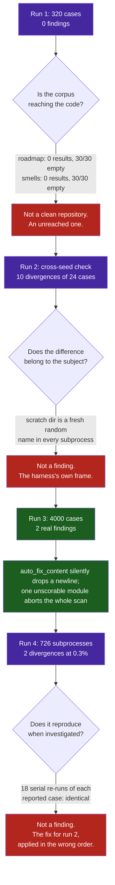

# Observation 17: A Fuzzer's First Report Is About the Fuzzer

> **Project**: `vibes` — Feedback Loop & Instrumentation
> **Topic**: The First Three Runs of a New Detector Measure Its Reach, Its Frame of Reference, and Only Then the System
> **Key Metric**: Four consecutive runs of one new fuzzer returned, in order, 0 findings across 320 cases (two of eight instruments were never actually reached), 10 findings of which 10 were false (the harness's scratch path was inside the comparison), 2 findings that were real, and then 2 more that were false at a rate of 0.3% — because the fix for the third run's defect introduced a fourth, in the same place, by applying two normalizations in the wrong order

---

## 1. Executive Context & Baseline

Every oracle in this repository is a parser aimed at whatever happens to be in the tree: an AST invariant sentinel, a code smell quantifier, a documentation validator, a roadmap ingester, a supply chain auditor. Each has a test suite. Each test suite consists of inputs an author thought of.

A fuzzer was added to supply the other kind, asserting four properties that need no model of what an instrument *should* say — no exception outside its declared tolerances, identical answers for identical input, convergence when repairing, completion inside a budget.

The baseline expectation was the ordinary one: point it at eight instruments, read the findings. What happened instead was that the first two reports contained no information about the instruments at all.

---

## 2. The Observed Phenomenon



**Run 1 — a clean report from an unreached corpus.** 320 cases produced nothing. The temptation is to read that as eight healthy instruments. Counting what each target actually returned said otherwise:

| Target | Findings returned | Cases producing nothing |
|---|---:|---:|
| `roadmap` | 0 | 30 / 30 |
| `smells` | 0 | 30 / 30 |
| `refactorer` | 6 | 24 / 30 |
| `sentinel` | 18 | 12 / 30 |

The roadmap parser reads a *grammar* — milestone headings carrying a version, checkbox items carrying a priority, indented context bullets, a value/effort table. Fed ordinary generated Markdown it matched its first regex and returned, every time. The smell quantifier was being run with its advisory detectors off, which is correct for a release gate and starves a campaign: the detectors that remain need structures a small generated module does not contain.

**Run 2 — ten divergences, ten of them false.** With the corpus fixed, the cross-process determinism check reported all three `PYTHONHASHSEED` values disagreeing, for every target, on almost every case. The cause was that the fingerprint hashed the `repr` of each instrument's output, and each finding carries a `file_path` pointing into a scratch directory whose name is generated per process. Nothing about any instrument had been measured.

**Run 3 — two findings, both real.** `auto_fix_content` removed one trailing newline on every call while returning a repair count of zero. `splitlines()` discards the final line terminator, and the rejoin restored it only when the joined text did not already end in a newline — which a document ending in two or more newlines always does. The text changed and the count said it had not. A later campaign at a different seed found the second: one module radon could not tokenize aborted the entire code smell scan.

**Run 4 — a 0.3% flake, and it was the repair from run 2.** With everything above fixed and committed, two concurrent cross-seed runs of the *same* command on the *same* inputs returned 0 findings and 2 findings. Each reported case then re-ran identically eighteen times in isolation. The anomaly rate was one subprocess in roughly three hundred, and it was invisible to every serial investigation:

| Investigation | Runs | Anomalies |
|---|---:|---:|
| Each reported case, serially | 18 each | 0 |
| The target invoked directly, 40 threads | 360 | 0 |
| Through the real worker, 40 threads | 240 | 1 |
| Through the real worker, printing the normalized `repr` beside the hash | 420 | 2 |

The last of those showed the cause in plain text. The fingerprint normalizes memory addresses and then the scratch directory, in that order — and `mkdtemp` draws its suffix from a pool containing `0`, `x` and the hex digits. About one directory in three hundred is named something like `vibes-fuzz-8t0x1im`, which the address pattern rewrites to `vibes-fuzz-8t0xX`. The path replacement then no longer matched its own directory, and the name reached the hash.

---

## 3. The Underlying Failure Mode or Catalyst

The three runs fail in three different ways that share one shape: **a new detector's output is a joint measurement of the subject and the instrument, and for the first few runs the instrument term dominates.**

- **Run 1 is a reach failure.** A zero from a detector is ambiguous between *nothing is wrong* and *nothing was examined*, and the terminal renders both as silence. This is the same ambiguity [Observation 11](./11-silent-certification-failure-and-gate-integrity.md) records for gates that certify unread input; a fuzzer adds a second way to reach it, because a generator can produce inputs the target rejects before executing anything worth testing.
- **Run 2 is a frame-of-reference failure.** The comparison included something that varies for reasons that are not the subject. Every property that compares two executions — determinism, idempotence, replay — is only as meaningful as the normalization applied first, and what needs normalizing is whatever the *harness* introduced: addresses, temporary paths, timestamps, working directories.
- **Run 3 is the first one about the system**, and it only became reachable once the other two were closed.
- **Run 4 is a composition failure**, and it is the same defect as run 2 wearing the repair for run 2. Two substitutions that each look correct in isolation are not correct in either order: normalizing addresses can destroy the very string the path normalization was about to match. It stayed hidden because its trigger is a property of a *name*, not of a workload — contention raises the number of directories drawn per run and leaves the odds for any one of them untouched, which is exactly the shape that survives serial reproduction and reappears in CI.

The catalyst in each case was the same question, asked of the instrument rather than the repository: *what would this report look like if it could not report at all?* For run 1 the answer was "identical"; for run 2, "different, but for the wrong reason".

---

## 4. Remediation & Architectural Pattern

Four mechanisms, each of which closes one of the ways a new detector can report about itself.

**Measure reach before believing a clean run.** Count what each target returns, not only what the campaign reports. Two targets returning nothing for every case is a property of the corpus, and it is visible in one cheap tally:

```python
counts[name] += len(target.invoke(case.text, workspace))
empty[name] += (len(out) == 0)
```

The roadmap corpus became a grammar generator rather than a Markdown generator; the Python generator gained five structural shapes chosen to trip specific detectors; the smell target switched to advisory detection, a decision made on a measurement — 0.08s against 0.02s over 15 modules, moving the yield from 3 findings to 263 — rather than on the whole-corpus cost that had motivated excluding them elsewhere.

**Normalize the harness out of every comparison — and treat the order as part of the contract.**

```python
# Path first. The reverse order rewrites `vibes-fuzz-8t0x1im` to `vibes-fuzz-8t0xX`
# before the path replacement can match it, roughly once in three hundred directories.
normalized = _ADDRESS_RE.sub("0xX", repr(value).replace(str(workspace), "<workspace>"))
```

Test a hostile name rather than a representative one. `tmp_path` will not produce the collision in a thousand runs; a literal `/tmp/vibes-fuzz-8t0x1im` produces it every time.

**Confirm a divergence before reporting it, and only a divergence.** A determinism verdict taken from one sample per seed is itself a one-sample measurement. Genuine hash-order dependence is deterministic for a fixed seed and survives a second pass; a sampling artefact does not. Re-running only on disagreement costs three subprocesses per finding and nothing per clean case.

**Prove each property fires before trusting any of them.** Every property is driven by a deliberately broken target in the test suite, and the cross-seed check was verified end to end by injecting a hash-order dependence into a real target and watching it caught. That drill also quantified the check's sensitivity: the injected defect was caught in 3 of 25 cases and missed entirely at 4 cases, because hash-order dependence is only visible when a case produces two or more order-sensitive elements. A probabilistic check needs volume, and saying so is part of reporting it honestly.

**Separate the search from the gate.** A time-boxed random search that must pass fails on the run that happened to find something and passes on the run that happened not to; neither outcome is about the commit under test. Exploration runs on a schedule and publishes minimized inputs as artifacts. `replay` over the committed corpus is deterministic, only grows, and is what gates — so a finding becomes a permanent regression test at the moment it is committed, and is verified in both directions by reverting the repair and watching the gate go red.

---

## 5. Verifiable Impact & Key Takeaways

| Measure | Before | After |
|---|---:|---:|
| Instruments the corpus reached at all | 6 / 8 | 8 / 8 |
| `roadmap` findings returned over 30 cases | 0 | 86 |
| `smells` findings returned over 15 modules | 3 | 263 |
| Cross-seed divergences reported / real | 10 / 0 | 0 / 0 |
| Real defects found | 0 | 2 |
| False findings from the harness itself | 12 | 0 |
| Cases needed to find the first | — | 4,000 |
| Cases needed to find the second | — | 5,600, at a different seed |
| Minimized reproducers | — | 4 lines each |
| Cross-seed anomaly rate under contention | 1 in 240 | 0 in 900 |

The first defect was small and genuinely latent: `auto_fix_file` guards its write on a non-zero repair count, so the corruption never reached disk on its own. It reached disk only when a document had a real repair *and* trailing blank lines, in which case one more line was deleted than was reported. It had been present since the auto-fixer was written and no hand-written fixture had ever ended in two newlines.

The second was larger, and arrived only from a different seed after the first campaign had already been read as clean. The code smell quantifier filters its corpus with `ast.parse` and then hands the accepted source to radon, which tokenizes independently — **the two do not accept the same language**. A form feed inside a string literal is valid Python and raises `SyntaxError` out of radon's raw analyser, so one such file in a repository stopped the quantifier reporting anything about every other module in it. Two parsers guarding one pipeline, with only the first one's verdict checked, is the same shape as [Observation 16](./16-the-prioritizer-is-not-under-test.md): instruments that disagree about what the corpus *is* cannot be reconciled about what is wrong with it.

That second finding also says something about campaign length. 1,600 cases at one seed range found nothing; 5,600 at another found this. A campaign that finds nothing bounds the defect rate from above and proves nothing about a particular defect, which is the reason exploration is scheduled rather than gated.

**Takeaways:**

1. **A detector's first clean run is evidence about the detector.** Ask what its report would look like if it could not report at all. If the answer is "the same", the run has told you nothing — the inversion [Observation 12](./12-gates-catch-their-author-first.md) states for gates, reached by a different route.
2. **Count reach, not only findings.** A zero is ambiguous; a tally of what each target returned is not.
3. **Any property that compares two executions is a claim about what was normalized.** Whatever the harness introduced — addresses, scratch paths, clocks, orderings — belongs outside the comparison, or the instrument reports itself.
4. **Normalizations compose, and their order is part of the contract.** The repair for a harness-reports-itself defect contained a harness-reports-itself defect, in the same two lines. Apply the most specific substitution first and test it against a hostile input, not a representative one.
5. **A rare flake and a rare defect are not distinguishable by re-running the thing that reported it.** Eighteen serial re-runs of each reported case said "stable" and were wrong about the cause, because the trigger was a property of the scratch *name* rather than of the input. What separated them was instrumenting the comparison to print what it was comparing.
6. **Store a fixture under a suffix nothing else reads.** A corpus of `.md` files is swept up by the documentation validator it is a fixture for, and a corpus of `.py` files by the sentinel, ruff and mypy.
7. **The corpus is the gate; the search is not.** Determinism is what makes a check a gate, and a random search has none. Keep what it found and replay that instead.
