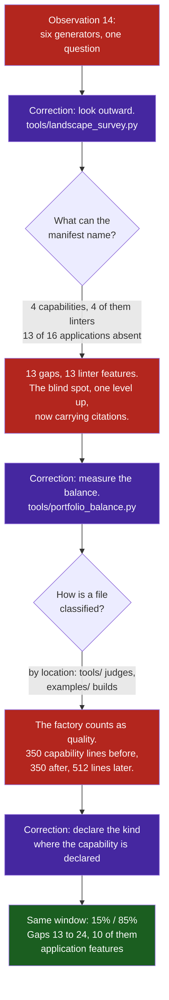

# Observation 18: A Correction Inherits the Frame It Corrects

> **Project**: `vibes` — Work Generation & Portfolio Measurement
> **Topic**: Why the Instrument Built to Close a Blind Spot Reproduced It, and Why the Metric Built to Detect the Imbalance Disagreed With the Change That Corrected It
> **Key Metric**: A survey added to look outward emitted **13 gaps, 13 of them linter features**, from a manifest naming **3 of this repository's 16 sample applications**; the balance metric added to detect the drift then held capability investment at **exactly 350 lines** across the release that added **512 lines** of application factory

---

## 1. Executive Context & Baseline

[Observation 14](./14-defect-shaped-loops-and-the-feature-blind-spot.md) recorded a loop that had run out of work while the project was unfinished. Six work generators, all of them inspection tools, all answering *what is wrong with what exists*; nothing answering *what should exist next*. The backlog emptied and the empty state read as completion.

Two corrections followed. The first was internal: [`tools/roadmap_ingest.py`](../../tools/roadmap_ingest.py) parses declared intent into the same shape as defects, so a roadmap deliverable can be ranked against a complexity breach. The second was external: [`tools/landscape_survey.py`](../../tools/landscape_survey.py) compares each capability this repository ships against real upstream projects that ship something comparable, and turns the differences into roadmap deliverables.

The survey was built to be hard to fool. A feature is claimed for an alternative only by writing evidence for it — a flag, a command, a documented behaviour — so there is no way to assert a capability without citing something. A feature absent from both `has:` and `lacks:` is *unknown*, never *no*, and gap detection reads `has:` alone, so an unknown can never manufacture work. Every fact in the snapshot comes from the GitHub API rather than from a README.

All of that is about the *rigour of each claim*. None of it is about **which claims were available to make**.

---

## 2. The Observed Phenomenon

### 2.1 The survey could only ever propose a linter feature

At the moment it was first asked what to build next, [`docs/landscape/capabilities.yaml`](../../docs/landscape/capabilities.yaml) declared four capabilities:

| Capability | Implementation | What it does |
|---|---|---|
| `complexity-gating` | `examples/ast-invariant-sentinel/` | judges code |
| `smell-quantification` | `examples/code-smell-quantifier/` | judges code |
| `documentation-integrity` | `tools/docs_validator.py` | judges documents |
| `prompt-adversarial-testing` | `examples/prompt-mutation-fuzzer/` | judges prompts |

Four capabilities, four analysis tools. The repository at that moment contained **sixteen sample applications** under `examples/` — a web crawler, a container sandbox, a CST parser, a context packer, a trace generator, a token-bucket gateway, an L2 cache, a CEGIS workbench, and more. Three of the sixteen appeared in the manifest. **Thirteen were invisible to the instrument that chooses this repository's work.**

The consequence is mechanical and total. Running the survey against that manifest returns thirteen gaps:

```text
13 capability gap(s):
  Complexity gate: ships selectable rule presets rather than one fixed rule set
      held by: astral-sh/ruff, pylint-dev/pylint
  Docs validator: ships selectable rule presets rather than one fixed rule set
      held by: DavidAnson/markdownlint, vale-cli/vale
  Docs validator: analyses languages beyond python
      held by: lycheeverse/lychee, vale-cli/vale
  ...
  Smell quantifier: tracks metric movement across git history rather than one snapshot
      held by: tonybaloney/wily
```

Thirteen gaps, and every one of them a linter feature — because a gap is a difference between a declared capability and its declared alternatives, and every declared capability was a linter. The top-ranked item, by the survey's own ordering (most holders first), was *ships selectable rule presets*, cited to `ruff` and `pylint`. A well-evidenced, correctly-ranked, verifiably-sourced proposal to make the linter more like other linters.

This is worse than the silence of Observation 14, not better. An empty backlog is visibly empty. A cited proposal is an argument, and **the citation lends its rigour to the choice as well as to the claim**, which is precisely the move it does not license: `ruff` demonstrably has rule presets, and that is evidence about `ruff`, not evidence that presets are what this repository should build next.

### 2.2 The metric built to detect the imbalance moved the wrong way

[`tools/portfolio_balance.py`](../../tools/portfolio_balance.py) was written in the same change, to report what the repository holds against where its recent lines went. It classified each touched file by location: `examples/` builds things, `tools/` judges them.

Then [`tools/app_factory.py`](../../tools/app_factory.py) was built — a contract in, a runnable application out, the single largest capability investment of the release, and infrastructure, so it lives in `tools/`. Measured over one fixed window of twenty commits, before and after that change and then under the repaired classifier:

| Window ending at | Classifier | Capability lines | Total | Share |
|---|---|---:|---:|---:|
| the survey commit (`e321a1f`) | by location | 350 | 5,119 | **7%** |
| the factory commit (`112ba87`) | by location | 350 | 5,692 | **6%** |
| the factory commit (`112ba87`) | by declaration | 862 | 5,692 | **15%** |

The numerator did not move. Five hundred and twelve lines of application factory landed in the window and the capability count stayed at exactly 350, because every one of those lines was counted on the quality side of the ledger. The metric whose entire purpose is to notice "this repository has become an inspectorate" responded to the largest anti-inspectorate change in its history by reporting that the problem had got slightly worse.

Location was wrong in both directions at once: `examples/ast-invariant-sentinel/` judges code and was being counted as a capability for the same reason.



---

## 3. The Underlying Failure Mode or Catalyst

**A correction is designed inside the frame of the defect it corrects, and inherits that frame unless something outside it intervenes.**

Observation 14's defect lived in the *structure* of the loop: six tools, one question, no path for intent. The survey fixes that structure completely — its code can propose anything at all, and the proof is that the same code, given a wider manifest, now proposes sandboxing and web acquisition. The narrowing did not survive in the code. It **moved into the configuration**, which is where nothing was looking:

- **A manifest is code that nothing executes.** The gates in this repository run over `tools/`, `examples/` and `tests/`. `capabilities.yaml` is data, it is schema-valid, every claim in it is cited, and it was profoundly incomplete. No test can fail on an absence it has no way to enumerate.
- **The ambiguity is Observation 14's, one level up.** There, *a feature's absence is indistinguishable from a decision not to build it*. Here, *a capability absent from the manifest is indistinguishable from a capability the repository does not have*. The survey's most careful design decision — unknowns never manufacture work — guarantees that an unlisted capability contributes nothing and is never missed.
- **The author of the widening is the author of the narrowing.** The manifest was written by an agent whose recent work was all instruments, listing "what this repository builds" from what was salient. Salience is a recency measure, and the balance metric exists because recency was the thing that had drifted.
- **Citation raises confidence without widening the draw.** Every gap named real repositories with verified facts. Nothing in that evidence speaks to the composition of the candidate set, and a proposal that arrives with sources is harder to overrule than one that does not — so rigour applied to each claim made the narrow set *more* persuasive, not less.

The third level is the same shape in miniature. Location is a **proxy** for kind. It was accurate for every file that existed when it was written, which is what makes a proxy feel safe, and it broke on the first file that mattered: the one just added. A proxy is calibrated on the past and asked about the present. [Observation 13](./13-verify-the-finding-before-you-fix-it.md) records proxy distance as a thing to test before acting on a finding; this is the same test applied to a metric instead of a finding, and the case worth testing is the newest one.

---

## 4. Remediation & Architectural Pattern

**Widen the manifest, and treat its coverage as a measurement.** Six application-shaped capabilities were added with cited alternatives and verified upstream facts — Go leak detection, structural parsing, web acquisition, sandboxing, context packing, trace observability — and the factory made a seventh.

| Manifest | Before | After |
|---|---:|---:|
| Capabilities declared | 4 | 11 |
| Sample applications named | 3 of 16 | 9 of 16 |
| Alternatives cited | 13 | 30 |
| Features catalogued | 25 | 50 |

**Declare the kind where the capability is declared; never infer it.** Every entry carries `kind: capability` or `kind: quality`, in the same file that already records its path and its evidence. This is the rule the self-hardening audit had learned two pull requests earlier, when its detector was a keyword scan over a whole patch: a classifier that guesses reports whatever its word list caught.

```python
def _classify_path(path: str, declared: dict[str, str] | None = None) -> str:
    """The manifest decides where it can. Location alone gets this wrong in both
    directions: `tools/app_factory.py` builds applications and
    `examples/ast-invariant-sentinel/` judges them."""
    for prefix, kind in (declared or {}).items():   # longest prefix first
        if path == prefix or path.startswith(prefix + "/"):
            return kind
    if path.startswith(CAPABILITY_PREFIXES):
        return "capability"
    if path.startswith(QUALITY_PREFIXES):
        return "quality"
    return "other"
```

Declarations are sorted longest-first so the most specific wins — `examples/` alone would classify the sentinel and the crawler identically, and they are opposite kinds. Location survives as the *fallback*, because most files are not a declared capability and dropping them would leave the ratio measuring a handful of paths.

**Pin the metric to the change that broke it.** The regression test is one line of intent:

```python
def test_the_real_manifest_classifies_the_factory_as_a_capability() -> None:
    """The regression in one line: this is the case that made the metric disagree with itself."""
```

**Report a stock ratio and a flow ratio separately.** They disagreed, and both were true:

```text
portfolio: 11 unit(s)                      # what the repository holds
  capability      6    55%
  quality         5    46%
investment/20 (lines added): 5726 unit(s)  # where the last twenty commits went
  capability    862    15%
  quality      4864    85%
```

A single blended number would have averaged a balanced portfolio against an unbalanced release and reported something reassuring about neither. **Count added lines, not touched files**: the first version counted touches and reported a comfortable 52/48 for a window whose only `examples/` activity was a repository-wide lint sweep across 29 files.

**Steer, never gate.** Balance is a ratio over an arbitrary window; a single well-justified instrument commit would breach any threshold set on it. It is a compass, and [`AGENTS.md` §1](../../AGENTS.md) carries the rule it is a compass for: *neither side may go a milestone without work*.

---

## 5. Verifiable Impact & Key Takeaways

| Measure | Before | After |
|---|---:|---:|
| Capabilities in the survey manifest | 4 | 11 |
| Of those, quality instruments | 4 of 4 | 5 of 11 |
| Sample applications the manifest can see | 3 of 16 | 9 of 16 |
| Upstream alternatives cited | 13 | 30 |
| Gaps emitted | 13 | 24 |
| Gaps that are application features | 0 | 10 |
| Top three gaps by the survey's own ranking | all linter features | all application features |
| Capability investment, window ending at the factory | 350 lines, 6% | 862 lines, 15% |
| Capability lines added by the factory, counted as such | 0 of 512 | 512 of 512 |

The survey's top three proposals are now `Sandbox: confines a workload below the process boundary`, `Trace generator: follows published semantic conventions for ai spans` and `Web crawler: emits text shaped for direct model consumption` — and three of the twenty-four gaps are against the application factory itself, so the instrument that chooses work can now propose application features *against* the factory as well as *through* it.

> [!IMPORTANT]
> **The correction for a blind spot is the most likely place to find the blind spot.** It is designed by the same author, inside the same frame, at the moment that frame is least visible — and because it is the correction, its output is read as the resolution rather than as evidence.

- **Check the new instrument for the old defect before reading its first report.** This repository has now recorded that lesson for gates ([Observation 12](./12-gates-catch-their-author-first.md)), for prioritizers ([Observation 16](./16-the-prioritizer-is-not-under-test.md)), for fuzzers ([Observation 17](./17-a-fuzzers-first-report-is-about-the-fuzzer.md)) and now for the instrument that chooses what to build. The general form is that a first report is a joint measurement of the subject and the instrument.
- **The narrowing moves from code into configuration, where nothing tests it.** A manifest, a rule list, an exclusion set and a corpus are all code that nothing executes. Measure an instrument's *coverage of its subject* — 3 of 16 applications — not the volume or quality of its output.
- **Evidence for a claim is not evidence for the choice.** Citations raise the confidence of every proposal in a set without saying anything about how the set was drawn. Rigour applied per-item makes a narrow candidate list more persuasive, not less.
- **Declare the kind; never infer it from location or vocabulary.** Location is a proxy calibrated on the files that already exist, and it fails first on the file you just added — which is the one the measurement was taken for.
- **Test a proxy against the change you just made.** A proxy is worth what it gets right on the cases you care about, and the case you care about is almost always the newest one.
- **A stock ratio and a flow ratio answer different questions.** 55% capability holdings and 6% capability investment were simultaneously true, and only one of them was the problem.
