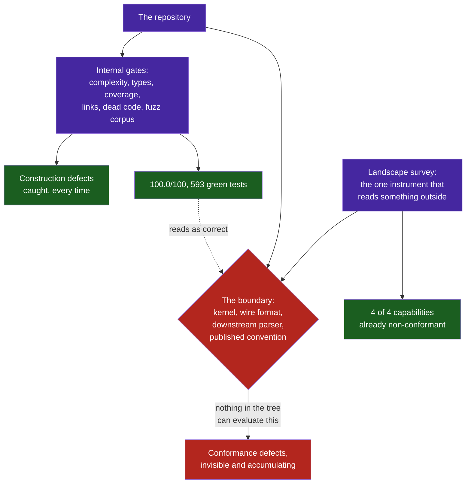

# Observation 19: Self-Consistency Is Not Conformance

> **Project**: `vibes` — Capability Development Against External Standards
> **Topic**: Why a Repository With Excellent Gates Is Systematically Wrong at Its Boundaries, and What a Capability Gap Exposes That a Defect Scan Cannot
> **Key Metric**: Four capabilities built to close gaps an external survey named; **all four** turned out to have an existing implementation that was already wrong — a sandbox reporting **100.0/100 while enforcing 0 of 8 controls**, a trace generator emitting a private vocabulary in a standard envelope, a crawler dropping every code block, and a balance metric counting capability work as instrument work. None was visible to any gate in the repository, and every one became obvious the moment something outside it was consulted

---

## 1. Executive Context & Baseline

[Observation 14](./14-defect-shaped-loops-and-the-feature-blind-spot.md) found a loop that could only ever produce defects, and [Observation 18](./18-a-correction-inherits-the-frame-it-corrects.md) found that the survey added to correct it had inherited the same narrowing through its manifest. Once that manifest was widened, the survey began proposing application work: sandboxing, semantic conventions, model-ready extraction, interactive scaffolding.

This observation is about what happened when that work was actually done. Four capabilities were built across four pull requests, each closing a gap the survey had ranked, each verified upstream against the projects it cited.

The repository they were built in is not under-instrumented. Every commit passes an AST invariant sentinel, ruff, mypy across three interpreter versions, a documentation validator, a code smell quantifier, a supply chain audit, a fuzzing corpus replay, a 90% coverage floor and a workflow contract gate — 593 tests at the start of this sequence, all green, on a repository reporting 100.0/100 health.

**Every one of the four capabilities already existed in some form, and every one of the four was already wrong.**

---

## 2. The Observed Phenomenon

### 2.1 What building the gap exposed

| Capability | The gap the survey named | What building it found in the code that was already there |
|---|---|---|
| Sandbox | `syscall_isolation` | `CISPolicyAuditor` scored the **policy object**. A default policy reported **100.0/100, 8/8, zero violations** while the engine-less execution path — the one that runs whenever `docker` and `podman` are absent — enforced **none** of the eight. The same harness then ran a payload that opened a socket, wrote into the invoking user's home directory and read its uid. Exit 0. Reported compliant. |
| Trace generator | `semantic_conventions` | Valid OTLP carrying `ai.tokens.prompt`, `ai.model.name` and `agent.persona`; every span kind hard-coded to `INTERNAL`; an array attribute exported as the Python repr `"['stop']"` because the formatter had no `arrayValue` branch. Every collector accepted it. No GenAI-aware backend could chart any of it. |
| Web crawler | `llm_ready_output` | `<pre><code>` dropped entirely, so a snippet arrived as one unindented line with no language; hrefs collected into a list with nothing joining them to their text and never resolved against the base; page text emitted raw, so a line beginning `#` became a heading in the prompt. |
| App factory | `interactive_prompts` | Nothing wrong — and then re-measuring after the merge found the **balance metric** counting the new module as a quality instrument, because a capability's declaration named one file and the capability had grown a second. |

Four for four, and the fourth found its defect one level out, in the instrument watching the work.

### 2.2 Two populations of defect, and only one of them the gates could see

Across the same four pull requests, the repository's own instruments also fired — repeatedly, and correctly, on the code being written.

| Found by | Defect | Where it lived |
|---|---|---|
| AST sentinel | `elif` ladder at complexity 16, depth 12 | new code |
| AST sentinel | six `example.com` subdomains | new code |
| Smell quantifier | God class at 27 methods / 14 attributes | new code |
| CPython `TypeError` | `_pending` shadowing an `HTMLParser` private | new code |
| Reading output | requirement level silently downgraded from `required` | new code |
| Reading output | skip counter letting `</a>` close a `<nav>` | new code |
| **An external standard** | sandbox enforcing nothing it certified | **existing code** |
| **An external standard** | telemetry nothing could read | **existing code** |
| **An external standard** | extraction losing code, links and structure | **existing code** |
| **An external standard** | link rule scanning inline code spans | **existing code** |
| **An external standard** | egress check reading only the first URL in a literal | **existing code** |

The split is the finding. **The gates caught every construction defect and not one conformance defect.** Complexity, typing, coverage, imports, dead code, link targets — each is a property the repository can evaluate entirely from its own contents. Whether a span is readable by a GenAI backend, whether a seccomp filter actually confines, whether Markdown survives a model's parser: none of those can be derived from the tree, and no number of additional scanners would have found them.



### 2.3 The fallback path is the one that runs

Two of the four defects lived in a code path the design treated as secondary.

The sandbox has a container mode and a "simulator" fallback. The container mode is the one the README documents and the CIS table describes. The simulator is what runs whenever `docker` and `podman` are absent — which is most developer machines, most CI jobs, and every environment this repository is actually exercised in. It enforced nothing.

The crawler has a headless-browser tier and a static-HTTP tier. The static tier is the default and the common case, and its extraction was the one losing every code block.

**A fallback is not a degraded path; it is the path, because the conditions that select it are the ordinary ones.**

---

## 3. The Underlying Failure Mode or Catalyst

**An instrument that measures a system against the system's own declarations converges to agreement, and agreement is not correctness.**

Every gate in this repository takes its ground truth from inside the repository. The sentinel derives complexity from the AST. Coverage derives from the tests that exist. The documentation validator resolves links against paths in the tree. The CIS auditor read the policy object — the declaration of what confinement was wanted — and scored *that*. Each is internally valid, each converges to green, and none of them has any way to be surprised.

Three forces make the resulting gap invisible while it widens:

1. **A conformance defect produces no signal anywhere.** A span with the wrong attribute key is not rejected by the collector; it is accepted, stored, and never matched by the query built to read it. An empty dashboard renders as *no traffic*. A sandbox that confines nothing returns exit 0. The failure mode of non-conformance is silence on both sides of the boundary, which is exactly what success looks like.

2. **The instruments confirm health at the same time.** 100.0/100 and 593 passing tests are true statements about construction and are read as statements about the system. This is [Observation 11](./11-silent-certification-failure-and-gate-integrity.md)'s silent certification widened from a step to a whole discipline: not a gate that skipped its input, but a gate that never had the input in scope.

3. **The boundary is where the repository ends, so it is where the tooling ends.** Every one of these defects sits at a seam with something the project does not control — the Linux kernel, the OTLP wire format, a published semantic convention, a model's Markdown parser, CommonMark's fence rule. The tooling was built by reading the code, and none of that is in the code.

The catalyst in all four cases was identical, and it was not cleverness: **something outside the repository was consulted, and the existing implementation was compared to it.** The survey names an external project and a feature it demonstrably has. Closing that gap requires reading what the external project actually does — and the moment you do, the local implementation is measured against something it did not author.

That is why a capability gap is worth more than its feature. **The gap and the defect have one cause**: nobody had ever compared this capability to anything outside itself.

---

## 4. Remediation & Architectural Pattern

**Derive the standard; never restate it.** [`tools/semconv_snapshot.py`](../../tools/semconv_snapshot.py) fetches the upstream convention model at a pinned commit, resolves its attribute groups, and writes a snapshot the sample application reads with nothing but the standard library. A hand-written table of someone else's convention drifts silently and looks authoritative while it does, which is worse than an openly private vocabulary.

```bash
python3 tools/semconv_snapshot.py refresh   # needs upstream
python3 tools/semconv_snapshot.py verify    # what CI can run, offline
```

Pin the revision and record it. The conventions this snapshot targets had *moved repository* since they were last written about, and the pin is a commit because the new repository has no tagged release — a fact no cached knowledge would have supplied and the reason `--validate` prints provenance beside its findings.

**Score the runtime, never the declaration.** `CISPolicyAuditor` still exists and still scores the policy; `RuntimeEnforcementAuditor` scores the engine that is about to run and names every control it *cannot* apply and why. The engine-less path reports **6 of 8, honestly**, against 0 of 8 reported as 8 of 8. A test asserts the two scores differ, so they can never again be one number.

**Execute the claim against the thing outside.** The seccomp filter's tests run a child process and assert the kernel kills it. The factory's tests run the real sentinel, ruff, mypy and pytest over the real generated application. The convention's table is cross-checked against the kernel's own `asm/unistd_64.h` and the upstream registry. An assertion about a boundary that does not cross the boundary is an assertion about a belief.

**Audit the fallback first.** It is the path that runs. Where a control cannot be enforced there, say which one and why, rather than omitting it — `no mount namespace; an unprivileged process cannot remount its root` is a smaller claim than the README used to make and the first one that has been true.

**Report how a classification was reached.** [`tools/portfolio_balance.py`](../../tools/portfolio_balance.py) now states what share of its counted lines a declaration decided rather than a directory layout. A fallback that is never counted is a default that silently becomes the measurement — which is how the same metric was wrong twice.

---

## 5. Verifiable Impact & Key Takeaways

| Measure | Start of the sequence | After |
|---|---:|---:|
| Capability gaps open | 24 | 20 |
| Gaps closed by building the capability | — | 4 |
| Capabilities whose existing implementation was already wrong | unknown | 4 of 4 |
| Sandbox controls enforced on the path that runs | 0 of 8, reported as 8 of 8 | 6 of 8, reported as 6 of 8 |
| Trace generator conformance errors | not measurable | 0, with provenance printed |
| Repository instruments found to be wrong | — | 3 (balance, docs validator, sentinel) |
| Capability share of recent added lines | 15% | 64% |
| Share of that ratio decided by declaration | not reported | 65% |
| Tests | 593 | 736 |

> [!IMPORTANT]
> **A repository can be internally perfect and externally wrong, and the internal perfection is what hides it.** Every gate here takes its ground truth from inside the tree, so every gate converges to agreement without ever being able to be surprised. The only instrument that could be surprised was the one that read something outside.

- **Self-consistency is not conformance.** An auditor that scores a declaration, a validator that resolves against its own tree, a test suite written by the author of the code — each is necessary and none can detect a disagreement with the world.
- **Construction defects and conformance defects need different instruments.** Complexity, typing, coverage and dead code are properties of the artifact. Whether a filter confines, a span charts, or Markdown survives a parser are properties of a relationship with something else. No number of additional scanners converts one into the other.
- **A capability gap is a lens, not just a feature request.** The gap and the defect share a cause: nobody had compared this capability to anything outside itself. Four for four is not a coincidence, it is the mechanism.
- **The fallback path is the path.** It is selected by the ordinary conditions, so it deserves the audit the primary path gets — and where it cannot enforce something, saying so is a smaller and truer claim than inheriting the primary path's score.
- **Non-conformance is silent on both sides.** The collector accepts the span, the query returns zero rows, the dashboard renders as no traffic, and nothing is red. A defect whose symptom is an empty result is indistinguishable from an idle system.
- **Derive an external standard at a pinned revision; never transcribe it.** The conventions had moved repository since anything here was written about them, and a table copied from memory would have looked authoritative and been wrong in a way no diff would show.
- **Turning content into syntax is the whole of the vulnerability**, and it arrived three times from three directions in one sequence — a workflow expression in a `run:` block, a contract answer rendered into YAML before parsing, and page text emitted into Markdown a model will parse. Escape on the way out, mask on the way in, and size the delimiter from the content.
