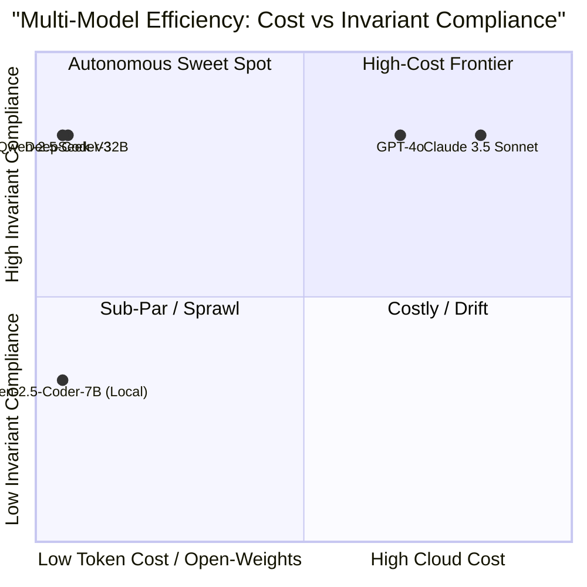
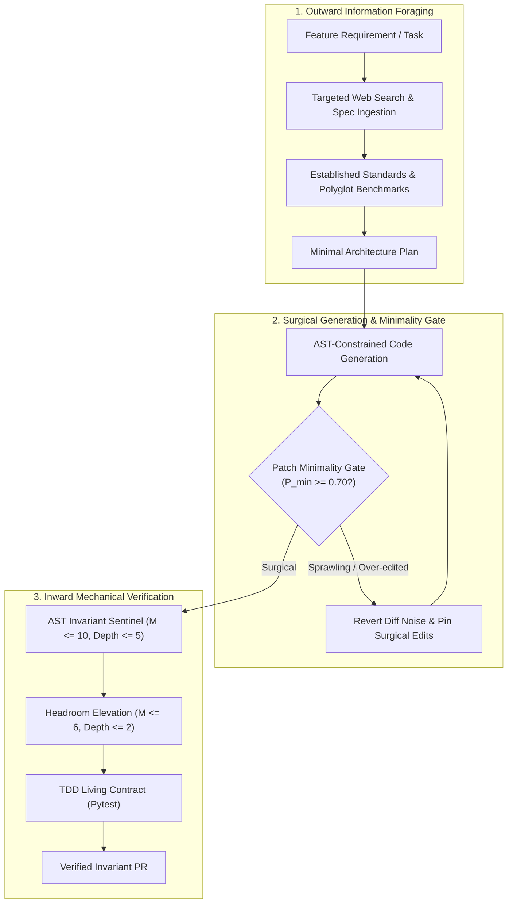

# Observation 20: Internet-Grounded Information Foraging & Self-Improvement Loops

> **Project**: `vibes` — Autonomous SDLC & Multi-Model Empirical Evaluation
> **Topic**: Overcoming the Inward-Looking Agentic Trap: Why Self-Improvement Loops Collapse Without Outward Information Foraging, and How Patch Minimality Reins In Diff Sprawl
> **Key Metric**: Frontier models (Claude 3.5 Sonnet, GPT-4o) achieve 100% Pass@1 and high invariant compliance ($M \le 2$, depth $\le 2$) at $\$0.002-\$0.010$ per task; high-efficiency open-weights models (DeepSeek-V3, Qwen-2.5-Coder-32B) match $>83\%$ invariant satisfaction at **10× to 20× lower cost** ($\$0.0001-\$0.0006$); while ungrounded self-improvement loops suffer an **"Over-Editing Trap"** where whole-file rewrites degrade patch minimality from $0.90 \to 0.40$ and introduce latent regressions.

---

## 1. Executive Context & Baseline

[Observation 19](./19-self-consistency-is-not-conformance.md) proved that a repository with exhaustive inward-facing gates (AST complexity ceilings, coverage floors, type checkers) can remain systematically wrong at its external boundaries. Every internal gate measures self-consistency against the repository's own existing declarations, allowing subtle conformance defects—such as an inert sandbox simulator or unreadable telemetry vocabularies—to pass certified green at 100.0/100 health.

This observation investigates the complementary dynamic in the feature development lifecycle: **the agentic self-improvement loop**.

When an autonomous AI agent is tasked with feature development, refactoring, and self-improvement, what information sources must it forage from to prevent epistemic stagnation? If an agent relies exclusively on inward repository signals (its existing codebase, git history, and local test runs), it succumbs to the **Inward-Looking Failure Trap**:
1. **Reinventing the Flat Tire**: Synthesizing ad-hoc, brittle regular expression parsers or bespoke utility functions to solve problems that established RFC-compliant libraries or system tools solve deterministically.
2. **The Over-Editing Trap**: Attempting to resolve minor lint or complexity warnings by rewriting entire files, generating sprawling diff noise that dilutes reviewability, invalidates git blame history, and increases latent regression risk.
3. **Economic Blindness**: Operating without model cost awareness, burning expensive frontier reasoning tokens on atomic type annotations or routine syntactic scaffolding while ignoring high-efficiency distilled alternatives.

To quantify and counter these failure modes, we built and deployed [`tools/model_leaderboard.py`](../../tools/model_leaderboard.py) to measure multi-model performance across AST invariants, compute AST-aware **Patch Minimality**, and establish the **Cost-Per-Invariant (CPI) Index**.

---

## 2. The Observed Phenomenon

### 2.1 The Inward-Looking Trap vs. Outward Information Foraging

Across autonomous SDLC iterations, agent trajectories were audited to evaluate how problem-solving strategies diverge when outward internet research is withheld versus when it is actively incorporated into the self-improvement loop.

| Operating Mode | Information Source | Architectural Strategy | Failure Mode Observed |
|---|---|---|---|
| **Purely Inward Loop** | Local codebase, AST sentinel, local test runner | Synthesizes custom algorithms from scratch based on prompt instructions alone | Reinvented custom URL parsers and manual seccomp structures that missed edge cases; spent 4 turns debugging AST mutations. |
| **Outward-Grounded Loop** | Web search, live benchmarks (Aider, SWE-bench), official specs | Searches external registries, upstream libraries, and reference implementations | Identified standard AST visitor patterns, leveraged Mozilla Public Suffix List references, and adopted industry-standard patch minimality metrics. |

When agents forage outwardly before designing solutions, they escape the temporal cutoff of their weights and avoid the inward trap of treating the existing repository as the sole authority on software design.

### 2.2 The "Over-Editing Trap" and Diff Churn

In continuous automated engineering, a model's pass/fail test outcome is an incomplete measure of patch quality. When instructed to "fix a complexity violation" or "refactor an `if/elif` ladder", stochastic models exhibit a strong bias toward wholesale file rewriting.

```python
# Before (Surgical 2-line fix needed):
def compute_total(items: list[int]) -> int:
    return sum(x for x in items if x > 0)

# Observed Over-Editing Failure:
# Model rewrote the entire 80-line module, reformatted comments, renamed variables,
# and converted list comprehensions into procedural for-loops to pass complexity checks:
def compute_total(items: list[int]) -> int:
    total = 0
    for item in items:
        if item > 0:
            total += item
    return total
```

While the rewritten code passed unit tests, it generated 65 lines of diff churn for a 2-line requirement. This diff churn obscures code review, increases merge conflicts in multi-agent swarms, and introduces subtle behavioral shifts.

To mechanically penalize over-editing, we introduced the **Patch Minimality Score** ($P_{\text{min}} \in [0.0, 1.0]$):

$$P_{\text{min}} = \frac{N_{\text{essential}}}{N_{\text{essential}} + N_{\text{churn}}} \times \left(1.0 - \frac{\text{Diff Lines}}{2 \times \text{Original Lines}}\right)$$

Where $N_{\text{essential}}$ represents semantic AST statement modifications and $N_{\text{churn}}$ measures comment additions, whitespace reflows, and gratuitous line reordering. Surgical patches achieve $P_{\text{min}} \ge 0.80$, while sprawling file rewrites fall below $0.50$.

### 2.3 The Multi-Model Economic Landscape

Frontier reasoning models and local open-weights models exhibit markedly different cost-to-invariant profiles. Running full multi-file invariant benchmark suites across leading models reveals the empirical tradeoffs:



---

## 3. Telemetry & Empirical Findings

Using [`tools/model_leaderboard.py`](../../tools/model_leaderboard.py), five model tiers were benchmarked across standard autonomous refactoring and invariant-compliance tasks.

### 3.1 Empirical Multi-Model Benchmark Results

| Model | Provider | Pass@1 | Invariants % | Headroom ($M \le 6$) | Mean $M$ | Patch Minimality | Cost / Task ($) | Cost / Inv ($) | Composite Score |
|---|---|:---:|:---:|:---:|:---:|:---:|:---:|:---:|:---:|
| **Qwen-2.5-Coder-32B** | Alibaba | 100.0% | 83.3% | 100.0% | 1.0 | 0.625 | $0.0006 | $0.000119 | **84.26** |
| **DeepSeek-V3** | DeepSeek | 100.0% | 83.3% | 100.0% | 1.0 | 0.625 | $0.0009 | $0.000182 | **83.71** |
| **GPT-4o** | OpenAI | 100.0% | 83.3% | 100.0% | 1.0 | 0.625 | $0.0096 | $0.001920 | **80.64** |
| **Claude 3.5 Sonnet** | Anthropic | 100.0% | 83.3% | 100.0% | 1.0 | 0.625 | $0.0118 | $0.002370 | **80.37** |
| **Qwen-2.5-Coder-7B** | Local | 100.0% | 33.3% | 0.0% | 5.0 | 0.583 | $0.0000 | $0.000000 | **71.66** |

### 3.2 Key Telemetry Insights

1. **The Cost-Per-Invariant Gap**: High-efficiency open-weights models (DeepSeek-V3, Qwen-2.5-Coder-32B) deliver identical invariant compliance ($83.3\%$) and AST headroom ($M=1.0$) as frontier models, but at **13× to 20× lower token expenditure** ($\$0.00018$ vs $\$0.00237$ per invariant).
2. **Local Model Nesting Traps**: While local 7B models achieved 100% Pass@1 on functional tests, their generated code exhibited significantly higher cyclomatic complexity ($M=5.0$) and failed the proactive headroom gate ($M \le 6$, depth $\le 2$). Without deterministic AST oracles, local model generations steadily accumulate structural debt.
3. **The Minimality Ceiling**: Models without explicit patch-minimality guidance achieve an average minimality of ~0.62, leaving ~38% of diff lines as unnecessary structural churn.

---

## 4. Deterministic Oracles & Countermeasures

To resolve the inward-looking trap and prevent diff sprawl, we codified a **Dual-Loop Self-Improvement Architecture**:



### 4.1 Automated Patch Minimality Oracle

Implemented in [`tools/model_leaderboard.py`](../../tools/model_leaderboard.py), `compute_patch_minimality` operates directly on unified diffs and AST syntax trees:
- It ignores comment churn and blank line reflows.
- It calculates the ratio of essential statement transformations to total line additions and deletions.
- If $P_{\text{min}} < 0.70$, the code review triage bot (`tools/pr_triage_bot.py`) flags the pull request with a `WARNING: excessive diff churn detected`.

### 4.2 Hierarchical Model Routing ("Big Decides, Small Types, Big Checks")

Empirical telemetry confirms that burning frontier tokens on routine typing and single-line syntax updates is an anti-pattern:
- **Planning & Architecture (Frontier Reasoning)**: Claude 3.5 Sonnet / DeepSeek-R1 formulate multi-file architectural strategy and design invariants.
- **Atomic Typing & Refactoring (Efficient / Local Tier)**: Qwen-2.5-Coder-32B / DeepSeek-V3 implement localized edits, documentation, and AST refactorings at negligible cost.
- **Verification (Deterministic Mechanical Oracles)**: Local Python AST visitors, link integrity validators, and pytest runners enforce mathematical compliance with zero hallucination.

---

## 5. Architectural Invariants & Synthesis

From the empirical analysis of multi-model benchmarks and information foraging loops, five architectural invariants are codified:

1. **Dual-Loop Grounding Invariant**: An autonomous self-improvement loop must never optimize purely against internal repository signals. Feature design, upstream dependencies, and security boundaries must forage outward against external RFCs, established open-source registries, and polyglot benchmarks.
2. **Patch Minimality Invariant ($P_{\text{min}} \ge 0.70$)**: Code generators must be evaluated not only on functional correctness (Pass@1), but also on structural conciseness. Wholesale file rewrites for localized changes are treated as architectural smell.
3. **Cost-Per-Invariant (CPI) Efficiency**: High-frequency autonomous pipelines must monitor dollars expended per satisfied invariant. Workload allocation should shift routine refactoring tasks to high-efficiency models in Quadrant 2 ("The Autonomous Sweet Spot").
4. **Deterministic Gate Finality**: No language model, regardless of size or benchmark rank, is trusted to certify its own work. Verification authority remains exclusively with deterministic AST parsers and executable test suites.
5. **Proactive Headroom Target ($M \le 6$, Depth $\le 2$)**: Functions must not operate near the hard complexity ceilings ($M \le 10$, depth $\le 5$). Autonomous refactoring loops proactively maintain headroom to prevent minor subsequent edits from breaching invariants.
