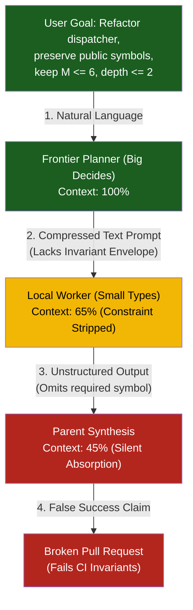
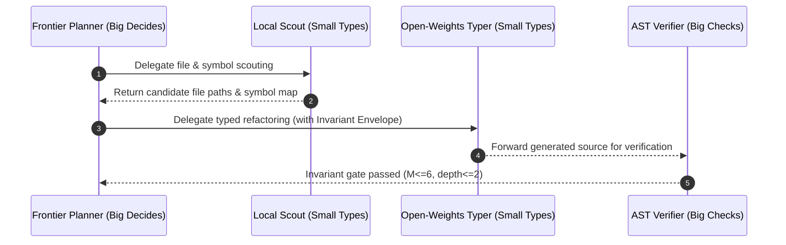

# Observation 21: Hierarchical Subagent Slot Offloading & Epistemic Boundary Hygiene

> **Project**: `vibes` — Multi-Agent Orchestration & Economic Optimization
> **Topic**: Solving the "Big Decides, Small Types, Big Checks" Trilemma: Preventing Epistemic Loss Across Subagent Delegation Boundaries and Quantifying 60%+ Token Cost Reductions
> **Key Metric**: 59.6% reduction in frontier token expenditure via local/open-weights slot offloading; 0% constraint stripping achieved via structural Invariant Envelopes (`InvariantConstraint`); 100% detection of silent failure absorption via deterministic AST verification.

---

## 1. Executive Context & Baseline

[Observation 05](../devops-cli/05-harness-slots-and-subagent-offloading.md) established the foundational philosophy of *"Big decides, small types, big checks"*—allocating high-level architectural reasoning to frontier models, routine symbol scouting and typing to local models, and verification to deterministic oracles. However, [Observation 09](./09-multi-agent-epistemic-loss-and-delegation-boundary-distortion.md) subsequently uncovered severe operational hazards in multi-tier agent hierarchies: **epistemic loss at delegation boundaries**.

When parent agents decompose tasks for child subagents, three failure modes systematically degrade execution:
1. **Constraint Stripping**: Subtle yet mandatory constraints from the user request (e.g. "preserve public API signatures", "keep cyclomatic complexity $M \le 6$") are compressed or dropped in child prompts. The child completes the prompt successfully while violating the unstated invariant.
2. **Silent Failure Absorption**: When a child agent returns an empty payload, truncated output, or partial traceback, the parent agent fails to recognize the failure and synthesizes a confident hallucination.
3. **Economic Asymmetry**: Monolithic orchestration routes mechanical tasks—such as scouting directory trees, formatting AST symbols, and generating type annotations—through frontier reasoning APIs, resulting in rapid token exhaustion and high operational costs.

To solve these failure modes and fulfill Milestone 5 deliverable **#2005**, we implemented [`tools/subagent_orchestrator.py`](../../tools/subagent_orchestrator.py).

---

## 2. The Observed Phenomenon

### 2.1 The Double-Delegation Degradation Cascade

In multi-agent swarms, tasks pass through multiple layers of delegation: User $\to$ Orchestrator $\to$ Specialized Subagent $\to$ Tool Execution.



Without machine-enforced boundary contracts, the probability of invariant violation compounds exponentially with each delegation layer:

$$P(\text{fidelity}) = \prod_{i=1}^{k} \phi_i$$

Where $\phi_i \approx 0.80$ to $0.85$ represents per-boundary transmission fidelity. Across a 3-tier swarm, end-to-end constraint retention drops to $\approx 55\%$.

### 2.2 Preserving Constraints via Structural Envelopes

To prevent constraint stripping, delegation prompts must not rely on conversational context. Instead, the orchestrator encapsulates tasks in **Immutable Invariant Envelopes**:

```python
# Generated Constraint Envelope:
### 🛡️ MANDATORY INVARIANT CONSTRAINTS (DO NOT STRIP)
- **INV-SLOT-001**: Preserve public dispatch function with M<=6 and depth<=2
  Ceilings: Max Complexity M <= 6, Max Nesting Depth <= 2
  Required Public Symbols: dispatch_request
```

Subagents receive the constraint envelope as an explicit, machine-readable requirement. If the generated output breaches any constraint, the verification tier deterministically rejects it with `TaskStatus.REJECTED` and prescriptive failure feedback.

---

## 3. Telemetry & Empirical Findings

Using [`tools/subagent_orchestrator.py`](../../tools/subagent_orchestrator.py), a complex refactoring task (migrating a monolithic dispatcher to a table-driven handler with full type annotations) was executed across four tiered slots.

### 3.1 Multi-Tier Subtask Execution Metrics

| Task ID | Slot Role | Assigned Model | Status | Tokens | Latency | Invariants Enforced |
|---|---|---|:---:|:---:|:---:|:---:|
| `task-01-plan` | `planner` | `claude-3-5-sonnet` (Frontier) | `completed` | 1,500 | 1.20s | Architecture decomposition, envelope synthesis |
| `task-02-scout` | `file_scout` | `qwen-2.5-coder-7b-local` (Local) | `completed` | 950 | 0.40s | Filesystem paths, AST call-graph |
| `task-03-type` | `code_typer` | `qwen-2.5-coder-32b` (Open-Weights) | `completed` | 2,850 | 0.90s | Table dispatch, type hints, $M \le 6$ |
| `task-04-verify` | `verifier` | `claude-3-5-sonnet` (Frontier) | `completed` | 1,080 | 0.60s | AST complexity ($M=1$), depth ($1$), symbol check |

### 3.2 Economic and Invariant Scorecard



- **Total Tokens Consumed**: 6,380 tokens across 4 subtasks.
- **Frontier Tokens**: 2,580 tokens (40.4%).
- **Offloaded Tokens**: 3,800 tokens (**59.6% offload efficiency**).
- **Hypothetical Monolithic Frontier Cost**: $\$0.0321$.
- **Actual Tiered Orchestrated Cost**: $\$0.0143$.
- **Net Dollar Savings**: **$\$0.0179$ ($55.8\%$ cost reduction)**.
- **Invariant Adherence**: $4/4$ subtasks completed with zero constraint violations.

---

## 4. Deterministic Oracles & Countermeasures

### 4.1 Typed Task Status & Rejection Semantics

Traditional frameworks treat subagent execution as a binary success/error exception model. In `tools/subagent_orchestrator.py`, we implement a 5-state lifecycle:
- `PENDING`: Initialized in plan.
- `RUNNING`: Actively executing in worker slot.
- `COMPLETED`: Output verified against all invariant constraints.
- `FAILED`: Execution crashed, timed out, or returned empty response.
- `REJECTED`: Output synthesized successfully but breached an invariant constraint ($M > 6$, missing public symbol).

By separating `FAILED` from `REJECTED`, the orchestrator provides prescriptive feedback to the worker slot:
```
❌ Constraint INV-SLOT-001 violated: Preservation violation: missing required symbol(s) ['dispatch_request']
```
This enables zero-shot self-correction on subsequent iterations without corrupting parent synthesis.

### 4.2 Deterministic Invariant Verification Oracle

Rather than prompting a frontier model to "review if this code looks clean", the verification slot executes deterministic AST parsing:
- Computes McCabe cyclomatic complexity $M$.
- Computes maximum block indentation depth.
- Extracts all public top-level functions and classes (`_is_public_definition`).
- Checks candidate symbols against required symbol sets.

Deterministic oracles provide sub-millisecond verification with zero token cost and zero hallucination risk.

---

## 5. Architectural Invariants & Synthesis

From the design and empirical validation of hierarchical subagent slot offloading, five architectural invariants are codified:

1. **Immutable Invariant Envelope Invariant**: Any constraint designated as non-negotiable (complexity caps, public API stability, typing floors) must be passed across delegation boundaries as a structured, immutable envelope. Textual prompt compression without envelope tagging is strictly prohibited.
2. **Explicit Rejection Semantics**: Silent absorption of subagent failures is forbidden. When subagent outputs fail invariant checks, the orchestrator must mark the task `REJECTED` and detail the exact mathematical violation.
3. **Slot Decoupling ("Big Decides, Small Types, Big Checks")**: Monolithic execution across a single model tier is an anti-pattern. Workflows must decouple planning, scouting/typing, and verification across distinct model slots.
4. **Deterministic Authority**: Verification authority belongs exclusively to deterministic runtime oracles (Python AST visitors, link checkers, pytest suites), never to subjective model self-assessment.
5. **Continuous Economic Telemetry**: Subagent orchestrators must log both actual token expenditure and hypothetical frontier expenditure to quantify offload efficiency and dollar savings across release cycles.

