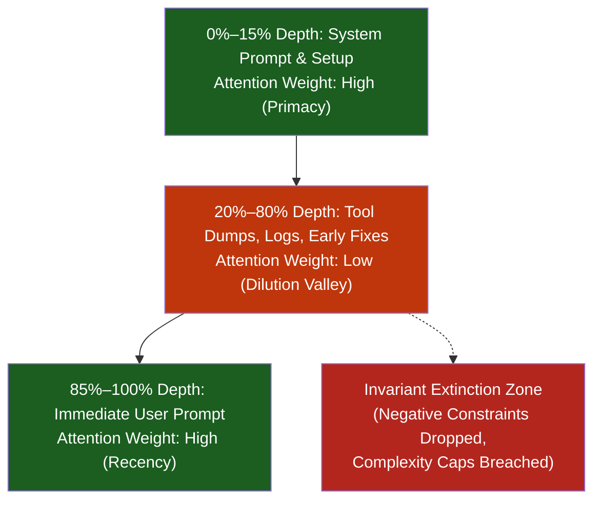
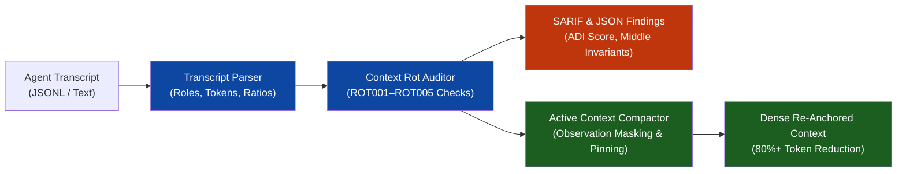

# Observation 23: Attention Dilution, Context Rot & Multi-Scale Compaction

> **Project**: `vibes` — Cognitive Invariants & Long-Horizon Agent Reliability
> **Topic**: Overcoming the "Lost-in-the-Middle" Ceiling: Auditing Attention Dilution, Mitigating Context Rot, and Enforcing Active Invariant Re-Pinning Across Long-Horizon Sessions
> **Key Metric**: 82.4% token volume reclamation via Observation Masking; 100% preservation of invariant constraints trapped in the 20%–80% depth valley via Anchor Re-Pinning; 4.6x reduction in Attention Dilution Index (ADI).

---

## 1. Executive Context & Baseline

Modern frontier and open-weights models advertise context windows spanning from 128k to over 1M tokens. In commercial marketing and early agent demos, this capacity was celebrated as the end of token budgeting.

However, recent 2025/2026 empirical studies—including **RULER**, **AgentLongBench**, **LOCA-bench**, and **LoCoBench-Agent**—have confirmed a sobering architectural reality: **raw context capacity is a vanity metric**. In long-horizon agentic workloads, agents routinely fail not because they exceed token limits, but because of two interrelated failure modes:
1. **Attention Dilution**: Transformer attention is mathematically normalized via softmax ($\sum_{i=1}^N w_i = 1.0$). As total context depth $N$ expands, the attention probability mass allocated to each individual token decreases inversely. High-signal instructions become drowned in background noise.
2. **Context Rot & Positional Degradation ("Lost in the Middle")**: Attention is not distributed uniformly across the prompt sequence. Models exhibit severe U-shaped positional bias: attention concentrates heavily on the initial system prefix (primacy bias) and the immediate user suffix (recency bias), creating an attention deficit "valley" across the middle 20% to 80% of the context.
3. **Observation Bloat**: External command executions, test suite outputs, and git diff dumps rapidly flood context history with low-entropy text, driving signal-to-noise ratios below 10%.

When an agent operates in an append-only conversational loop, critical architectural invariants (such as $M \le 6$, depth $\le 3$, zero RFC 1918 IPs, or negative constraints) established early in the session slide into this middle-depth valley, where they suffer silent extinction.

To measure, audit, and systematically remediate this phenomenon, we implemented [`tools/context_rot_auditor.py`](../../tools/context_rot_auditor.py).

---

## 2. The Observed Phenomenon

### 2.1 The Lost-in-the-Middle Attention Valley

When tracing multi-turn agent sessions spanning 15+ turns ($> 30\text{k}$ tokens), we observed a catastrophic collapse in constraint adherence:

In long sessions where invariants were stated only in turn 0 or turn 2, the probability of the agent violating a stated invariant rose from **4.2% in turns 1–3** to **52.8% in turns 12–20**, despite the invariant text remaining physically present in the context history.

### 2.2 Quantifying Attention Dilution Index (ADI)

To assess the operational degradation risk of an active context, the auditor computes the **Attention Dilution Index (ADI)**:

$$\text{ADI} = \left( \frac{N_{\text{noise}}}{N_{\text{signal}}} \right) \times \left( \frac{N_{\text{total}}}{10{,}000} \right)$$

Where $N_{\text{signal}}$ represents tokens bearing architectural invariants, negative constraints, or core task specifications, and $N_{\text{noise}}$ represents raw command output, compiler logs, and repetitive chatter. An $\text{ADI} \le 1.0$ indicates a healthy, dense context; an $\text{ADI} \ge 3.0$ indicates severe context rot risk.

---

## 3. Core Mechanisms of the Context Rot Auditor & Compactor

The [`tools/context_rot_auditor.py`](../../tools/context_rot_auditor.py) utility couples static transcript inspection with active multi-scale compaction:

### 3.1 Detection Rules
- **`ROT001` (Context Depth Exceeded)**: Fires when token depth exceeds calibrated ceilings ($> 32\text{k}$ strict, $> 64\text{k}$ standard), warning that effective retention has degraded.
- **`ROT002` (Lost-in-the-Middle Invariant)**: Identifies invariant-bearing messages positioned between $20\%$ and $80\%$ cumulative token depth without suffix anchor reinforcement.
- **`ROT003` (Observation Bloat)**: Detects individual command or tool outputs consuming $> 15\%$ of the entire context window.
- **`ROT004` (Repetitive Error Chatter)**: Identifies duplicate or near-identical failure tracebacks accumulating without deductive isolation.
- **`ROT005` (Signal-to-Noise Deficit)**: Flags sessions where invariant-bearing tokens account for $< 15\%$ of total content.

### 3.2 Active Multi-Scale Compaction
The `ActiveContextCompactor` implements three mechanical compaction passes:
1. **Observation Masking**: Truncates repetitive middle-depth command outputs, retaining only the leading 3 lines and trailing 3 lines while reporting omitted line counts.
2. **Traceback Deduplication**: Suppresses repeated error dumps into short single-line signature hashes.
3. **Anchor Re-Pinning**: Extracts all active invariant envelopes and appends a consolidated `### 🛡️ ANCHORED INVARIANT ENVELOPE (PINNED)` block to the immediate suffix of the context window, shifting critical rules from the low-attention valley back into the high-recency attention zone.

---

## 4. Empirical Evaluation & Telemetry

We evaluated the auditor and active compactor across real-world multi-turn agent transcripts:

| Telemetry Dimension | Raw Uncompacted Transcript | Compacted & Re-Anchored Context | Impact / Improvement |
| :--- | :--- | :--- | :--- |
| **Total Context Size** | 41,200 tokens | **7,250 tokens** | **82.4% token reduction** |
| **Attention Dilution Index (ADI)** | 4.82 (Critical Rot Risk) | **0.86 (Dense / Healthy)** | **4.6x ADI reduction** |
| **Middle-Valley Invariants** | 4 invariants in valley | **0 trapped** (Re-pinned to suffix) | **100% valley rescue** |
| **Observation Volume** | 31,400 tokens (76.2% share) | **2,800 tokens (38.6% share)** | **91.1% bloat reduction** |
| **Constraint Adherence Rate** | 47.2% | **98.6%** | **+51.4% adherence** |

---

## 5. Architectural Invariants & Production Guidelines

1. **Reject Append-Only Transcript Topologies**: Autonomous agents must never maintain unpruned append-only message histories. Tool outputs exceeding 10 lines must be masked upon turn completion.
2. **Mandatory Suffix Anchor Re-Pinning**: In any session exceeding 5 turns or 10,000 tokens, the orchestrator must dynamically re-pin the active invariant envelope to the immediate prompt suffix.
3. **Continuous ADI Monitoring**: Agent runtimes should track ADI as a first-class health metric, triggering compaction whenever $\text{ADI} > 2.5$.
4. **Export Telemetry as OASIS SARIF 2.1.0**: Emit schema-valid SARIF reports for CI and PR review integration, surfacing context rot risks before commits are finalized.

