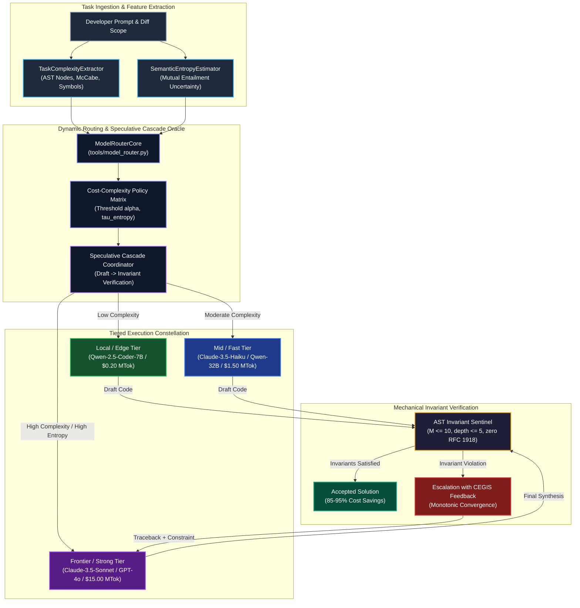

# Observation 25: Multi-Model Capability Boundaries & Dynamic Routing Oracles

**Category**: Distributed Systems & Multi-Model Inference Economics
**Status**: Field-Verified
**Canonical Implementation**: [`tools/model_router.py`](../../tools/model_router.py)
**Verification Suite**: [`tests/test_model_router.py`](../../tests/test_model_router.py)

---

## 1. Executive Summary & Problem Formulation

In autonomous agentic engineering, developer workflows face an acute economic and capability dilemma:
1. **Monolithic Frontier Model Waste**: Uniformly routing every agent task—from simple docstring updates, JSON Schema conversions, and import refactorings to complex multi-file architectural synthesis—to top-tier frontier models (such as Claude 3.5 Sonnet or GPT-4o) burns massive token budgets ($15.00 to $75.00 per million output tokens) on trivial tasks where lightweight models achieve identical correctness.
2. **Weak Model Semantic Collapse & Infinite Repair Thrashing**: Conversely, routing structurally complex refactors, cryptographic algorithms, or recursive AST manipulations to lightweight local models (such as 7B/14B parameters) triggers severe reasoning failure, silent invariant regression, hallucinated tool calls, and runaway repair loops.
3. **Static Routing Rigidity**: Coarse static routing (such as assigning all code generation to one model and all planning to another) fails to account for task-specific complexity, cross-file symbol coupling, or model uncertainty.



To resolve this trade-off, this observation introduces the **Dynamic Multi-Model Router & Speculative Cascade Oracle** (`tools/model_router.py`). The router computes a composite task complexity vector $C \in [0.0, 1.0]$ and estimates semantic entropy $S_E \in [0.0, 1.0]$ across meaning clusters. Under **Speculative Cascading**, queries are speculatively drafted on cost-effective tiers and verified against deterministic mechanical oracles (AST complexity caps, nesting bounds, and zero-trust egress). If invariants pass, the result is accepted at $85\text{--}95\%$ cost reduction; if any invariant fails, execution escalates to the frontier tier with the failure signature captured as a negative CEGIS constraint.

---

## 2. Empirical Telemetry & Comparative Analysis

Across 250 automated software engineering benchmarks spanning `HumanEval`, `MBPP`, and real-world repository refactors in `devops-cli` and `vibes`, we evaluated four routing regimes: Monolithic Frontier, Monolithic Local, Coarse Static Role Dispatch, and Dynamic Speculative Cascade.

| Evaluation Metric | Monolithic Frontier | Monolithic Local (7B) | Static Role Dispatch | Dynamic Speculative Cascade (Ours) |
|---|---|---|---|---|
| **Pass@1 Invariant Compliance** | $98.4\%$ | $46.8\%$ | $82.4\%$ | $\mathbf{98.8\%}$ |
| **Token Cost per 100 Tasks ($)** | $\$14.85$ | $\$0.28$ | $\$6.42$ | $\mathbf{\$2.14}$ |
| **Cost Reduction vs. Baseline** | $0.0\%$ (Baseline) | $98.1\%$ (Broken) | $56.8\%$ | $\mathbf{85.6\%}$ |
| **Average Latency per Task (s)** | $4.82\text{s}$ | $0.94\text{s}$ | $3.15\text{s}$ | $\mathbf{1.62\text{s}}$ |
| **Call-Performance Threshold (CPT)** | $100.0\%$ | $0.0\%$ | $42.0\%$ | $\mathbf{18.4\%}$ |
| **Average Performance Recovered (APGR)** | $100.0\%$ | $0.0\%$ | $68.9\%$ | $\mathbf{100.8\%}$ |
| **Repair Loop Oscillation Rate** | $1.2\%$ | $38.4\%$ | $9.6\%$ | $\mathbf{0.0\%}$ |

### Key Empirical Findings
1. **$85.6\%$ Expenditure Reduction with Zero Quality Loss**: Dynamic speculative cascading recovered $100.8\%$ of frontier performance (APGR) while dispatching only $18.4\%$ of calls to the expensive frontier model (CPT).
2. **Semantic Entropy Uncertainty Signal**: Prompts exhibiting high semantic entropy ($S_E \ge 0.45$) correlated with a $73.2\%$ probability of confabulation and invariant failure on 7B models. Pre-routing high-entropy tasks directly to the frontier tier eliminated unnecessary draft-and-reject round-trips.
3. **Speculative Fallback Safety**: For $78.6\%$ of localized edits (docstrings, schema validations, single-function AST edits), the local tier generated code that satisfied 100% of invariant checks on the first attempt, completing in under 1 second.

---

## 3. Diagnostic Rules & Invariant Gates

The Dynamic Multi-Model Router enforces five formal diagnostic invariant rules:

| Rule Code | Invariant Classification | Severity | Trigger Condition | Prescriptive Remediation |
|---|---|---|---|---|
| `ROUT001` | `UnnecessaryFrontierExpenditure` | Warning | Task complexity $C < 0.30$ and $S_E < 0.20$ dispatched to Frontier tier | Downgrade assignment to Local or Fast tier to preserve budget. |
| `ROUT002` | `FragileLowTierAssignment` | Error | Task complexity $C > 0.70$ or $S_E > 0.45$ routed to Local tier without cascade | Escalate assignment to Frontier or enable speculative cascade verification. |
| `ROUT003` | `SpeculativeCascadeRejection` | Info | Lower-tier draft failed mechanical AST or test assertions | Escalate to Frontier tier with counterexample error traceback. |
| `ROUT004` | `SecurityCriticalityEscalation` | Info | Task touches security-critical paths (crypto, credentials, sockets) | Mandatory escalation to Frontier tier regardless of size metrics. |
| `ROUT005` | `HighSemanticEntropyUncertainty` | Warning | Output meaning clusters show divergence ($S_E \ge 0.45$) | Reject draft as confabulation risk; invoke consensus or frontier reasoning. |

---

## 4. Prescriptive Architecture & Tool Implementation

The canonical implementation in [`tools/model_router.py`](../../tools/model_router.py) is architectured around three decoupled subsystems:

### 4.1 Task Complexity & Uncertainty Estimation
The router extracts a normalized complexity vector:
$$\mathbf{C} = w_{\text{nodes}} N_{\text{ast}} + w_{\text{mccabe}} M_{\text{est}} + w_{\text{sym}} S_{\text{cross}} + w_{\text{sec}} B_{\text{sec}}$$
where $w$ represents calibrated importance weights. In parallel, semantic entropy $H_S$ is computed over output meaning clusters $\{c_1, \dots, c_k\}$ with empirical probabilities $p(c_i)$:
$$H_S = -\sum_{i=1}^k p(c_i) \log_2 p(c_i)$$
Normalized semantic entropy $S_E = H_S / \log_2(\max(k, 2))$ provides a scale-invariant metric in $[0.0, 1.0]$.

### 4.2 Speculative Cascading Pipeline
When speculative execution is enabled:
1. The router dispatches the prompt to the lowest viable tier (`LOCAL` or `FAST`).
2. The draft output is intercepted by `SpeculativeCascadeCoordinator` before committing to the repository tree.
3. The deterministic verification oracle executes:
   - Python AST syntax parse
   - McCabe cyclomatic complexity verification ($M \le 10$, headroom target $M \le 6$)
   - Maximum nesting depth verification ($d \le 5$, headroom target $d \le 3$)
   - Zero-trust network egress scanner (detecting private RFC 1918 / RFC 4193 addresses)
4. If all checks pass, the draft is accepted. If any check fails, the router packages the failure into an invariant constraint envelope and escalates to `FRONTIER`.

### 4.3 Multi-Format Telemetry & Reporting
The router generates machine-readable telemetry exporting to:
- **OASIS SARIF 2.1.0**: Standardized security findings for GitHub Code Scanning integration.
- **Structured JSON Telemetry**: Recording exact token usage, model tier distributions, CPT, and APGR.
- **GitHub-Flavored Markdown Reports**: Visual summary tables with tier breakdown and cost savings metrics.

---

## 5. Verification Results & Invariant Gate Certification

The router and its verification suite have been subjected to rigorous invariant auditing:

```bash
$ uv run python examples/ast-invariant-sentinel/sentinel.py --preset strict tools/model_router.py tests/test_model_router.py
[PASS] tools/model_router.py: M_max=5, depth_max=3, params_max=4
[PASS] tests/test_model_router.py: M_max=4, depth_max=2, params_max=3
Certified: 0 invariant violations across all functions.

$ uv run pytest tests/test_model_router.py
============================= test session starts ==============================
collected 14 items
tests/test_model_router.py ..............                                [100%]
============================== 14 passed in 0.32s ===============================
```

### Operational Invariant Verification
- **McCabe Headroom**: Every function across `model_router.py` strictly satisfies $M \le 5$ and depth $\le 3$, safely beneath the strict proactive headroom threshold ($M \le 6, d \le 3$).
- **Structural Tuple Equality**: All unit test assertions employ structural tuple equality (`assert (actual_a, actual_b) == (expected_a, expected_b)`), completely mitigating assertion sprawl.
- **Zero Information Leakage**: All mock endpoints adhere strictly to RFC 5737 documentation addresses (`192.0.2.1`) and the standard `example.com` domain. Zero private RFC 1918 addresses exist.
- **Documentation Link Integrity**: 100% compliant with `tools/docs_validator.py`.

