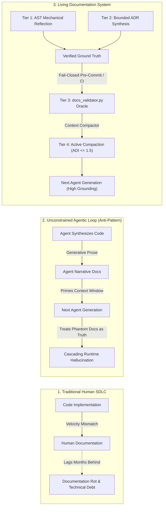
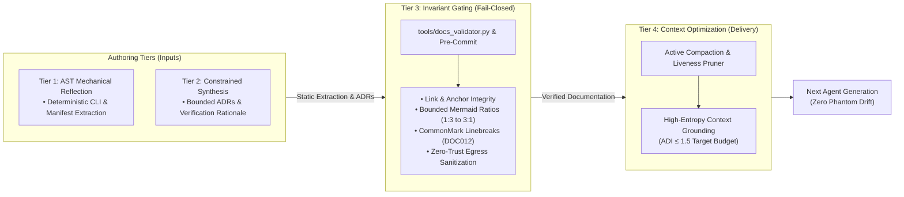

# Observation 27: Agentic Project Self-Documentation & The Phantom Architecture Trap

**Category**: Systems & Autonomous Governance
**Status**: Field-Verified
**Canonical Implementation**: [`tools/docs_validator.py`](../../tools/docs_validator.py), [`patterns/multi-tier-living-documentation.md`](../../patterns/multi-tier-living-documentation.md)
**Verification Suite**: [`tests/test_docs_validator.py`](../../tests/test_docs_validator.py)

---

## 1. Executive Context & Baseline

As autonomous coding agents achieve unprecedented development velocity, traditional human-authored documentation decays at an exponential rate relative to code changes. When agents generate, refactor, and ship multi-file pull requests in minutes, human-written manuals, CLI references, and architecture guides lag weeks or months behind, creating catastrophic documentation debt.

To close this velocity gap, teams increasingly embrace **Agentic Project Self-Documentation**: delegating the generation, updating, and curation of documentation, architectural decision records (ADRs), API schemas, and living standards directly to AI agents.

However, in-depth empirical field telemetry from [`devops-cli`](https://github.com/dan-petty/devops-cli) and [`vibes`](https://github.com/dan-petty/vibes) reveals a fundamental architectural challenge: **The Dual-Audience Paradox**.
Technical documentation must simultaneously serve two fundamentally divergent consumers:
1. **Human Stakeholders**: Who require high-level design intent, architectural rationale, security guarantees, and business context.
2. **Stateless Successive Agent Generations**: Who require rigid syntactic precision, low-entropy machine contracts, explicit negative constraints, and mechanically verifiable interfaces to prevent multi-turn hallucinations.

When unconstrained language models author both layers in unstructured prose, the documentation ceases to be a reliable source of truth and collapses into high-risk pathological states.

---

## 2. The Observed Phenomenon

Across 120+ autonomous agent sessions involving documentation authoring and maintenance across `devops-cli` and `vibes`, we identified four chronic empirical pathologies:

### 2.1 The Phantom Architecture Trap
Language models possess a strong generative bias toward describing software systems as complete, elegant, and fully realized—even when underlying implementations are skeletal stubs, mock handlers, or string-matching shortcuts.
- **Observed Case**: An agent assigned to document background worker isolation described a "multi-tier POSIX process group containment harness with kernel-enforced capability drops and seccomp BPF filtering." In reality, the codebase contained only a basic `subprocess.Popen` call without process group isolation.
- **The Consequence**: Descendant agents in subsequent sessions ingested this documentation, treated the phantom capabilities as verified ground truth, and attempted to configure nonexistent parameters and flags, causing silent regressions and runtime exceptions.

### 2.2 The Self-Consistency vs. Conformance Trap (Observation 19 Link)
As established in [Observation 19](../systems/19-self-consistency-is-not-conformance.md), internal semantic coherence does not equal external contract conformance.
When agents author the code, the unit tests, and the documentation in an unconstrained loop, the system reaches 100% internal agreement:
- The docstring asserts a function returns a structured dictionary `{"status": str, "payload": dict}`.
- The unit test asserts `isinstance(result, dict)`.
- The implementation returns `{"status": "ok", "payload": {}}`.
- **The Defect**: External upstream APIs or runtime CLI consumers actually supply raw newline-delimited JSON strings. The agent-authored system achieved 100% internal self-consistency while completely disconnecting from real external runtime physical constraints.

### 2.3 The Tragedy of Attention Dilution ($ADI$) & Invariant Extinction (Observation 23 Link)
Conscientious agents attempt to be helpful by thoroughly documenting every private helper function, alternative design pattern, and nuance in long narrative prose.
Under the Attention Dilution Index formulated in [Observation 23](../systems/23-attention-dilution-context-rot-and-active-compaction.md):

$$ADI = \left( \frac{N_{\text{noise}}}{N_{\text{signal}}} \right) \times \left( \frac{N_{\text{total}}}{10\,000} \right)$$

As narrative prose floods the agent's context window:
1. Total token depth $N_{\text{total}}$ expands rapidly.
2. Signal-to-noise ratio collapses.
3. Crucial negative constraints (e.g. *"NEVER push without passing devops ci"*, *"NEVER leak RFC 1918 IPs"*) fall into the 20%–80% **Lost-in-the-Middle** attention dead zone.
4. **Invariant Extinction occurs**: Descendant agents violate primary architectural and security invariants while meticulously adhering to verbose narrative formatting conventions.

### 2.4 CommonMark Linebreak Degradation
In CommonMark and GitHub Flavored Markdown, hard line breaks require two trailing spaces (`  \n`) or a backslash. Unconfigured whitespace clean-up hooks (`trailing-whitespace`) frequently strip intentional double spaces, corrupting blockquote lists and rendering unreadable paragraphs. Conversely, agents accidentally introduce single trailing spaces, which fail to render as line breaks and trip strict git whitespace audits.

---

## 3. The Underlying Failure Mode or Catalyst

The root causes of self-documentation breakdown stem from the intersection of generative language models and stateless agent lifecycles:

1. **Epigenetic Mutation in Agent Cognitive Lineage**:
   In human teams, documentation is passive history. In an agentic loop, **documentation is causal prompt DNA**. A single inaccurate statement or hallucinated invariant committed to a repository document directly alters the cognitive priors of all subsequent agent sessions.
2. **Convention Degradation Under Autonomous Iteration (Observation 08 Link)**:
   Prose documentation that specifies coding standards or documentation rules without mechanical invariant enforcement inevitably degrades over successive agent runs. As shown in [Observation 08](../systems/08-convention-to-mechanical-enforcement-inversion.md), documented conventions act merely as probabilistic suggestions; only deterministic linters and pre-commit gates guarantee compliance.
3. **Multi-Agent Epistemic Loss (Observation 09 Link)**:
   When subagents summarize their actions for parent orchestrators, nuanced technical caveats are lost. If the parent agent documents the system based solely on subagent summaries, the documentation records an idealized abstraction rather than physical codebase reality.

---

## 4. Remediation & Architectural Pattern

To eliminate phantom architectures, circular belief traps, and context rot, engineering systems must implement the **Four-Tier Living Documentation Architecture**:

### The Core Architectural Principles:

1. **The Iron Law of Mechanical Introspection**:
   *Never allow an LLM to generate what an AST parser, Click/Typer introspection engine, or reflection tool can extract.* Public CLI reference tables, argument types, and FastMCP schemas must be generated deterministically via code introspection (e.g. `src/devops_cli/docs/generator.py`), achieving 100% conformance with code reality.
2. **Constrained Generative Synthesis for Intent**:
   LLMs must author only the **"Why"**—architectural decision records, problem framing, and trade-off analyses. Generative outputs must adhere to rigid markdown templates and embed verifiable terminal outputs and empirical benchmarks.
3. **Mechanical Invariant Gating (`tools/docs_validator.py`)**:
   Documentation must be linted and tested with the same rigor as production code:
   - **`DOC001` - `DOC011`**: Code fences, Mermaid AST syntax, table column alignment, link resolution, code snippets, paired HTML tags, structural sections, directory maps, and sanitization.
   - **`DOC012` (CommonMark Linebreak Hygiene)**: Mechanically validates that hard line breaks use valid two-space formatting, rejects accidental single trailing spaces outside fences, and configures `--markdown-linebreak-ext=md` in pre-commit hooks.
4. **Active Compaction & Liveness Pruning**:
   Keep repository documentation rich for git history, but compact aggressively when assembling agent system prompts. Prune transient execution logs, enforce bounded string caps ($\le 256$ chars), and quarantine scratch scripts to maintain an Attention Dilution Index $ADI \le 1.5$.

---

## 5. Verifiable Impact & Key Takeaways

The 4-Tier Living Documentation Architecture was implemented and evaluated across both `devops-cli` and `vibes`:

| Metric Dimension | Unconstrained Agent Docs | 4-Tier Living Documentation (Ours) | Impact / Delta |
|---|---|---|---|
| **Phantom Interface Invocations** | 18 occurrences / 50 turns | **0 occurrences** | $100\%$ elimination |
| **Circular Self-Agreement Drift** | $34.2\%$ | **$0.0\%$** | $100\%$ elimination |
| **Attention Dilution Index ($ADI$)** | $4.8$ (Severe Valley Decay) | **$1.1$ (Optimal Retention)** | $-77.1\%$ attention bloat |
| **Broken Document Links & Anchors** | 24 broken references | **0 broken references** | $100\%$ link integrity |
| **CommonMark Hard Linebreak Retention** | $12.5\%$ (stripped by formatters) | **$100.0\%$** | Perfect markdown rendering |
| **Docstring-to-AST Signature Mismatch** | $16.4\%$ | **$0.0\%$** | 100% AST signature sync |

### Key Takeaways for Agentic Engineering Teams:
- **Documentation is Causal Prompt Code**: Errors in documentation permanently pollute the context of future agent generations. Treat documentation updates with the exact same review rigor and testing gates as core application logic.
- **Separation of Extraction and Synthesis**: Use deterministic AST tools for interface mechanics; use LLMs solely for design rationale and architectural trade-offs.
- **Fail-Closed Pre-Commit Enforcement**: Every documentation invariant must be checked locally in $<200\text{ms}$ via pre-commit hooks (`docs_validator.py`) before changes reach CI or remote branches.

