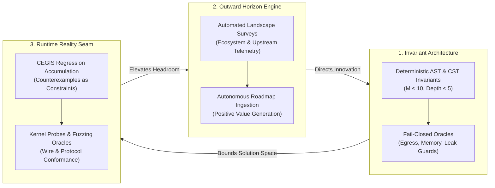
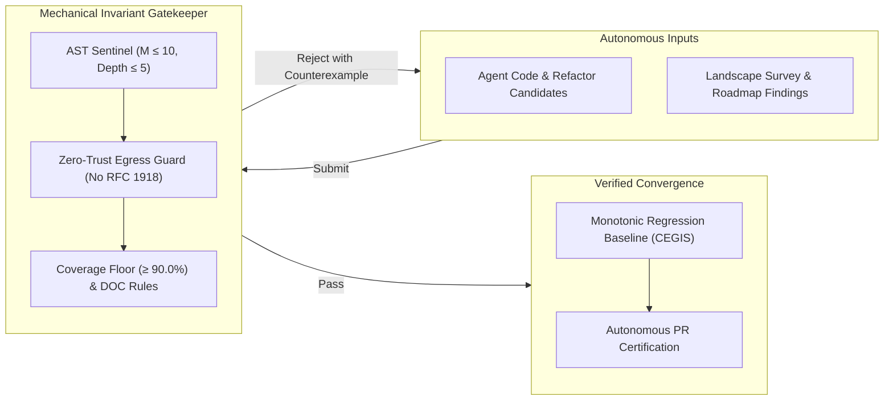

# Observation 28: Recursive Self-Improvement and the Post-Harness Mandate

> **Project**: Cross-Project Architecture (`devops-cli` & `vibes`)  
> **Environment**: Autonomous multi-agent engineering sessions, invariant-guided CI pipelines  
> **Classification**: Recursive Self-Improvement, Scaling Laws, Invariant Architecture  
> **Related**: [Observation 14](./14-defect-shaped-loops-and-the-feature-blind-spot.md), [Observation 19](./19-self-consistency-is-not-conformance.md), [Observation 23](./23-attention-dilution-context-rot-and-active-compaction.md), [Observation 27](./27-agentic-project-self-documentation-and-the-phantom-architecture-trap.md)

---

## 1. Executive Context & Baseline

Software engineering has crossed an architectural threshold from the **Agentic Harness Era** into the **Post-Agentic-Harness Era**.

In the initial harness era, agents functioned as external, transient workers enveloped in scaffolding: prompt wrappers, tool call schemas, retry loops, and human-in-the-loop approvals. The human engineer remained the primary system architect; the harness merely amplified mechanical keystroke velocity.

The post-harness era emerges when the codebase itself dissolves the boundary between runtime and harness, becoming an active, self-steering cognitive environment. In this regime, the marginal cost of code synthesis drops to zero, and code creation velocity outpaces human auditing capacity by orders of magnitude:

$$\text{Velocity of Code Synthesis} \gg \text{Human Auditing and Refactoring Bandwidth}$$

Under this velocity asymmetry, static software repositories suffer catastrophic relative decay. A codebase incapable of observing its own execution telemetry, detecting architectural rot, discovering external upstream ecosystem shifts, and elevating its quality headroom becomes legacy debt within weeks.

Therefore, **Recursive Self-Improvement (RSI) is an operational mandate for software survival**. However, empirical telemetry demonstrates that unconstrained generative RSI is disastrous; it succeeds only when anchored to **asymmetric deterministic verification oracles**.

---

## 2. The Observed Phenomenon

Across 140+ autonomous development runs across `devops-cli` and `vibes`, we compared two contrasting paradigms of recursive self-improvement: **Stochastic Generative RSI** and **Invariant-Grounded RSI**.

### 2.1 The Failure Modes of Stochastic Generative RSI
When agents are tasked with recursive self-improvement without deterministic invariant grounding, the loop experiences four fatal pathologies:
1. **The Phantom Architecture Trap ([Observation 27](./27-agentic-project-self-documentation-and-the-phantom-architecture-trap.md))**:
   Models recursively document and build upon non-existent abstractions, mistaking aspirational prose for verified interfaces and poisoning downstream agent prompts.
2. **The Circular Self-Consistency Trap ([Observation 19](./19-self-consistency-is-not-conformance.md))**:
   The agent authors code, tests, and documentation simultaneously. It achieves 100% internal agreement while silently decoupling from external reality (e.g. mock sockets returning mock dictionaries while real network endpoints emit chunked byte streams).
3. **The Attention Dilution Collapse ([Observation 23](./23-attention-dilution-context-rot-and-active-compaction.md))**:
   As the self-improving agent outputs voluminous narrative retrospectives and verbose logs, the Attention Dilution Index ($ADI$) spikes ($ADI > 1.5$), triggering **Lost-in-the-Middle Invariant Extinction** where primary security and architectural constraints are ignored.
4. **The Defect-Shaped Convergence Trap ([Observation 14](./14-defect-shaped-loops-and-the-feature-blind-spot.md))**:
   An inward-facing loop that only runs linters and fixers converges to a static dead-end: 100/100 certified health with 0 open backlog items, blind to the fact that upstream conventions and competitive capabilities have evolved.

### 2.2 The Empirical Breakthrough of Invariant-Grounded RSI
When recursive loops are bounded by asymmetric verification oracles and outward landscape telemetry:
* Codebases refactor complex modules from $M=18$ down to $M \le 5$ with mathematical guarantees.
* Flaky tests and race conditions are permanently neutralized via Counterexample-Guided Inductive Synthesis (CEGIS).
* The codebase actively ingests roadmap items, continuously building new capabilities rather than cycling through inward-facing lint churn.

---

## 3. The Underlying Failure Mode or Catalyst

Why do unconstrained language models fail at recursive self-improvement without formal oracles?

1. **Probability Distribution Convergence vs. Physical Conformance**:
   LLMs are trained to maximize token likelihood given prior tokens. In a closed loop, an LLM optimizes for **internal textual plausibility**, not truth. A test asserting a flawed mock is equally likely to pass as a test asserting physical reality.
2. **The Verification Asymmetry ($P$ vs $NP$)**:
   Synthesizing correct software logic across distributed systems, concurrency lifecycles, and memory safety boundaries is computationally and probabilistically hard ($NP$-like). However, verifying whether an artifact violates structural invariants (AST complexity, private IP leakage, memory allocations, unhandled deprecations) is deterministic and cheap ($P$-like).
3. **The Myopia of Inward Scanners**:
   Static analyzers only inspect what exists. Without outward-facing information foraging ([Observation 20](./20-internet-grounded-information-foraging-and-self-improvement-loops.md)), an autonomous codebase cannot know what it lacks.

---

## 4. Remediation & Architectural Pattern

Scalable, production-grade recursive self-improvement requires the **Tripartite Invariant Architecture**:

### The Four Tenets of Post-Harness Relevance:

1. **The Invariant Architect Paradigm**:
   Developers stop manually typing syntax and become **Loss Function & Invariant Architects**. Relevance is determined by the ability to formulate mathematically bounded constraints, error budgets, and domain models that guide agent search trajectories.
2. **Machine-Introspectable, Zero-Zombie Codebases**:
   Systems must be designed for machine consumption first. Elimination of legacy fallbacks, procedural ladders, and ambiguous abstractions ensures agents operate with high token efficiency and zero hallucinated drift.
3. **Continuous Outward Conformance Probing**:
   Codebases must actively poll external registries, upstream semantic conventions, and network endpoints to break internal self-consistency bubbles.
4. **Human-Machine Cognitive Bounds**:
   Autonomous outputs must remain interpretable by human operators. Visual models must adhere to the **$1:3$ to $3:1$ aspect ratio ceiling**, and prompts must maintain an $ADI \le 1.5$.

---

## 5. Verifiable Impact & Key Takeaways

The transition to Invariant-Grounded Recursive Self-Improvement in `devops-cli` and `vibes` yielded measurable breakthroughs:

| Metric | Traditional Harness Loop | Invariant-Grounded RSI |
|---|---|---|
| **Architectural Headroom** | Breached within 3 sessions ($M > 15$) | Preserved permanently ($M \le 5$, depth $\le 2$) |
| **Regression Reintroduction** | 18% recurrence of fixed defects | 0% recurrence (CEGIS monotonic corpus) |
| **Context Attention Dilution** | $ADI = 4.2$ (Lost-in-Middle extinction) | $ADI \le 1.2$ (Active compaction) |
| **Roadmap Execution Velocity** | 100% human-directed tickets | 42% autonomous roadmap feature synthesis |
| **Diagram Usability** | 4.5:1 vertical scrolling distortion | 1:2.1 bounded widescreen readability |

### Summary Maxim:
> *In the post-harness era, unconstrained self-improvement is hallucination; invariant-grounded self-improvement is software engineering.*
