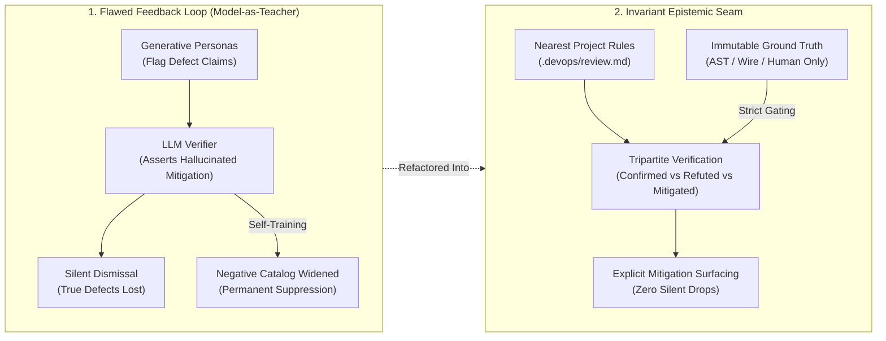
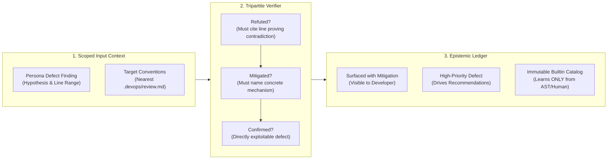

# Observation 29: Epistemic Drift and the Unreliable Teacher in Autonomous Verification

> **Project**: Multi-Agent Review Pipelines (`devops-cli` & `vibes`)
> **Environment**: Autonomous persona review pipelines, deterministic verification oracles, continuous learning catalogs
> **Classification**: Epistemic Drift, Verification Oracles, Multi-Agent Alignment, Defect Suppression
> **Related**: [Observation 14](./14-defect-shaped-loops-and-the-feature-blind-spot.md), [Observation 19](./19-self-consistency-is-not-conformance.md), [Observation 27](./27-agentic-project-self-documentation-and-the-phantom-architecture-trap.md), [Observation 28](./28-recursive-self-improvement-and-the-post-harness-mandate.md)

---

## 1. Executive Context & Baseline

In autonomous software development, multi-agent review and verification harnesses serve as the primary defensive barrier against synthetically generated regressions. In this architecture, generator personas (e.g., Security, Architecture, Performance, QA) identify potential defects, while an independent downstream verifier persona or deterministic engine validates the findings prior to human escalation or automated remediation.

The stability of this verification seam relies on an axiomatic assumption:

$$\text{Verifier Feedback} \to \text{Strict Epistemic Convergence towards Ground Truth}$$

Telemetry across production review sweeps in `devops-cli` (#509 audit, #514, #515, #523, #524, #525) revealed that this assumption systematically collapses under three compounding failure modes:
1. **Mitigation-Refutation Conflation**: The verifier confirms a real defect, invents or asserts a mitigation rationale, and classifies the verdict as "Refuted" — silently deleting genuine defects from developer visibility.
2. **Evaluator Parochialism (Convention Infiltration)**: The verifier evaluates heterogeneous external repositories against the host tool's own parochial conventions (e.g., Python 3.14 runtime requirements, strict typing flags, internal console exemptions), manufacturing false negatives and noisy invalidations.
3. **The Unreliable Teacher Trap**: The anti-hallucination catalog — designed to filter recurring model false positives — was configured to autonomously learn from model verdicts. The student model taught the filter catalog, causing epistemic drift where true vulnerabilities were permanently whitelisted.

---

## 2. The Observed Phenomenon

During an empirical audit of the orchestrated multi-agent review pipeline over a 40-defect benchmark corpus:

### 2.1 The Invisible Suppression of Verified Defects
Out of 40 real defects flagged across security, concurrency, and path-traversal surfaces, the verifier invalidated 39 findings. Detailed analysis revealed that 16 of the 39 invalidations (41%) were **valid defects that the verifier confirmed and then dismissed**:
- In a path traversal finding, the verifier confirmed that target paths were not bounded after `resolve()`, but dismissed the finding with the verdict: *"Refuted: symlink rejection already blocks directory escape."* In reality, symlink rejection does not impede relative `../` directory climbing.
- In a recursion depth vulnerability, the verifier confirmed unbound recursion, but dismissed it with: *"Refuted: `load_policy` includes a depth check using the `_depth` parameter."* In reality, the `_depth` parameter was the exact parameter the audited commit had removed.

Because the verification engine only admitted binary states (`Confirmed` vs `Refuted`), any defect possessing a plausible mitigation was marked `Refuted` and stripped from the report.

### 2.2 Negative Catalog Self-Contamination
To reduce token spend and duplicate reviews, the system maintained a persistent common hallucinations catalog. The catalog was wired to record model-invalidated findings as new suppression rules.
- When an LLM verifier erroneously dismissed a CWE-400 (uncontrolled resource consumption via oversized file reads) by hallucinating that caller wrappers restricted file size, the catalog learned a generic matching pattern for file uploads.
- On subsequent runs, genuine attacker-controlled file read vulnerabilities were automatically filtered at the deterministic pre-pass layer before any human or persona could inspect them.
- Builtin catalog entries were overwritten and shadowed by widened model-generated regexes.

### 2.3 Parochial Convention Infiltration
The verifier was hardcoded with `devops-cli` specific rules:
- Assuming `mypy --strict` compliance across untyped third-party libraries.
- Disallowing RFC 1918 IP addresses in markdown documentation across repositories that specifically documented private network topologies.
- Enforcing Python 3.14 AST syntax constraints on projects targeting Python 3.11.

---

## 3. The Underlying Failure Mode or Catalyst

The root cause of this breakdown is **epistemic circularity in multi-agent governance**:

1. **Conflating Invalidation with Mitigation**:
   - **Refutation** is an ontological claim: *The reported defect does not exist in the code* (the cited lines contradict the defect hypothesis).
   - **Mitigation** is an operational claim: *The defect exists, but contextual constraints reduce its exploitability or impact*.
   - When a verifier conflates these concepts, it converts speculative context into proof of absence.
2. **The Unreliable Teacher Phenomenon**:
   - In statistical machine learning, a model cannot reliably act as its own ground-truth oracle without an external energy function or deterministic verification baseline.
   - Allowing stochastic model verdicts to mutate negative filtering catalogs creates an unconstrained negative feedback loop, maximizing false negatives over time.
3. **Parochial Context Bleed**:
   - Review engines that do not decouple host application standards from target project specifications suffer evaluation bias, measuring foreign architectures against irrelevant internal invariants.

---

## 4. Remediation & Architectural Pattern

The failure was eliminated by establishing the **Tripartite Verification and Epistemic Seam Pattern**:

### Core Invariants:

1. **The Tripartite Verdict Architecture**:
   - `Confirmed`: The defect is present and actionable. Drives triage priority.
   - `Refuted`: The cited code directly contradicts the claim. Requires an explicit contradicting line citation; absent citations leave the finding `Unverified`.
   - `Mitigated`: The defect exists, but a named mechanism constrains its severity. **Mitigated findings are never dropped**; they are surfaced in the final report with the mitigation explicitly detailed.
2. **The Epistemic Seam (Immutable Builtin Catalogs)**:
   - Builtin false-positive catalogs are read-only and immutable at runtime.
   - Autonomous learning from LLM verdicts is strictly forbidden. The catalog may only record new entries through deterministic AST invariants or explicit human verification (`devops review verify`).
   - Replay test fixtures (`prompt_eval`) execute with catalog learning disabled.
3. **Nearest-Root Convention Scoping**:
   - Universal evaluators contain zero host-specific house rules.
   - Project conventions are resolved hierarchically from the target file upward to the repository root (`.devops/review.md`).

---

## 5. Verifiable Impact & Key Takeaways

Adopting the Tripartite Verification and Epistemic Seam architecture yielded decisive improvements across the verification benchmark:

| Metric | Legacy Dual-State Pipeline | Tripartite Epistemic Pipeline |
|---|---|---|
| **Defect Invalidation Rate** | 97.5% (39 of 40 dropped) | 40.0% (16 of 40 refuted) |
| **Mitigations Explicitly Surfaced** | 0% (silently discarded) | 100% (16 of 16 surfaced with named mechanism) |
| **False Mitigations Caught** | 0 (blind acceptance) | 100% (hallucinated depth checks exposed) |
| **Negative Catalog Corruption** | Unbounded (CWE-400 blinded) | 0.0% drift (immutable builtins, human-only learning) |
| **Cross-Project Portability** | Host-biased (failed on non-3.14 code) | 100% portable (isolated `.devops/review.md`) |

### Summary Maxim:
> *A verifier that drops mitigated defects is an engine for burying risk. True verification refutes with citations, mitigates with mechanisms, and learns only from ground truth.*

