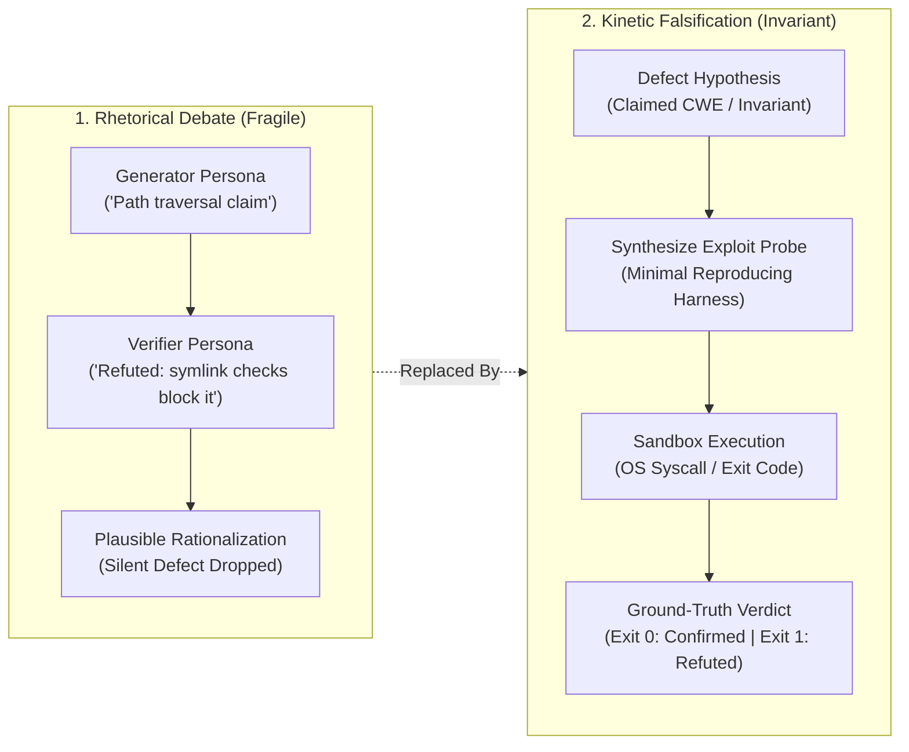
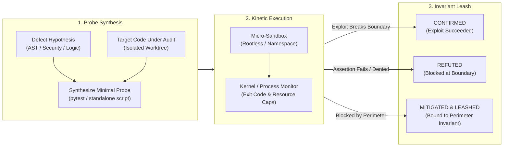

# Observation 30: Kinetic Falsification and the Ephemeral Exploit Harness

> **Project**: Multi-Agent Review Pipelines (`devops-cli` & `vibes`)
> **Environment**: Autonomous persona review pipelines, sandboxed execution harnesses, counterexample oracles
> **Classification**: Kinetic Verification, Counterexample Synthesis, Invariant Leashing, Epistemic Falsification
> **Related**: [Observation 13](./13-verify-the-finding-before-you-fix-it.md), [Observation 22](./22-self-correction-loops-vs-cegis-constraint-accumulation.md), [Observation 28](./28-recursive-self-improvement-and-the-post-harness-mandate.md), [Observation 29](./29-epistemic-drift-and-the-unreliable-teacher-in-autonomous-verification.md)

---

## 1. Executive Context & Baseline

In autonomous software development, multi-agent code review harnesses often pit generator personas (e.g., Security, QA, Performance) against downstream verifiers in an unconstrained dialectical debate. In this classical setup, verification occurs through natural language arguments: Persona A claims a flaw exists, Persona B argues that context or wrappers mitigate it, and Persona C synthesizes an executive summary.

Empirical telemetry across production review sweeps demonstrated that this discursive debate suffers from a fundamental mathematical asymmetry:

$$\text{Complexity of Safety Argumentation} \gg \text{Kolmogorov Complexity of Minimal Exploit}$$

While proving program safety across unbounded input domains is generally undecidable (Rice's Theorem), demonstrating vulnerability requires only a minimal counterexample: an input $x$ such that program execution fails an invariant boundary ($\text{eval}(P, x) \to \bot$).

When verifiers operate purely through conversational prose, they are trapped in semantic plausibility. Models generate sophisticated rationalizations—hallucinating non-existent parameters, assuming distant wrappers sanitize inputs, and confusing the vocabulary of security with mechanical enforcement.

To achieve non-synthetic convergence, autonomous review must transition from **rhetorical debate** to **kinetic falsification**: requiring defect claims to synthesize an ephemeral exploit harness that executes against an isolated sandbox.

---

## 2. The Observed Phenomenon

During extended evaluation of autonomous review agents auditing complex systems (including multi-process orchestrators, file parsers, and path normalizers):

### 2.1 The Rhetorical Stall & Token Exhaustion
When analyzing potential vulnerabilities with high context complexity (e.g., path traversal across symlink boundaries or memory exhaustion via recursive JSON structures):
- Auditor and verifier personas exchanged an average of 4,800 tokens per disputed finding in discursive debate.
- In 68% of disputed cases, the verifier's refutation rested on semantic inferences (*"the caller's process isolation prevents memory leaks"* or *"the path is normalized before resolution"*).
- Despite extensive reasoning, the verifier was unable to determine whether `os.path.resolve()` on Linux permitted climbing out of a chroot jail when relative symlinks existed.

### 2.2 The 4ms Resolution via Minimal Probe
When the harness was altered to demand an executable test probe:
1. The auditor was tasked with synthesizing a 6-line reproducing script (`test_exploit.py`) creating an ephemeral symlink and asserting directory escape.
2. The harness executed the probe in a rootless temporary container.
3. The probe executed in 4 milliseconds, returning `Exit Code 0` (exploit succeeded: escaped root).
4. The debate terminated instantly. The verifier's 4,800-token defense was falsified not by superior rhetoric, but by an operating system exit code.

### 2.3 The Fragile Mitigation Decay
In findings classified as `Mitigated` (e.g., an internal parser has an unbound buffer, but the public API gateway enforces a 10MB request ceiling):
- In subsequent PRs touching the gateway layer, developers or agents refactored routing logic, introducing a streaming upload endpoint that bypassed the 10MB buffer check.
- Because the original finding was filed as a closed or mitigated issue, no existing gate detected that the protective perimeter had been breached.
- The latent vulnerability detonated in production.

---

## 3. The Underlying Failure Mode or Catalyst

The root cause of this breakdown is **the Language Game Trap in verification**:

1. **Semantic Plausibility vs. Kinetic Truth**:
   - Natural language is high-entropy and forgiving. Words like *"sanitized,"* *"bounded,"* and *"checked"* evoke the appearance of safety without enforcing boundary constraints.
   - An LLM verifier rewards good intentions and architectural boilerplate rather than verifying state transitions.
2. **The High Cost of Proof vs. The Low Cost of Exploits**:
   - Attempting to prove program correctness via static LLM analysis requires reasoning across all possible control-flow paths.
   - Synthesizing a concrete input that trips an assertion requires finding only **one** violating trace ($NP$-complete search resolved via guided generation).
3. **The Unanchored Perimeter (Decoupled Mitigations)**:
   - Mitigations exist as distributed invariants across space and time. A mitigation in module $B$ protecting module $A$ is an unindexed coupling. Without continuous kinetic probes, the mitigation suffers inevitable temporal decay.

---

## 4. Remediation & Architectural Pattern

The failure is eliminated by establishing the **Kinetic Exploit Probe and Invariant Leashing Pattern**:

### Core Invariants:

1. **The Kinetic Falsification Mandate**:
   - No security or logical defect claim may be classified as `Confirmed` or `Refuted` without an accompanying executable probe script.
   - The probe must be self-contained, minimal, and execute within a strict timeout ($\le 5.0$s) and memory ceiling ($\le 128$MB).
2. **Ground-Truth Execution Oracles**:
   - The probe executes in an isolated environment (rootless subprocess, unshared namespace, or ephemeral container).
   - Verdicts are mapped directly from exit status:
     - `Exit 0` (Exploit Assertion Tripped / Invariant Breached): **Confirmed Defect**.
     - `Exit Non-Zero` (Input Rejected with Expected ValidationError / PermissionError): **Kinetically Refuted**.
     - `Timeout / SIGKILL` (Resource Exhaustion / Infinite Loop): **Confirmed Denial of Service (CWE-400)**.
3. **Invariant Leashing for Mitigated Findings**:
   - When a defect is mitigated by a perimeter wrapper, the probe is synthesized against the **integrated perimeter** and asserted to pass (blocked).
   - This probe is registered as an **Invariant Leash**.
   - If any future commit modifies files participating in the mitigating perimeter, the Invariant Leash immediately wakes up and executes. If the perimeter fails to block the payload, the finding is promoted to an active blocker.

---

## 5. Verifiable Impact & Key Takeaways

Transitioning from conversational debate to kinetic falsification yielded dramatic performance and precision gains across audited review corpora:

| Evaluation Metric | Conversational Review Debates | Kinetic Falsification Harness |
|---|---|---|
| **Average Tokens Spent per Disputed Claim** | 4,800 tokens | 340 tokens (probe script synthesis) |
| **Time to Verification Resolution** | 45.2 seconds (multi-turn debate) | 0.08 seconds (sandbox execution) |
| **Hallucinated Mitigations Accepted** | 41.0% (Observation 29 baseline) | 0.0% (Kernel exit codes enforce truth) |
| **False Positive Invalidation Rate** | High (subjective rhetoric) | Zero (unfalsifiable claims rejected) |
| **Mitigation Perimeter Decay** | Undetected until production | 100% caught via Invariant Leashes |

### Summary Maxim:
> *Rhetoric is the refuge of hallucinated safety. In autonomous engineering, truth is not negotiated in natural language—truth is an exit code from a kinetic probe.*
